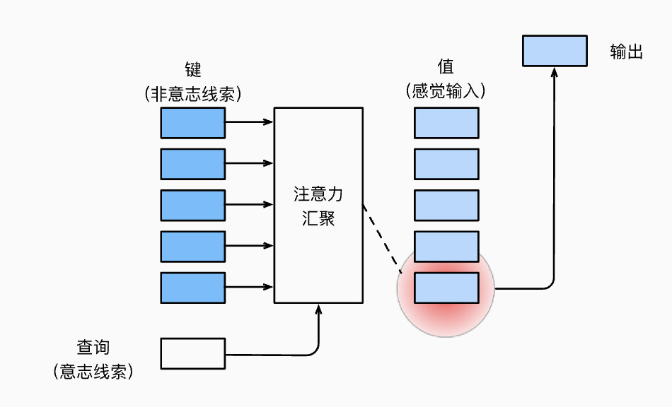
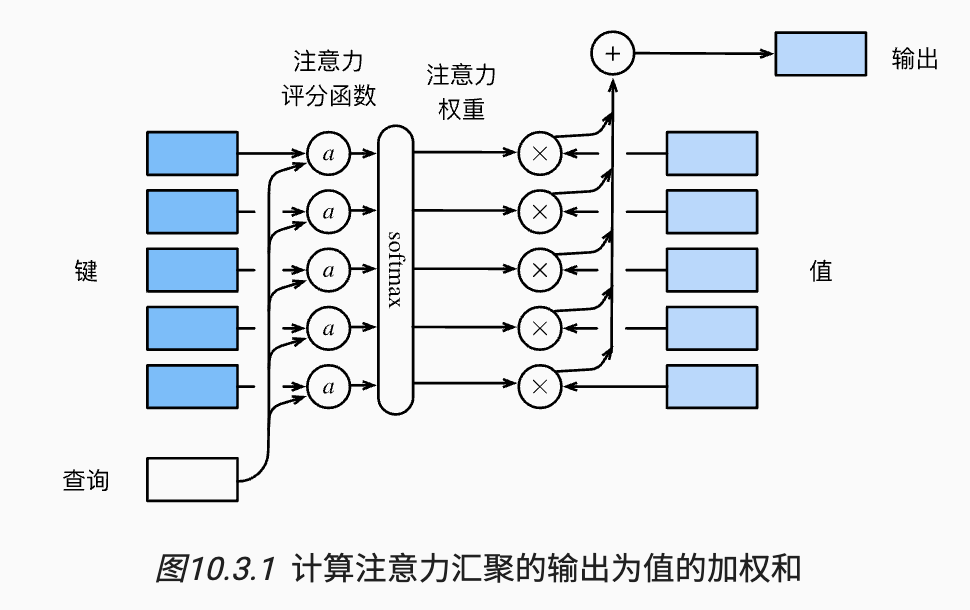
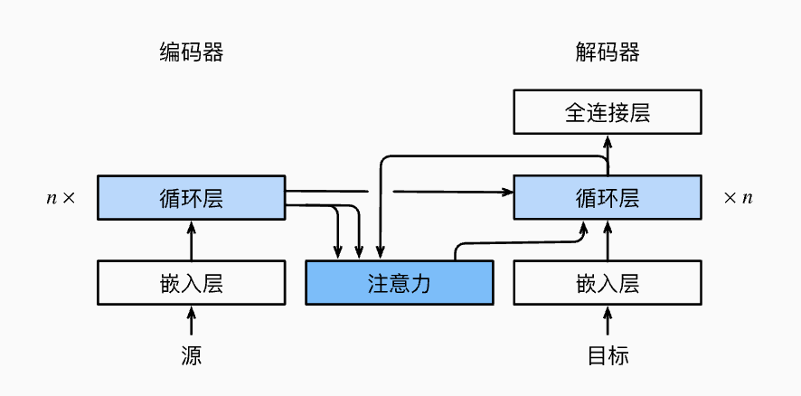
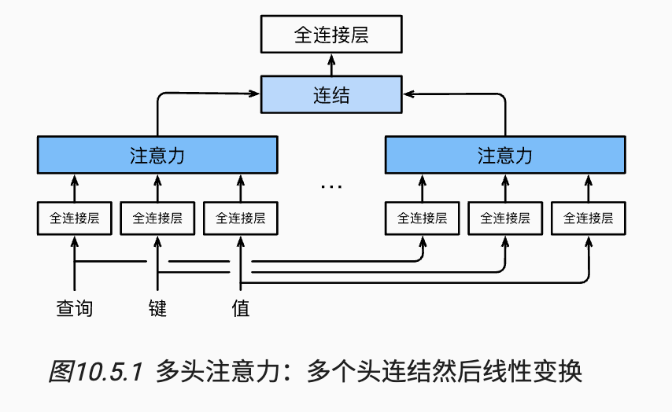
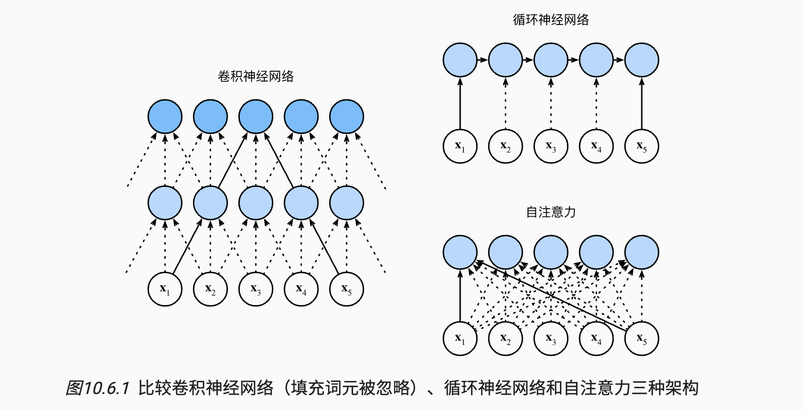

## 一. 注意力机制简介



### 1. 引入

注意力分为自主性和非自主性的提示，在深度学习中，自主性被称为查询(query), 给定任何查询，注意力机制通过注意力汇聚，将选择引导至感官输入，而非自主性提示被称之为键 (key)，所以注意力其实是query与key的交互汇聚过程

### 2. 非参数注意力汇聚

这里介绍一种比较简单的例子：Nadaraya-Waston核回归，我们先生成一下训练和测试样本

```python
# 训练样本数
n_train = 50
x_train, _ = torch.sort(torch.randn(n_train) * 5)

def f(x):
    return 2 * torch.sin(x) + x ** 0.8

y_train = f(x_train) + torch.normal(0, 0.05, (n_train, ))
x_test = torch.arange(0, 5, 0.01)
y_truth = f(x_test)
n_test = len(x_test)
```

对于query和key，核回归其实定义了一种汇聚方式：

$$
f(x) = \sum_{i=1}^n \frac{K(x - x_i)}{\sum_{j=1}^n K(x - x_j)} y_i
$$

我们调整一下，形成一种更为通用的注意力汇聚方式：

$$
f(x) = \sum_{i=1}^n \alpha(x, x_i)y_i
$$

其中，$x$ 为查询，$(x_i, y_i)$ 为键值对，注意力汇聚是 $y_i$ 的加权平均，$\alpha$ 是query与key之间的关系建模，被称之为注意力权重，这个权重将分配给每一个值 $y_i$

我们给出一个注意力权重，名为高斯核：

$$
K(u) = \frac{1}{\sqrt{2\pi}} \exp\left(-\frac{u^2}{2}\right).
$$

我们将高斯核带入注意力汇聚公式，可以得到以下结果：

$$
f(x) = \sum_{i=1}^n \alpha(x, x_i) y_i
$$

$$
= \sum_{i=1}^n \frac{\exp\left(-\frac{1}{2}(x - x_i)^2\right)}{\sum_{j=1}^n \exp\left(-\frac{1}{2}(x - x_j)^2\right)} y_i
$$

$$
= \sum_{i=1}^n \text{softmax}\left(-\frac{1}{2}(x - x_i)^2\right) y_i.
$$

分析得到，如果键 $x_i$ 越是接近给定的 query $x$ , 那么分配给这个键对应的 $y_i$ 的权重就会更大，也就意味着获得了更多的注意力。

Nadaraya-Watson核回归是一个非参数模型，所以上述的注意力汇聚其实是非参数注意力汇聚模型。

### 3. 带参数注意力汇聚

从上述例子可以看出，非参数的模型收敛其实取决于key的数目，对于其的改进其实就是将可学习的参数集成到注意力汇聚中：

$$
f(x) = \sum_{i=1}^{n} \alpha(x, x_i) y_i
$$

$$
     = \sum_{i=1}^{n} \frac{\exp\left(-\frac{1}{2}((x - x_i)w)^2\right)}{\sum_{j=1}^{n} \exp\left(-\frac{1}{2}((x - x_j)w)^2\right)} y_i
$$

$$
     = \sum_{i=1}^{n} \text{softmax}\left(-\frac{1}{2}((x - x_i)w)^2\right)y_i.
$$

这里首先引入一个torch的简便操作：批量矩阵乘法

```python
weights = torch.ones((2, 10)) * 0.1
values = torch.arange(20.0).reshape((2, 10))
# unsqueeze 用于在指定的维度上插入一维，比如unsqueeze(1)就会使得weight变为(2, 1, 10)
torch.bmm(weights.unsqueeze(1), values.unsqueeze(-1))
```

可以看出，weight _values = (2, 1, 10)_ (2, 10, 1) = (2, 1, 1), 其实这里批量就是 2，然后对于第一维中的每个矩阵，执行对应矩阵相乘

集中看一下模型的定义以及训练

```python
class NWKernelRegression(nn.Module):
    def __init__(self, **kwargs):
        super().__init__(**kwargs)
        self.w = nn.Parameter(torch.rand((1,), requires_grad=True))

    def forward(self, queries, keys, values):
        # queries和attention_weights的形状为(查询个数，“键－值”对个数)
        queries = queries.repeat_interleave(keys.shape[1]).reshape((-1, keys.shape[1]))
        self.attention_weights = nn.functional.softmax(
            -((queries - keys) * self.w)**2 / 2, dim=1)
        # values的形状为(查询个数，“键－值”对个数)
        return torch.bmm(self.attention_weights.unsqueeze(1),
                         values.unsqueeze(-1)).reshape(-1)

# X_tile的形状:(n_train，n_train)，每一行都包含着相同的训练输入
# repeat((n_train, 1)) 表示按行复制n_train次，列不拓展
X_tile = x_train.repeat((n_train, 1))
# Y_tile的形状:(n_train，n_train)，每一行都包含着相同的训练输出
Y_tile = y_train.repeat((n_train, 1))
# keys的形状:('n_train'，'n_train'-1)，
# torch.eye可以生成单位矩阵，这种操作可以使得X_tile的主对角线元素被移除
keys = X_tile[(1 - torch.eye(n_train)).type(torch.bool)].reshape((n_train, -1))
# values的形状:('n_train'，'n_train'-1)
values = Y_tile[(1 - torch.eye(n_train)).type(torch.bool)].reshape((n_train, -1))

net = NWKernelRegression()
# 平方损失
loss = nn.MSELoss(reduction='none')
trainer = torch.optim.SGD(net.parameters(), lr=0.5)
animator = d2l.Animator(xlabel='epoch', ylabel='loss', xlim=[1, 5])

for epoch in range(5):
    trainer.zero_grad()
    l = loss(net(x_train, keys, values), y_train)
    l.sum().backward()
    trainer.step()
    print(f'epoch {epoch + 1}, loss {float(l.sum()):.6f}')
    animator.add(epoch + 1, float(l.sum()))
```

- w是一个可学习的标量参数，在反向传播时会被更新

- querys被调整为(查询个数，每个查询对应(n_train-1)个键值对匹配)

- 进行完softmax操作之后attention_weights的形状为(n_train, n_train-1), 然后进行批量矩阵乘法，最后输出shape为(n_train, ), 对应每个的查询结果

### 4. 注意力评分

上面介绍了注意力汇聚的建模方式，接下来我们介绍注意力评分函数

其实上述的高斯核就可以被视为注意力评分函数



假设我们有一个查询 $\mathbf{q} \in R^q$, 和 $m$ 个键值对 $(k_1, v_1) ... (k_m, v_m)$, 那么注意力汇聚函数就可以表示为值的加权和

$$
f(\mathbf{q}, (\mathbf{k}_1, \mathbf{v}_1), \dots, (\mathbf{k}_m, \mathbf{v}_m)) = \sum_{i=1}^m \alpha(\mathbf{q}, \mathbf{k}_i) \mathbf{v}_i \in \mathbb{R}^v,
$$

其中查询 $q$ 和键 $k_i$ 的注意力权重是通过注意力评分函数 $\alpha$ 将两个向量映射为标量，再经过softmax运算得到的

$$
\alpha(\mathbf{q}, \mathbf{k}_i) = \text{softmax}(a(\mathbf{q}, \mathbf{k}_i)) = \frac{\exp(a(\mathbf{q}, \mathbf{k}_i))}{\sum_{j=1}^m \exp(a(\mathbf{q}, \mathbf{k}_j))} \in \mathbb{R}.
$$

接下来我们介绍一下其他的一些注意力评分函数，首先引入掩蔽softmax操作，其实是为了去忽略一些值，类似于rnn中将一些特殊词元忽略掉

```python
def masked_softmax(X, valid_lens):
    """通过在最后一个轴上掩蔽元素来执行softmax操作"""
    # X:3D张量，valid_lens:1D或2D张量
    if valid_lens is None:
        # 如果没有传入valid_lens，就视为不需要掩蔽
        return nn.functional.softmax(X, dim=-1)
    else:
        shape = X.shape
        if valid_lens.dim() == 1:
            valid_lens = torch.repeat_interleave(valid_lens, shape[1])
        else:
            valid_lens = valid_lens.reshape(-1)
        # 最后一轴上被掩蔽的元素使用一个非常大的负值替换，从而其softmax输出为0
        X = d2l.sequence_mask(X.reshape(-1, shape[-1]), valid_lens,
                              value=-1e6)
        return nn.functional.softmax(X.reshape(shape), dim=-1)
```

#### 加性注意力

一般来说，当查询和键是不同长度的向量时，可以使用加性注意力作为评分函数，给定查询 $\mathbf{q} \in \mathbb{R}^q$, 以及键 $\mathbf{k} \in \mathbb{R}^k$:

$$
a(\mathbf{q}, \mathbf{k}) = \mathbf{w}_v^\top \tanh(\mathbf{W}_q \mathbf{q} + \mathbf{W}_k \mathbf{k}) \in \mathbb{R},
$$

其中可学习的参数是 $\mathbf{W}_q \in \mathbb{R}^{h*q}$, $\mathbf{W}_k \in \mathbb{R}^{h*k}$, $\mathbf{W}_v \in \mathbb{R}^{h}$

我们发现这里引入了一个隐藏层参数 $h$ ，那么其实这里就会将query和key连结，输入到一个MLP中，其中包含了一个隐藏层，超参数为 $h$ , 通过使用tanh作为激活函数，并且禁用偏置项

```python
class AdditiveAttention(nn.Module):
    """加性注意力"""
    def __init__(self, key_size, query_size, num_hiddens, dropout, **kwargs):
        super(AdditiveAttention, self).__init__(**kwargs)
        self.W_k = nn.Linear(key_size, num_hiddens, bias=False)
        self.W_q = nn.Linear(query_size, num_hiddens, bias=False)
        self.w_v = nn.Linear(num_hiddens, 1, bias=False)
        self.dropout = nn.Dropout(dropout)

    def forward(self, queries, keys, values, valid_lens):
        queries, keys = self.W_q(queries), self.W_k(keys)
        # 在维度扩展后，
        # queries的形状：(batch_size，查询的个数，1，num_hidden)
        # key的形状：(batch_size，1，“键－值”对的个数，num_hiddens)
        # 使用广播方式进行求和
        features = queries.unsqueeze(2) + keys.unsqueeze(1)
        features = torch.tanh(features)
        # self.w_v仅有一个输出，因此从形状中移除最后那个维度。
        # scores的形状：(batch_size，查询的个数，“键-值”对的个数)
        scores = self.w_v(features).squeeze(-1)
        # attention_weights的形状：(batch_size，查询的个数，“键-值”对的个数)
        self.attention_weights = masked_softmax(scores, valid_lens)
        # values的形状：(batch_size，“键－值”对的个数，值的维度)
        return torch.bmm(self.dropout(self.attention_weights), values)

# 查询、键和值的形状为（批量大小，query/key的个数，特征大小）
# 注意力汇聚输出的形状为（批量大小，查询的步数，值的维度）
queries, keys = torch.normal(0, 1, (2, 1, 20)), torch.ones((2, 10, 2))
# values的小批量，两个值矩阵是相同的
values = torch.arange(40, dtype=torch.float32).reshape(1, 10, 4).repeat(
    2, 1, 1)
valid_lens = torch.tensor([2, 6])

attention = AdditiveAttention(key_size=2, query_size=20, num_hiddens=8,
                              dropout=0.1)
attention.eval()
# 输出的维度为(batch_size，查询的个数，值的维度)
print(attention(queries, keys, values, valid_lens).shape)
```

#### 缩放点积注意力

使用点积可以得到计算效率更高的评分函数， 但是点积操作要求查询和键具有相同的长度 $d$ 。 假设查询和键的所有元素都是独立的随机变量， 并且都满足零均值和单位方差，那么两个向量的点积的均值为0，方差为 $d$ 。 为确保无论向量长度如何， 点积的方差在不考虑向量长度的情况下仍然是1， 我们再将点积除以 $\sqrt{d}$ ， 则缩放点积注意力（scaled dot-product attention）评分函数为：

$$
a(\mathbf{q}, \mathbf{k}) = \frac{\mathbf{q}^\top \mathbf{k}}{\sqrt{d}}.
$$

假如现在基于 $n$ 个查询和 $m$ 个键值对计算注意力，其中查询和键的长度为 $d$ , 值的长度为 $v$ , $\mathbf{Q} \in \mathbb{R}^{n*d}$, 以及键 $\mathbf{K} \in \mathbb{R}^{m*d}$, 值$\mathbf{V} \in \mathbb{R}^{m*v}$, 那么查询为：

$$
\text{softmax}\left(\frac{\mathbf{Q} \mathbf{K}^\top}{\sqrt{d}}\right) \mathbf{V} \in \mathbb{R}^{n \times v}.
$$

下面为代码实现

```python
class DotProductAttention(nn.Module):
    """缩放点积注意力"""
    def __init__(self, dropout, **kwargs):
        super(DotProductAttention, self).__init__(**kwargs)
        self.dropout = nn.Dropout(dropout)

    # queries的形状：(batch_size，查询的个数，d)
    # keys的形状：(batch_size，“键－值”对的个数，d)
    # values的形状：(batch_size，“键－值”对的个数，值的维度v)
    # valid_lens的形状:(batch_size，)或者(batch_size，查询的个数)
    def forward(self, queries, keys, values, valid_lens=None):
        d = queries.shape[-1]
        # 设置transpose_b=True为了交换keys的最后两个维度
        scores = torch.bmm(queries, keys.transpose(1,2)) / math.sqrt(d)
        self.attention_weights = masked_softmax(scores, valid_lens)
        return torch.bmm(self.dropout(self.attention_weights), values)
```

## 二. 注意力模型

### 1. Bahdanau注意力模型

该注意力模型优化了seq2seq模型，在预测词元时，如果不是所有输入词元都是相关的，那么具有Bahdanau注意力的rnn encoder-decoder会有选择地统计输入序列的不同部分。这是通过将上下文变量视为加性注意力池化的输出来实现的。



在Bahdanau注意力模型中，我们的上下文变量 $c$ 在解码的某个时间步 $t'$ 都会被 $c_{t'}$ 替换 , 假设输入序列中有 $T$ 个词元，那么解码时间步 $t‘$ 的上下文变量是注意力集中的输出。

$$
\mathbf{c}_{t'} = \sum_{t=1}^{T} \alpha(s_{t'-1}, \mathbf{h}_t) \mathbf{h}_t,
$$

其中时间步 $t' - 1$ 时的解码器隐状态为 $s_{t'-1}$ ，作为查询。编码器隐状态 $h_t$ 既是键，也是值。注意力权重函数 $\alpha$ 使用了加性注意力打分函数

接下来我们实现一下注意力优化的encoder-decoder

```python
class AttentionDecoder(d2l.Decoder):
    """带有注意力机制解码器的基本接口"""
    def __init__(self, **kwargs):
        super(AttentionDecoder, self).__init__(**kwargs)

    @property
    def attention_weights(self):
        raise NotImplementedError


class Seq2SeqAttentionDecoder(AttentionDecoder):
    def __init__(self, vocab_size, embed_size, num_hiddens, num_layers,
                 dropout=0, **kwargs):
        super(Seq2SeqAttentionDecoder, self).__init__(**kwargs)
        self.attention = AdditiveAttention(
            key_size=num_hiddens,
            query_size=num_hiddens,
            num_hiddens=num_hiddens,
            dropout=dropout
        )
        self.embedding = nn.Embedding(vocab_size, embed_size)
        self.rnn = nn.GRU(
            embed_size + num_hiddens, num_hiddens, num_layers,
            dropout=dropout
        )
        self.dense = nn.Linear(num_hiddens, vocab_size)

    def init_state(self, enc_outputs, enc_valid_lens, *args):
        # outputs的形状为(batch_size，num_steps，num_hiddens).
        # hidden_state的形状为(num_layers，batch_size，num_hiddens)
        outputs, hidden_state = enc_outputs
        return outputs.permute(1, 0, 2), hidden_state, enc_valid_lens

    def forward(self, X, state):
        # enc_outputs的形状为(batch_size, num_steps, num_hiddens).
        # hidden_state的形状为(num_layers, batch_size, num_hiddens)
        enc_outputs, hidden_state, enc_valid_lens = state
        # 输出X的形状为(num_steps, batch_size, embed_size)
        X = self.embedding(X).permute(1, 0, 2)
        outputs, self._attention_weights = [], []
        for x in X:
            # query的形状为(batch_size,1,num_hiddens)
            query = torch.unsqueeze(hidden_state[-1], dim=1)
            # context的形状为(batch_size,1,num_hiddens)
            context = self.attention(
                query, enc_outputs, enc_outputs, enc_valid_lens
            )
            # 在特征维度上连结
            x = torch.cat((context, torch.unsqueeze(x, dim=1)), dim=-1)
            # 将x变形为(1,batch_size,embed_size+num_hiddens)
            out, hidden_state = self.rnn(x.permute(1, 0, 2), hidden_state)
            outputs.append(out)
            self._attention_weights.append(self.attention.attention_weights)
        # 全连接层变换后，outputs的形状为
        # (num_steps,batch_size,vocab_size)
        outputs = self.dense(torch.cat(outputs, dim=0))
        return outputs.permute(1, 0, 2), [enc_outputs, hidden_state,
                                          enc_valid_lens]

    @property
    def attention_weights(self):
        return self._attention_weights
```

举一个例子：对于输入序列"介绍一下西安"，假设模型的任务是翻译为英语，encoder和decoder的运行步骤如下：

#### Encoder步骤

- 输入嵌入：将输入序列"介绍一下西安"转化为嵌入向量再惯例permute一下，形状为`(num_steps, batch_size, embed_size)`。

- 编码处理：通过一个RNN逐步处理嵌入，得到encoder的隐状态序列(hidden states)，形状为`(num_steps, batch_size, hidden_size)`，这表示源句子的编码表示。

#### Decoder与Attention机制步骤

- 初始化：用encoder的最终隐状态初始化decoder的隐状态。

- 目标嵌入：对于目标序列（例："Introduce Xi'an"，解码过程中逐词生成），将其输入（例如\<START>标记或之前生成的词）转化为嵌入向量。

- Attention计算：

  - 结合当前decoder隐状态和encoder的隐状态序列，计算注意力权重 α。
  - 根据注意力权重用加权求和生成上下文向量 $ \mathbf{c}\_{t'} $，表示当前解码步骤的对源句子的主要关注部分。

- 生成输出：将上下文向量 $ \mathbf{c}\_{t'} $ 和当前嵌入向量结合，输入到GRU中，更新decoder的隐状态。利用decoder的隐状态生成当前时间步的输出单词（概率分布），并用argmax或采样选择下一个单词。

- 迭代输出：上一个时间步生成的单词作为下一时间步的输入，重复步骤3-4，直到生成 \<END>标记或达到最大长度。

模型通过这种方式逐步生成目标语句"Introduce Xi'an"的英文翻译。

### 2. 多头注意力

在实践中，当给定相同的查询、键和值的集合时， 我们希望模型可以基于相同的注意力机制学习到不同的行为， 然后将不同的行为作为知识组合起来， 捕获序列内各种范围的依赖关系 （例如，短距离依赖和长距离依赖关系）。 因此，允许注意力机制组合使用查询、键和值的不同 子空间表示（representation subspaces）可能是有益的。

为此，与其只使用单独一个注意力汇聚， 我们可以用独立学习得到的 $h$ 组不同的 线性投影（linear projections）来变换查询、键和值。 然后，这 $h$ 组变换后的查询、键和值将并行地送到注意力汇聚中。 最后，将这 $h$ 个注意力汇聚的输出拼接在一起， 并且通过另一个可以学习的线性投影进行变换， 以产生最终输出。 这种设计被称为多头注意力（multihead attention）。 对于 $h$ 个注意力汇聚输出，每一个注意力汇聚都被称作一个头（head）。 下图展示了使用全连接层来实现可学习的线性变换的多头注意力



让我们用数学语言描述一下多头注意力模型，给定查询 $\mathbf{q} \in \mathbb{R}^{d_q}$, 以及键 $\mathbf{k} \in \mathbb{R}^{d_k}$ 和值 $\mathbf{v} \in \mathbb{R}^{d_v}$ , 每个注意力头 $h_i$ $(i = 1, .... , h)$ 的计算方式为：

$$
\mathbf{h}_i = f(\mathbf{W}_i^{(q)}\mathbf{q}, \mathbf{W}_i^{(k)}\mathbf{k}, \mathbf{W}_i^{(v)}\mathbf{v}) \in \mathbb{R}^{p_v}
$$

其中可学习的参数为 $\mathbf{W}_i^{(q)} \in \mathbb{R}^{p_q * d_q}$, $\mathbf{W}_i^{(k)} \in \mathbb{R}^{p_k * d_k}$, $\mathbf{W}_i^{(v)} \in \mathbb{R}^{p_v * d_v}$ , 以及代表注意力汇聚的函数 $f$ , 多头注意力的输出需要经过另一个线性变换，它对应着 $h$ 个头连结后的结果，因此其可学习的参数 $W_o \in \mathbb{R}^{p_o * hp_v}$

$$
\mathbf{W}_o
\begin{bmatrix}
\mathbf{h}_1 \\
\vdots \\
\mathbf{h}_h
\end{bmatrix}
\in \mathbb{R}^{p_o}.
$$

#### 实现

在实现过程中通常选择缩放点积注意力作为每一个注意力头。 为了避免计算代价和参数代价的大幅增长， 我们设定 $p_q = p_k = p_v = \frac{p_o}{h_o}$ 在下面实现中，$p_o$ 就为 num_hiddens

```python
class MultiHeadAttention(nn.Module):
    """多头注意力"""
    def __init__(self, key_size, query_size, value_size, num_hiddens,
                 num_heads, dropout, bias=False, **kwargs):
        super(MultiHeadAttention, self).__init__(**kwargs)
        self.num_heads = num_heads
        self.attention = d2l.DotProductAttention(dropout)
        self.W_q = nn.Linear(query_size, num_hiddens, bias=bias)
        self.W_k = nn.Linear(key_size, num_hiddens, bias=bias)
        self.W_v = nn.Linear(value_size, num_hiddens, bias=bias)
        self.W_o = nn.Linear(num_hiddens, num_hiddens, bias=bias)

    def forward(self, queries, keys, values, valid_lens):
        # queries，keys，values的形状:
        # (batch_size，查询或者“键－值”对的个数，num_hiddens)
        # valid_lens　的形状:
        # (batch_size，)或(batch_size，查询的个数)
        # 经过变换后，输出的queries，keys，values　的形状:
        # (batch_size*num_heads，查询或者“键－值”对的个数，num_hiddens/num_heads)
        queries = transpose_qkv(self.W_q(queries), self.num_heads)
        keys = transpose_qkv(self.W_k(keys), self.num_heads)
        values = transpose_qkv(self.W_v(values), self.num_heads)

        if valid_lens is not None:
            # 在轴0，将第一项（标量或者矢量）复制num_heads次，
            # 然后如此复制第二项，然后诸如此类。
            valid_lens = torch.repeat_interleave(
                valid_lens, repeats=self.num_heads, dim=0)

        # output的形状:(batch_size*num_heads，查询的个数，num_hiddens/num_heads)
        output = self.attention(queries, keys, values, valid_lens)

        # output_concat的形状:(batch_size，查询的个数，num_hiddens)
        output_concat = transpose_output(output, self.num_heads)
        return self.W_o(output_concat)

def transpose_qkv(X, num_heads):
    """为了多注意力头的并行计算而变换形状，可以发现W其实包含了所有注意力头的子线性空间"""
    # 输入X的形状:(batch_size，查询或者“键－值”对的个数，num_hiddens)
    # 输出X的形状:(batch_size，查询或者“键－值”对的个数，num_heads，num_hiddens/num_heads)
    X = X.reshape(X.shape[0], X.shape[1], num_heads, -1)

    # 输出X的形状:(batch_size，num_heads，查询或者“键－值”对的个数, num_hiddens/num_heads)
    X = X.permute(0, 2, 1, 3)

    # 最终输出的形状:(batch_size*num_heads,查询或者“键－值”对的个数,num_hiddens/num_heads)
    return X.reshape(-1, X.shape[2], X.shape[3])

def transpose_output(X, num_heads):
    """逆转transpose_qkv函数的操作"""
    X = X.reshape(-1, num_heads, X.shape[1], X.shape[2])
    X = X.permute(0, 2, 1, 3)
    return X.reshape(X.shape[0], X.shape[1], -1)
```

- 多头注意力融合了来自于多个注意力汇聚的不同知识，这些知识的不同来源于相同的查询、键和值的不同的子空间表示。

- 基于适当的张量操作，可以实现多头注意力的并行计算。

### 3. 自注意力和位置编码

在深度学习中，经常使用cnn或者rnn对序列进行编码，但是有了注意力机制后，我们将词元序列输入注意力池化中，以便同一组词元同时充当查询、键和值。具体来说，每个查询都会关注所有的键－值对并生成一个注意力输出，由于查询、键和值来自同一组输入，因此被称为 自注意力（self-attention）

给定一个由词元组成的输入序列 $x_1, x_2, ... , x_n$ , 其中任意 $x_i \in \mathbb{R}^{d}$ , 该序列的自注意力输出为一个长度相同的序列 $y_1, y_2, ..., y_n$

$$
\mathbf{y}_i = f(\mathbf{x}_i, (\mathbf{x}_1, \mathbf{x}_1), \dots, (\mathbf{x}_n, \mathbf{x}_n)) \in \mathbb{R}^d
$$

#### 对比

我们现在有三种方式，目标均是将一个由 $n$ 个词元组成的序列映射到另一个长度相等的序列，其中每个输入词元或者输出词元都是 $d$ 维向量。我们将比较cnn，rnn，和self-attention三种架构的计算复杂性，顺序操作和最大路径长度，顺序操作会妨碍并行计算，路径越短则更可以学习序列中的远距离依赖关系。

- rnn：考虑一个卷积核大小为 $k$ 的卷积层，由于序列长度为 $n$ , 输入和输出的通道数都是 $d$ , 所以卷积层的计算复杂度为 $O(knd^2)$ ，因为rnn是分层的，所以有 $O(1)$ 个顺序操作，最大路径长度为 $O(n/k)$ , 代表的是一个卷积核啥时候可以覆盖到两个词元。

- cnn: 拥有 $d * d$ 的权重矩阵，以及 $d$ 维隐状态，所以每一次计算复杂度为 $O(d^2)$ , 由于序列长度为 $n$ , 因此计算复杂度为 $O(nd^2)$ , 有 $O(n)$ 个顺序操作，无法并行化，最大路径长度也是 $O(n)$

- self-attention: queries，key-values都是 $n * d$ 的矩阵，计算复杂度为 $O(n^2d)$ , 每个词元都通过自注意力直接连接到其他的词元，因此有 $O(1)$ 个顺序操作，最大路径长度也是 $O(1)$

总结：rnn和self-attention都有并行计算的优势，而且self-attention的最大路径长度最短，但是self-attention的计算复杂度和序列长度成平方关系，所以在长序列的计算中会很慢



位置编码是为了让self-attention使用序列的顺序信息而设计的，我们可以在输入表示中添加位置编码来注入绝对的或者相对的位置信息。

假设输入 $\mathbf{X} \in \mathbb{R}^{n * d}$ 包含一个序列中 $n$ 个词元的 $d$ 维embedding向量，位置编码使用相同形状的位置嵌入矩阵 $\mathbf{P} \in \mathbb{R}^{n * d}$ , 这样的话每次输出 $\mathbf{X} + \mathbf{P}$

$$
p_{i,2j} = \sin\left(\frac{i}{10000^{\frac{2j}{d}}}\right),
$$

$$
p_{i,2j+1} = \cos\left(\frac{i}{10000^{\frac{2j}{d}}}\right).
$$

```python
# @save
class PositionalEncoding(nn.Module):
    """位置编码"""
    def __init__(self, num_hiddens, dropout, max_len=1000):
        super(PositionalEncoding, self).__init__()
        self.dropout = nn.Dropout(dropout)
        # 创建一个足够长的P
        self.P = torch.zeros((1, max_len, num_hiddens))
        X = torch.arange(max_len, dtype=torch.float32).reshape(
            -1, 1) / torch.pow(10000, torch.arange(
            0, num_hiddens, 2, dtype=torch.float32) / num_hiddens)
        self.P[:, :, 0::2] = torch.sin(X)
        self.P[:, :, 1::2] = torch.cos(X)

    def forward(self, X):
        X = X + self.P[:, :X.shape[1], :].to(X.device)
        return self.dropout(X)
```
