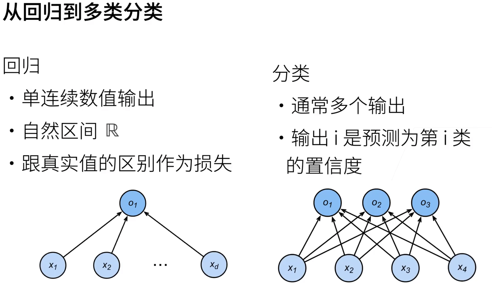

## 一. 什么是Softmax

### 1. 引入



我们首先要对分类问题有基本的认知，首先假设现在有三个类别，鸡鸭鹅，我们需要将若干禽类数据划分到三种类别下，这个时候我们通常使用”软性”类别，即得到属于每个类别的概率

表示鸡鸭鹅这种类别数据的一种简单方式是onehot编码，onehot编码将每个类别表示为一个向量，属于该类别的分量为1，否则为零，所以鸡鸭鹅可以表示为：

$$
y = \{\{1, 0, 0\}, \{0, 1, 0\}, \{0, 0, 1\}\}
$$

接下来有了目标输出，我们还想有一个网络架构来对其进行计算，这里假设我有一张禽类图片，然后从图片中提取出4个特征 $(x_1, x_2, x_3, x_4)$, 如上图所示，那么就可以将模型表示为如下的结构：

$$
\mathbf{o} = \mathbf{x} \cdot \mathbf{W} + \mathbf{b}
$$

其中 $\mathbf{W}$ 其实就是我们想要的权重，$\mathbf{b}$ 是偏置量。最后我们得到$\mathbf{o}$

可以看出，最后一步，如果我们想获得软性类别，就需要构建概率的分布，具体来说，就是将一个 $n$ 维的张量，转换维一个 $n$ 元的离散型概率分布。$softmax$ 就是一种通用的解决方案

### 2. 介绍

引入一个 $n$ 维的张量 $\mathbf{x} = [x_1, x_2, ... x_n] \in \mathbb{R}^n$ , 它的元素可正可负，没有限定上下界，$softmax$ 函数的基本定义如下：

$$
p_i = softmax(\mathbf{x})_i = \frac{e^{x_i}}{\sum_{j=1}^{n}{e^{x_j}}}
$$

其实从式子中，我们可以看出两点性质：

- 单调性：$p_i > p_j \Longleftrightarrow x_i > x_j$ , $<$ 同理
- 不变性：$softmax(\mathbf{x}) = softmax(\mathbf{x} + c)\ \ \  \forall c \in \mathbb{R}$

可以看出，$softmax$ 将某层的输出，映射为 $(0, 1)$ 的值，这些值累加为1，满足概率的性质，这样便构建了概率分布，可以解决单标签多分类问题。

### 3. 梯度计算

在深度学习中，了解一个函数的性质最重要的方式之一就是了解它的梯度，对于 $softmax$ , 我们可以计算一下它的梯度，首先它的输入是一个 $n$ 维张量 $\mathbf{x}$, 输出也是一个 $n$ 维张量 $softmax(\mathbf{x})$ , 那么我们求梯度的过程其实是对其求偏导，这样最后梯度的形态应该是一个 $Jacobian$ 矩阵的形式。

我们首先进行推导：

- 对于 $i = j$ , 即对角线的情况：

$$
\begin{aligned}
&\frac{\partial p_i}{\partial x_j} \\
=\  &\frac{\partial}{\partial x_i} \frac{e^{x_i}}{\sum_{k=1}^{n}{e^{x_k}}} \\
=\  &\frac{e^{x_i}\sum_{k=1}^{n}{e^{x_k}} - e^{2x_i}}{(\sum_{k=1}^{n}{e^{x_k}})^2} \\
=\  &\frac{e^{x_i}}{\sum_{k=1}^{n}{e^{x_k}}} - (\frac{e^{x_i}}{\sum_{k=1}^{n}{e^{x_k}}})^2 \\
=\  &p_i - p_i^{2}
\end{aligned}
$$

- 对于 $i \neq j$:

$$
\begin{aligned}
&\frac{\partial p_i}{\partial x_j} \\
=\  &\frac{\partial}{\partial x_j} \frac{e^{x_i}}{\sum_{k=1}^{n}{e^{x_k}}} \\
=\  &\frac{0 \cdot \sum_{k=1}^{n}{e^{x_k}} - e^{x_i + x_j}}{(\sum_{k=1}^{n}{e^{x_k}})^2} \\
=\  &-\frac{e^{x_i}}{\sum_{k=1}^{n}{e^{x_k}}} \cdot \frac{e^{x_j}}{\sum_{k=1}^{n}{e^{x_k}}} \\
=\  &-p_ip_j
\end{aligned}
$$

总结来说，$softmax$ 的梯度为：

$$
\frac{\partial p_i}{\partial x_j} = p_i \delta_{i,j} - p_i p_j =
\begin{cases}
p_i - p_i^2, & i = j \\
-p_i p_j, & i \neq j
\end{cases}
$$

它的 $L1$ 范数有一个简单的形式

$$
\frac{1}{2} \left\| \frac{\partial p}{\partial x} \right\|_1 = \frac{1}{2} \sum_{i,j} \left| \frac{\partial p_i}{\partial x_j} \right|
= \frac{1}{2} \sum_i (p_i - p_i^2) + \frac{1}{2} \sum_{i \neq j} p_i p_j = 1 - \sum_i p_i^2
$$

这说明如果 $\mathbf{p}$ 接近 one hot 分布的时候，梯度消失现象会很严重

### 4. 损失函数

$softmax$ 为模型函数，一般作为神经网络的一层，将输出映射为概率分布，用来构建单标签多分类任务的输出，即假设有一个 $n$ 分类任务，$\mathbf{x}$ 为模型的输入，那么我们希望通过 $\mathbf{p} = softmax(\mathbf{x})$ 来预测每个类的概率。

对于模型的训练，我们需要一个损失函数 $loss$, 来使用梯度下降方法训练模型？

这里介绍一种损失函数：交叉熵函数，形式如下：

$$
Loss(\mathbf{x}) = -\sum_{i = 1}^{n}y_i \cdot lnp_i
$$

如果我们目标类别是 $t$, 我们可以将 $y_t$ 置为1，其他全部置为0, 这样 $loss$ 函数变为:

$$
Loss(\mathbf{x}) = -lnp_t
$$

我们可以求得它的梯度：

$$
-\frac{\partial ln p_t}{\partial x_j} = p_j - \delta_{t, j} =
\begin{cases}
p_j - 1\ \ \ j = t \\
p_j\ \ \ \ \ \ \ \ \ \ j \neq t
\end{cases}
$$

这里可以发现，$\delta_{t, j}$ 其实实际上表达的就是 onehot 分布，所以上式又可以表达为

$$
\frac{\partial Loss(\mathbf{x})}{\partial \mathbf{x}} = \mathbf{p} - onehot(t)
$$

也就是说，它的梯度正好是目标分布与预测分布之差，只要两者不相等，那么梯度会一直存在，而我们梯度下降的方式也很简单：目标类别 $p_t$ 减一，其余不变

## 二. 从零实现Softmax回归

1. 定义模型参数：

仍然使用小批次训练的方式，这里`num_outputs=10`, 代表一次训练十张图片。另外图片是一个二维像素点矩阵，我们输入需要为一个向量，所以为了简单，这里直接将图片展平，长度为784

回到我们一开始的模型公式，可以知道$\mathbf{W} \in \mathbb{R}^{784 * 10}$, 10为类别数目，$\mathbf{b} \in \mathbb{R}^{10 * 10}$

```python
num_inputs = 784
num_outputs = 10

W = torch.normal(0, 0.01, size=(num_inputs, num_outputs), requires_grad=True)
b = torch.zeros(num_outputs, requires_grad=True)
```

2. 实现softmax操作：

利用torch的按维度求和（因为一次训练多条数据），以及广播机制，我们可以实现如下softmax函数

```python
def softmax(X):
    X_exp = torch.exp(X)
    return X_exp / X_exp.sum(dim=1, keepdim=True)
```

按行求和，然后每行都除以它对应行的和

3. 定义模型以及损失函数：

模型其实就是开头的公式，损失函数这里采取上文所述的交叉熵

```python
# 模型代码，先将输入的参数reshape一下
def net(X):
    return softmax(torch.matmul(X.reshape((-1, W.shape[0])), W) + b)

def cross_entropy(y_hat, y):
    return -torch.log(y_hat[range(len(y_hat)), y])
```

这里的`y_hat` 其实是模型的输出，对于每行数据都是采用onehot编码的结果，而`y`是标准答案，对于每个数据，只有唯一的标签，这样我们就可以将所有的答案输出概率select出来

4. 分类精度

TODO: 有时间再完善实现的笔记，代码目前如下

```python
from IPython import display
import torch
from d2l import torch as d2l

batch_size = 256
train_iter, test_iter = d2l.load_data_fashion_mnist(batch_size)

num_inputs = 784
num_outputs = 10

W = torch.normal(0, 0.01, size=(num_inputs, num_outputs), requires_grad=True)
b = torch.zeros(num_outputs, requires_grad=True)

# 测试数据
y = torch.tensor([0, 2])
y_hat = torch.tensor([[0.1, 0.3, 0.6], [0.3, 0.2, 0.5]])


def softmax(X: torch.Tensor) -> torch.Tensor:
    """softmax函数"""
    X_exp = torch.exp(X)
    return X_exp / X_exp.sum(dim=1, keepdim=True)

def net(X: torch.Tensor) -> torch.Tensor:
    """模型网络"""
    return softmax(torch.matmul(X.reshape((-1, W.shape[0])), W) + b)

def cross_entropy(y_hat: torch.Tensor, y: torch.Tensor) -> torch.Tensor:
    """交叉熵"""
    return -torch.log(y_hat[range(len(y_hat)), y])


def accuracy(y_hat: torch.Tensor, y: torch.Tensor) -> float:
    """计算预测正确的数量"""
    if len(y_hat.shape) > 1 and y_hat.shape[1] > 1:
        y_hat = y_hat.argmax(axis=1)

    cmp = y_hat.type(y.dtype) == y
    return float(cmp.type(y.dtype).sum())

class Accumulator:  #@save
    """在n个变量上累加"""
    def __init__(self, n):
        self.data = [0.0] * n

    def add(self, *args):
        self.data = [a + float(b) for a, b in zip(self.data, args)]

    def reset(self):
        self.data = [0.0] * len(self.data)

    def __getitem__(self, idx):
        return self.data[idx]

def evaluate_accuracy(net, data_iter):
    if isinstance(net, torch.nn.Module):
        net.eval()

    metric = Accumulator(2)
    with torch.no_grad():
        for X, y in data_iter:
            metric.add(accuracy(net(X), y), y.numel())
    return metric[0] / metric[1]
```
