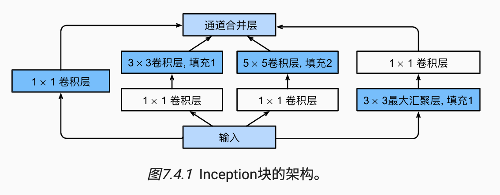

这一章主要是讲一些现代设计的卷积神经网络模型以及一些技术，这可以为我们的设计提供参考。

## 一. AlexNet

## 二. VGG

```python
# 生成VGG块，VGG以块为一个单元
def vgg_block(num_convs, in_channels: int, out_channels: int) -> nn.Sequential:
    layers: List[nn.Module] = []
    for _ in range(num_convs):
        layers.append(
            nn.Conv2d(
                in_channels=in_channels,
                out_channels=out_channels,
                kernel_size=3,
                padding=1
            )
        )
        layers.append(nn.ReLU())
        in_channels = out_channels
    layers.append(nn.MaxPool2d(kernel_size=2, stride=2))
    return nn.Sequential(*layers)


# VGG网络的超参数，定义块的数量和通道
conv_arch = [(1, 64), (1, 128), (2, 256), (2, 512), (2, 512)]


# 生成VGG网络
def vgg(conv_arch: List[Tuple[int, int]]) -> nn.Sequential:
    conv_blocks = []
    in_channels = 1
    for (num_convs, out_channels) in conv_arch:
        conv_blocks.append(vgg_block(num_convs, in_channels, out_channels))
        in_channels = out_channels

    return nn.Sequential(
        *conv_blocks, nn.Flatten(),
        nn.Linear(out_channels * 7 * 7, 4096), nn.ReLU(), nn.Dropout(0.5),
        nn.Linear(4096, 4096), nn.ReLU(), nn.Dropout(0.5),
        nn.Linear(4096, 10)
    )
```

训练网络：

```python
# 缩小一下通道数
ratio = 4
small_conv_arch = [(pair[0], pair[1] // ratio) for pair in conv_arch]

# 生成VGG网络
net = vgg(small_conv_arch)

# 定义学习率，迭代次数和批次
lr, num_epochs, batch_size = 0.05, 10, 128
train_iter, test_iter = d2l.load_data_fashion_mnist(batch_size, resize=224)
d2l.train_ch6(net, train_iter, test_iter, num_epochs, lr, d2l.try_gpu())
```

## 三. NiN

```python
def nin_block(
        in_channels: int,
        out_channels: int,
        kernel_size: int,
        strides: int,
        padding: int
) -> nn.Sequential:
    return nn.Sequential(
        nn.Conv2d(in_channels, out_channels, kernel_size, strides, padding),
        nn.ReLU(),
        nn.Conv2d(out_channels, out_channels, kernel_size=1), nn.ReLU(),
        nn.Conv2d(out_channels, out_channels, kernel_size=1), nn.ReLU(),
    )

net = nn.Sequential(
    nin_block(1, 96, kernel_size=11, strides=4, padding=0),
    nn.MaxPool2d(3, stride=2),
    nin_block(96, 256, kernel_size=5, strides=1, padding=2),
    nn.MaxPool2d(3, stride=2),
    nn.Dropout(0.5),
    nin_block(384, 10, kernel_size=3, strides=1, padding=1),
    nn.AdaptiveAvgPool2d((1, 1)),
    nn.Flatten()
)
```

## 四. GoogLeNet



```python
class Inception(nn.Module):
    def __init__(self, in_channels, c1, c2, c3, c4):
        super(Inception, self).__init__()
        self.conv1 = nn.Conv2d(in_channels, c1, kernel_size=1)
        self.conv2 = nn.Sequential(
            nn.Conv2d(in_channels, c2[0], kernel_size=1), nn.ReLU(),
            nn.Conv2d(c2[0], c2[1], kernel_size=3, padding=1), nn.ReLU()
        )
        self.conv3 = nn.Sequential(
            nn.Conv2d(in_channels, c3[0], kernel_size=1), nn.ReLU(),
            nn.Conv2d(c3[0], c3[1], kernel_size=5, padding=2), nn.ReLU()
        )
        self.conv4 = nn.Sequential(
            nn.MaxPool2d(kernel_size=3, stride=1, padding=1),
            nn.Conv2d(in_channels, c4, kernel_size=1), nn.ReLU(),
        )

    def forward(self, X):
        return torch.cat(
            (
                self.conv1(X),
                self.conv2(X),
                self.conv3(X),
                self.conv4(X),
            ),
            dim=1
        )


class GoogleNet(nn.Module):
    def __init__(self, in_channels, classes):
        super(GoogleNet, self).__init__()
        self.model = nn.Sequential(
            nn.Conv2d(in_channels, out_channels=64, kernel_size=7, stride=2, padding=3), nn.ReLU(),
            nn.MaxPool2d(kernel_size=3, stride=2),
            nn.Conv2d(in_channels=64, out_channels=64, kernel_size=1), nn.ReLU(),
            nn.Conv2d(in_channels=64, out_channels=192, kernel_size=3, padding=1), nn.ReLU(),
            nn.MaxPool2d(kernel_size=3, stride=2),
            Inception(192, c1=64, c2=[96, 128], c3=[16, 32], c4=32),
            Inception(256, c1=128, c2=[128, 192], c3=[32, 96], c4=64),
            nn.MaxPool2d(kernel_size=3, stride=2, padding=1),
            Inception(480, c1=192, c2=[96, 208], c3=[16, 48], c4=64),
            Inception(512, c1=160, c2=[112, 224], c3=[24, 64], c4=64),
            Inception(512, c1=128, c2=[128, 256], c3=[24, 64], c4=64),
            Inception(512, c1=112, c2=[144, 288], c3=[32, 64], c4=64),
            Inception(528, c1=256, c2=[160, 320], c3=[32, 128], c4=128),
            nn.MaxPool2d(kernel_size=3, stride=2, padding=1),
            Inception(832, c1=256, c2=[160, 320], c3=[32, 128], c4=128),
            Inception(832, c1=384, c2=[192, 384], c3=[48, 128], c4=128),
            nn.AvgPool2d(kernel_size=7, stride=1),
            nn.Dropout(p=0.4),
            nn.Flatten(),
            nn.Linear(1024, classes),
            nn.Softmax(dim=1)
        )

    def forward(self, X: torch.tensor):
        for layer in self.model:
            X = layer(X)
            print(layer.__class__.__name__, 'output shape:', X.shape)
```

## 五. Batch Normalization

批量规范化是一种流行且有效的技术，可以用来持续加速深层网络的收敛速度

```python
def batch_norm(
        X: torch.Tensor,
        gamma: nn.Parameter,
        beta: nn.Parameter,
        moving_mean: torch.Tensor,
        moving_var: torch.Tensor,
        eps: float,
        momentum: float
) -> Tuple[torch.Tensor, torch.Tensor, torch.Tensor]:
    if not torch.is_grad_enabled():
        # 预测模式，直接使用传入的移动平均所得的均值和方差
        X_hat = (X - moving_mean) / torch.sqrt(moving_var + eps)
    else:
        # 训练模式
        assert len(X.shape) in (2, 4)
        if len(X.shape) == 2:
            # 全连接层, 计算特征维度上的均值和方差
            mean = X.mean(dim=0)
            var = ((X - mean) ** 2).mean(dim=0)
        else:
            # 卷积层，计算通道维度上的均值和方差
            mean = X.mean(dim=(0, 2, 3), keepdim=True)
            var = ((X - mean) ** 2).mean(dim=(0, 2, 3), keepdim=True)
        # 训练模式下，用当前的均值和方差做标准化
        X_hat = (X - mean) / torch.sqrt(var + eps)
        # 更新移动平均的均值和方差
        moving_mean = momentum * moving_mean + (1.0 - momentum) * mean
        moving_var = momentum * moving_var + (1.0 - momentum) * var
    Y = gamma * X_hat + beta
    return Y, moving_mean.data, moving_var.data


class BatchNorm(nn.Module):
    # num_features：完全连接层的输出数量或卷积层的输出通道数。
    # num_dims：2表示完全连接层，4表示卷积层
    def __init__(self, num_features, num_dims):
        super().__init__()
        if num_dims == 2:
            shape = (1, num_features)
        else:
            shape = (1, num_features, 1, 1)
        # 参与求梯度和迭代的拉伸和偏移参数，分别初始化成1和0
        self.gamma = nn.Parameter(torch.ones(shape))
        self.beta = nn.Parameter(torch.zeros(shape))
        # 非模型参数的变量初始化为0和1
        self.moving_mean = torch.zeros(shape)
        self.moving_var = torch.ones(shape)

    def forward(self, X):
        # 如果X不在内存上，将moving_mean和moving_var
        # 复制到X所在显存上
        if self.moving_mean.device != X.device:
            self.moving_mean = self.moving_mean.to(X.device)
            self.moving_var = self.moving_var.to(X.device)
        # 保存更新过的moving_mean和moving_var
        Y, self.moving_mean, self.moving_var = batch_norm(
            X, self.gamma, self.beta, self.moving_mean,
            self.moving_var, eps=1e-5, momentum=0.9)
        return Y

```

## 六. ResNet
