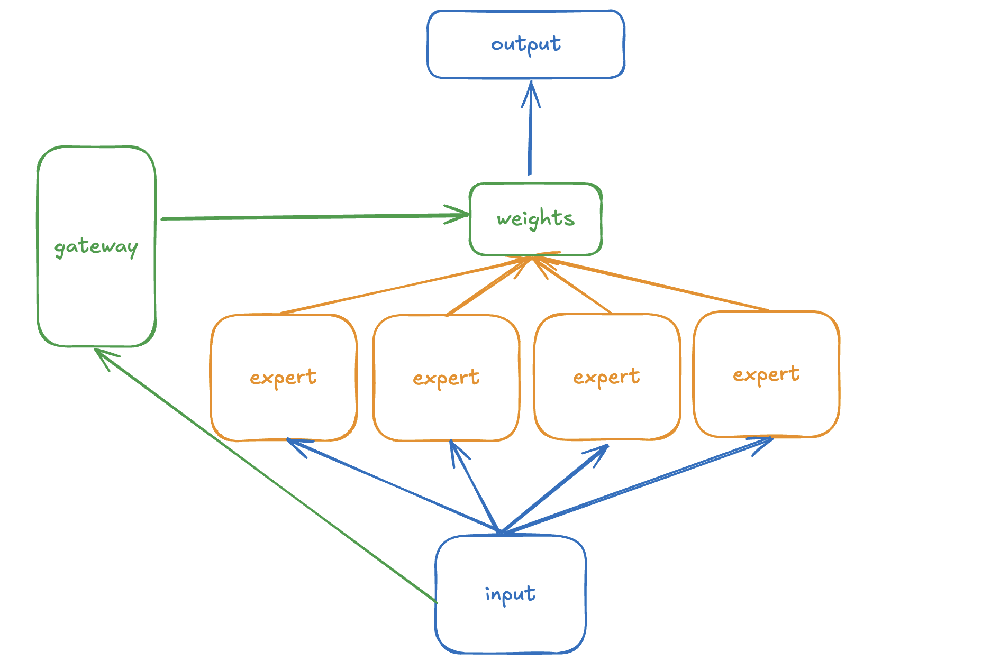

## 一. Basic MoE

较为简单，input流向所有的expert，所有的expert给出自己的答案，然后通过gateway决定
每个expert的权重，之后加权求和之后得到输出



```python
import torch
from torch import nn


class BasicExpert(nn.Module):
    """
    a basic expert can be a linear
    x shape is (batch_size, seq_length, feature_in)
    trans into (bath_size, seq_length, feature_out)
    """
    def __init__(self, feature_in, feature_out):
        super().__init__()
        self.linear = nn.Linear(feature_in, feature_out)

    def forward(self, x):
        return self.linear(x)


class BaseMoE(nn.Module):
    def __init__(self, feature_in, feature_out, expert_number):
        super().__init__()
        self.experts = nn.ModuleList(
            BasicExpert(
                feature_in,
                feature_out
            ) for _ in range(expert_number)
        )
        # determine the weights of experts
        self.gate = nn.Linear(feature_in, expert_number)

    def forward(self, x):
        # x shape: (batch_size, seq_length, feature_in)
        expert_weights = self.gate(x)
        expert_out_list = [
            expert(x).unsqueeze(2) for expert in self.experts
        ] # shape is (batch_size, seq_length, 1, feature_out)

        # shape is (batch_size, seq_length, expert_number, feature_out)
        expert_output = torch.cat(expert_out_list, dim=2)

        # shape is (batch_size, seq_length, 1, expert_number)
        expert_weights = expert_weights.unsqueeze(2)

        # shape is (batch_size, seq_length, 1, feature_out)
        output = expert_weights @ expert_output
        return output.squeeze(2)

if __name__ == "__main__":
    x = torch.rand(2, 10, 512)

    basic_moe = BaseMoE(feature_in=512, feature_out=128, expert_number=2)
    out = basic_moe(x)
    print(out.shape) # x shape is (2, 10, 128)

```
