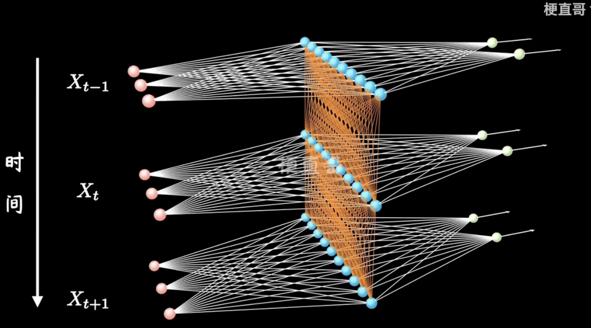
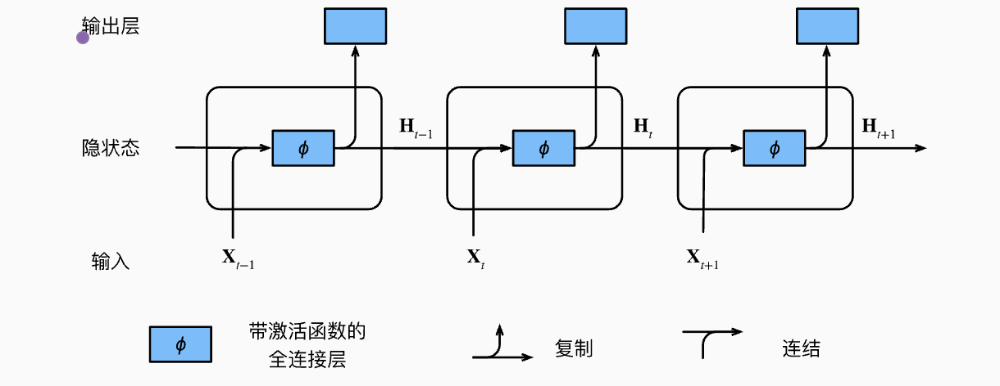

## 一. RNN引入

### 1. 简介

RNN的引入是为了解决序列信息引入的模型架构。在上文中，对于表格数据我们可以使用全
连接层来拟合，对于图像数据，我们使用卷积神经网络来提取图像的空间特征，但是对于表
格和图像数据，其实他们的样本之间都遵循着某种分布，且相互独立。

然而，大多数的数据并非如此。 例如，文章中的单词是按顺序写的，如果顺序被随机地重
排，就很难理解文章原始的意思。 同样，视频中的图像帧、对话中的音频信号以及网站上
的浏览行为都是有顺序的。 因此，针对此类数据而设计特定模型，可能效果会更好。

### 2. 马尔科夫模型

想象一下，我们现在有一连串随时间变化的股票数据：


其中，用 $x_t$ 表示第 $t$ 天的价格，作为一个股票预测员，想要预测股票所能依靠的信
息只有 $x_{1} - x_{t-1}$ 的数据, 也就是说，可以通过以下途径来预测：

$$
x_t \sim P(x_t \mid x_{t-1}, \ldots, x_1).
$$

我们预测的其实是一个概率！

这里如果尝试使用全连接来拟合数据，会发现我们的输入其实是在不断变大的，输入不固定
的情况下我们可以有以下两种策略：

- 我们只需要观测从 $t$ 开始向前 $\tau$ 个时间点跨度，之外的时间点我们认为其实是
  没有很大必要的，这样的话我们可以固定训练的参数数量，这叫 **自回归模型**
- 设 $h_{t}$ 是从 $1 \sim t$ 的数据中保留的特征，那么我们每次预测 $x_t$ 只需要依
  赖于 $h_t$, 对于$h_t$ 的更新我们可以递推地使用 $h_t = g(h_{t-1}, x_{t-1})$ ,
  由于 $h$ 自始至终没有出现过，类似于隐藏层，所以这被称为 **隐变量自回归模型**

我们现在解决了如何预测的问题，现在有一个常见的假设：假定序列的动力学不变，也就是
序列其实总是满足某个潜在的规律，那么这样的话整个序列的估计值都将通过以下的方式获
得：

$$
P(x_1, x_2, \ldots x_t) = \prod_{t = 1}^{T}{P(x_t \mid x_{t-1}, \ldots, x_1)}
$$

我们找到了生成一串序列的方法

接下来我们正式介绍一下马尔科夫条件：在自回归模型中，只要我们能够找到一个时间跨度
$\tau$ 使得其近似正确，那么我们就称这个序列满足马尔科夫条件，称之为 $\tau$ 阶马
尔科夫模型，特殊的，一阶马尔科夫模型如下：

$$
P(x_1, \ldots, x_T) = \prod_{t=1}^T P(x_t \mid x_{t-1}) \ \
\text{when } P(x_1 \mid x_0) = P(x_1).
$$

当 $x_t$ 是离散值时，我们可以使用动态规划来精确地计算结果，例如
$P(x_{t+1} \mid x_{t-1})$:

$$
P(x_{t+1} \mid x_{t-1}) = \frac{\sum_{x_t} P(x_{t+1}, x_t, x_{t-1})}{P(x_{t-1})}
= \frac{\sum_{x_t} P(x_{t+1} \mid x_t, x_{t-1}) P(x_t, x_{t-1})}{P(x_{t-1})}
= \sum_{x_t} P(x_{t+1} \mid x_t) P(x_t \mid x_{t-1})
$$

假如说一个序列满足一阶马尔科夫模型，那么我们就可以观察很短的一个历史，就可以计算
下去，这是一种很好的性质。

接下来我们实践一下

```python
# 生成时间序列数据，采用的是正弦波+一个随机噪声
T = 1000
time = torch.arange(1, T + 1, dtype=torch.float32)
x = torch.sin(0.01 * time) + torch.normal(0, 0.02, size=(T,))

# 类似滑动窗口，将过去四个时间点作为数据，来预测下一个时间点的值
tau = 4
features = torch.zeros((T - tau, tau))
for i in range(tau):
    features[:, i] = x[i: T - tau + i]
labels = x[tau:].reshape((-1, 1))

# 批量导入数据
batch_size, n_train = 16, 600
train_iter = d2l.load_array((features[:n_train], labels[:n_train]), batch_size, is_train=True)

# 初始化模型的权重，设计模型
def init_weights(m):
    if type(m) == nn.Linear:
        nn.init.xavier_uniform_(m.weight)


def get_net():
    net = nn.Sequential(
        nn.Linear(4, 10),
        nn.ReLU(),
        nn.Linear(10, 1)
    )
    net.apply(init_weights)
    return net

# 这里采用均方损失
loss = nn.MSELoss(reduction='none')

def train(net, train_iter, loss, epochs, lr):
    trainer = torch.optim.Adam(net.parameters(), lr)
    for epoch in range(epochs):
        for X, y in train_iter:
            trainer.zero_grad()
            l = loss(net(X), y)
            l.sum().backward()
            trainer.step()
        print(f'epoch {epoch + 1}, '
              f'loss: {d2l.evaluate_loss(net, train_iter, loss):f}')

net = get_net()
train(net, train_iter, loss, 5, 0.01)

```

我们可以发现，单步预测效果不错，但是如果我们持续预测下去，就会发现我们需要使用自
己预测出来的数据来预测，这样就会使得偏差越来越大。所以全连接层这种模型可能不符合
我们的预期，我们需要更好的模型

### 3. 文本预处理

对于训练来说，最重要的一步就是准备数据，我们这里探讨一下如何处理序列数据，以便我
们更好的训练模型。这里我们处理数据简单分为以下步骤：

- 将文本作为字符串加载到内存中。

- 将字符串拆分为词元（如单词和字符）。

- 建立一个词表，将拆分的词元映射到数字索引。

- 将文本转换为数字索引序列，方便模型操作。

这就是我们熟知的分词操作：（tokenizer）

首先我们读取数据集，这里仍然使用d2l的库

```python
from random import random
from typing import List, Tuple, Iterator

import torch
import collections
import re
from torch import nn
from d2l import torch as d2l

from torch.nn import functional as F

# -------------------
# 读取语料库
d2l.DATA_HUB['time_machine'] = (d2l.DATA_URL + 'timemachine.txt',
                                '090b5e7e70c295757f55df93cb0a180b9691891a')


def read_time_machine():
    with open(d2l.download('time_machine'), 'r') as f:
        lines = f.readlines()
    return [re.sub('[^A-Za-z]+', ' ', line).strip().lower() for line in lines]


lines = read_time_machine()

```

接下来是进行词元分割，也就是将一段段话分割为更小的单元，这个单元可以是字符单元，
也可以是单词单元，这里只实现这两种简单的词元分割。

```python
def tokenize(lines, token='word'):
    if token == 'word':
        return [line.split() for line in lines]
    elif token == 'char':
        return [list(line) for line in lines]
    else:
        print(f'错误，未知词元类型：' + token)


# tokens = tokenize(lines)
# for i in range(11):
#     print(tokens[i])
#
```

词元的本质就是一个个字符 or 字符串，而模型需要的输入是数字，因此这种类型不方便模
型使用，这里我们可以构建一个词表，将词元映射为数字，我们首先可以统计不同的词元数
目，然后对每个单词按照出现频率排序，之后逐一分配下标，我们还可以分配一些索引给未
知或者已删除的词元。

```python
class Vocab:  #@save
    """文本词表"""

    def __init__(self, tokens=None, min_freq=0, reserved_tokens=None):
        if tokens is None:
            tokens = []
        if reserved_tokens is None:
            reserved_tokens = []
        # 按出现频率排序
        counter = count_corpus(tokens)
        self._token_freqs = sorted(counter.items(), key=lambda x: x[1],
                                   reverse=True)
        # 未知词元的索引为0
        self.idx_to_token = ['<unk>'] + reserved_tokens
        self.token_to_idx = {token: idx
                             for idx, token in enumerate(self.idx_to_token)}
        for token, freq in self._token_freqs:
            if freq < min_freq:
                break
            if token not in self.token_to_idx:
                self.idx_to_token.append(token)
                self.token_to_idx[token] = len(self.idx_to_token) - 1

    def __len__(self):
        return len(self.idx_to_token)

    def __getitem__(self, tokens):
        if not isinstance(tokens, (list, tuple)):
            return self.token_to_idx.get(tokens, self.unk)
        return [self.__getitem__(token) for token in tokens]

    def to_tokens(self, indices):
        if not isinstance(indices, (list, tuple)):
            return self.idx_to_token[indices]
        return [self.idx_to_token[index] for index in indices]

    @property
    def unk(self):  # 未知词元的索引为0
        return 0

    @property
    def token_freqs(self):
        return self._token_freqs


def count_corpus(tokens):  #@save
    """统计词元的频率"""
    # 这里的tokens是1D列表或2D列表
    if len(tokens) == 0 or isinstance(tokens[0], list):
        # 将词元列表展平成一个列表
        tokens = [token for line in tokens for token in line]
    return collections.Counter(tokens)

```

接下来我们整合所有的功能为一个函数，这个函数会返回词元索引列表，以及词表，这里首
先为了简化之后的训练，我们选择字符词元化

```python
def load_corpus_time_machine(max_tokens=-1):
    lines = read_time_machine()
    tokens = tokenize(lines, 'char')
    vocab = Vocab(tokens)
    # 展平
    corpus = [vocab[token] for line in tokens for token in line]
    if max_tokens > 0:
        corpus = corpus[:max_tokens]
    return corpus, vocab

```

### 4. 语言模型

我们现在有了数据，接下来我们开始对其进行建模。首先，回到我们一开始提到的生成序列
的方法：

$$
P(x_1, x_2, \ldots x_t) = \prod_{t = 1}^{T}{P(x_t \mid x_{t-1}, \ldots, x_1)}
$$

举一个例子，如果我们想生成: `deep learning is fun`, 那么我们就需要不断地计算这样
的概率：

$$
P(deep, learning, is, fun) = P(deep)P(learning | deep)P(is | deep, learning)P(fun | deep, learning, is).
$$

为了训练语言模型，我们需要计算单词的概率，以及给定前面几个单词后，出现某个单词的
条件概率，这些概率本质上就是语言模型的参数。

该如何计算概率呢？首先我们的第一想法就是直接计算词元在语料库中出现的频率，但是这
样其实忽略了单词本来的意义，以及一些可以出现的短语，所以我们需要更有效的模型。

#### 齐普夫定律

我们引入一个关于词频的定律：齐普夫定律。也就是在自然语言中，第 $i$ 个最常用单词
的频率 $n_i$ 为：

$$
n_i \propto \frac{1}{i^\alpha}
$$

这个公式有一个前提，我们先将前面的常用词作为例外消除之后，剩余所有的单词大致遵循
双对数坐标图上的一条直线。

$$
\log n_i = -\alpha \log i + c,
$$

这是一个单词维度统计的频率，也被成为一元语法（一阶马尔科夫模型），但是通过实验发
现，多元语法也同样满足齐普夫定律。

### 5. 数据集随机采样

由于序列数据本质上是连续的，因此我们在处理数据时需要解决这个问题，那就是序列往往
很长，我们需要对其进行分割。这里介绍两种对序列进行分割的方法：

#### 随机采样

```python
def seq_data_iter_random(
        corpus: List[int],
        batch_size: int,
        num_steps: int
) -> Iterator[Tuple[torch.Tensor, torch.Tensor]]:
    """使用随机抽样生成一个小批量子序列"""
    # 从随机偏移量开始对序列进行分区，随机范围包括num_steps-1
    corpus = corpus[random.randint(0, num_steps - 1):]
    # 减去1，是因为我们需要考虑标签
    num_subseqs = (len(corpus) - 1) // num_steps
    # 长度为num_steps的子序列的起始索引
    initial_indices = list(range(0, num_subseqs * num_steps, num_steps))
    # 在随机抽样的迭代过程中，
    # 来自两个相邻的、随机的、小批量中的子序列不一定在原始序列上相邻
    random.shuffle(initial_indices)

    def data(pos):
        # 返回从pos位置开始的长度为num_steps的序列
        return corpus[pos: pos + num_steps]

    num_batches = num_subseqs // batch_size
    for i in range(0, batch_size * num_batches, batch_size):
        # 在这里，initial_indices包含子序列的随机起始索引
        initial_indices_per_batch = initial_indices[i: i + batch_size]
        X = [data(j) for j in initial_indices_per_batch]
        Y = [data(j + 1) for j in initial_indices_per_batch]
        yield torch.tensor(X), torch.tensor(Y)

```

#### 顺序分区

```python
def seq_data_iter_sequential(
        corpus: List[int],
        batch_size: int,
        num_steps: int
) -> Iterator[Tuple[torch.Tensor, torch.Tensor]]:
    """使用顺序分区生成一个小批量子序列"""
    # 从随机偏移量开始划分序列
    offset = random.randint(0, num_steps)
    num_tokens = ((len(corpus) - offset - 1) // batch_size) * batch_size
    Xs = torch.tensor(corpus[offset: offset + num_tokens])
    Ys = torch.tensor(corpus[offset + 1: offset + 1 + num_tokens])
    Xs, Ys = Xs.reshape(batch_size, -1), Ys.reshape(batch_size, -1)
    num_batches = Xs.shape[1] // num_steps
    for i in range(0, num_steps * num_batches, num_steps):
        X = Xs[:, i: i + num_steps]
        Y = Ys[:, i: i + num_steps]
        yield X, Y

```

通过以上两种方式，我们写出一个加载序列数据的迭代器，用来不断地返回训练数据

```python
class SeqDataLoader:
    """加载序列数据的迭代器"""

    def __init__(self, batch_size, num_steps, use_random_iter, max_tokens):
        if use_random_iter:
            self.data_iter_fn = seq_data_iter_random
        else:
            self.data_iter_fn = seq_data_iter_sequential
        self.corpus, self.vocab = load_corpus_time_machine(max_tokens)
        self.batch_size, self.num_steps = batch_size, num_steps

    def __iter__(self):
        return self.data_iter_fn(self.corpus, self.batch_size, self.num_steps)

```

## 二. RNN介绍

### 1. 原理

回顾一下我们引入过程中的马尔科夫模型，$n$ 阶马尔科夫模型又被称为 $n$ 元语法模
型，也就是我们第 $x_t$ 在时间步 $t$ 的条件概率仅取决于前面 $n - 1$ 个单词，对于
再往前的单词如果我们还想统计它们的影响的话，就得扩大 $n$ 来扩大语法模型，但是模
型的参数会指数增长，所以我们不妨使用隐变量模型

$$
P(x_t \mid x_{t-1}, \dots, x_1) \approx P(x_t \mid h_{t-1}),
$$

这里 $h_{t-1}$ 存储了从起始状态到 $t - 1$ 步的所有序列信息，这样我们就可以顾及到
前面所有的单词。隐变量一般使用递推式更新

$$
h_t = f(x_t, h_{t-1})
$$

#### 有隐状态的循环神经网络

这里首先定义输入小批量样本 $X \in R^{n \cdot d}$, 其中批量大小为 $n$ , 输入维度
为 $d$ , 隐藏层的输出为 $H \in R^{n \cdot h}$

我们首先看无隐状态的神经网络，那么我们一般这样计算

$$
H = \phi(XW_{dh} + b_h)
$$

其中 $W_{dh}$ 为隐藏层权重参数。然后再将隐藏层权重用为输出

$$
O = HW_{hq} + b_q
$$

其中，$q$ 为输出维度，$W_{hq}$ 为输出层的权重参数

那么我们增加了隐藏层状态该如何理解呢？这里我认为可以将二维的神经网络堆叠成三维，
第三维就是时间，我们沿着时间维度进行传播，每一维都是一个带有隐藏层的神经网络，而
每一维的隐藏层权重都需要上一维来更新



那么我们需要每一次保存前一个时间步的隐藏变量 $H_{t-1}$ , 并且引入一个新的权重
$W_{hh}$ 用来表示上一层到这一层的变化（如图中橙色映射关系），那么我们可以得到计
算公式

$$
H_{t} = \phi(X_tW_{dh} + H_{t-1}W_{hh} + b_h)
$$

我们可以看出，隐藏变量捕获并保留了序列直到当前时间步的历史信息，就如同当前时间步
下神经网络的状态和记忆一样，这种就被称之为隐状态（hidden state），这种计算就像不
断循环一样，所以被命名为循环神经网络。那么我们可以得知，对于时间步 $t$ 输出层的
数据可以写为

$$
O_t = H_tW_{hq} + b_q
$$



#### 设计字符级RNN模型

接下来我们设计一个语言模型，首先我们设定输入和输出，因为我们的目标是根据过去和当
前的词元预测下一个词元，那么我们的输出其实就是输入往后移一位，然后在训练过程中，
我们对每个时间步的输出层的输出进行softmax操作，然后利用交叉熵损失计算模型输出和
标签之间的误差，进而更新各个权重参数，就这样我们完成了权重的更新

#### 模型困惑度

我们需要一个手段来评估我们的模型生成的语言的质量，这里我们可以使用信息论，因为这
是一个很好的衡量“惊异度”的工具，因为我们模型生成的语言需要是更为符合语义，符合认
知的语言，所以一个更好的语言模型应该可以让我们更准确的预测下一个词元，因此，它应
该允许我们在压缩序列时花费更少的比特。 所以我们可以通过一个序列中所有的 $n$ 个词
元的交叉熵损失的平均值来衡量：

$$
\frac{1}{n} \sum_{t=1}^n -\log P\left(x_t \mid x_{t-1}, \ldots, x_1\right)
$$

其中 $P$ 由语言模型给出，$x_t$ 是时间步 $t$ 内观察到的实际词元

由于历史原因，这里我们其实有一个名为困惑度的量，是上述式子的指数形式

$$
\exp\left(-\frac{1}{n} \sum_{t=1}^n \log P\left(x_t \mid x_{t-1}, \ldots, x_1\right)\right).
$$

我们看一些边界情况来更好的理解上述式子

- 在最好的情况下，模型总是完美地估计标签词元的概率为1。 在这种情况下，模型的困惑
  度为1。

- 在最坏的情况下，模型总是预测标签词元的概率为0。 在这种情况下，困惑度是正无穷
  大。

- 在基线上，该模型的预测是词表的所有可用词元上的均匀分布。 在这种情况下，困惑度
  等于词表中唯一词元的数量。 事实上，如果我们在没有任何压缩的情况下存储序列， 这
  将是我们能做的最好的编码方式。 因此，这种方式提供了一个重要的上限， 而任何实际
  模型都必须超越这个上限。

### 2. 实现

首先准备数据, 这里我本人是使用mac本地训练，所以会尝试mps加速

```python
batch_size, num_steps = 32, 35
sq = SeqDataLoader(batch_size, num_steps, True, -1)
train_iter = sq.corpus
vocab = sq.vocab

def try_mps():
    device = 'mps' if torch.backends.mps.is_available() else 'cpu'
    return device
```

然后设置RNN中的各种权重

```python
def get_params(vocab_size: int, num_hiddens: int, device: str):
    num_inputs = num_outputs = vocab_size

    def normal(shape):
        return torch.randn(size=shape, device=device) * 0.01

    # 隐藏层参数
    W_xh = normal((num_inputs, num_hiddens))
    W_hh = normal((num_hiddens, num_hiddens))
    b_h = torch.zeros(num_hiddens, device=device)

    # 输出层参数
    W_hq = normal((num_hiddens, num_outputs))
    b_q = torch.zeros(num_outputs, device=device)

    # 附加梯度
    params = [W_xh, W_hh, b_h, W_hq, b_q]
    for param in params:
        param.requires_grad_(True)
    return params

```

接下来我们初始化RNN状态，也就是$H_0$, 这里我们初始化为全0张量

```python
def init_rnn_state(
        batch_size: int,
        num_hiddens: int,
        device: str
) -> Tuple[torch.Tensor]:
    """返回rnn的初始隐状态"""
    return (torch.zeros((batch_size, num_hiddens), device=device),)
```

定义RNN计算层，传入当前时间步的输入 $X_t$, 传入上一个隐状态 $H_{t-1}$ , 传入权重
和偏置参数 params 然后进行计算

这里需要重点讲解一下为什么会有一个for循环

回想一下，在`train_iter`中，每个词元其实都表示为一个数字索引，将这些索引直接输入
神经网络会导致没什么意义，结合我们的概率输出和softmax，我们可以想到独热编码，简
而言之，我们会将每个索引映射为互不相同的单位向量，假设词表的大小为 $N$ , 那么如
果某个词元为 $i$ , 我们将创建一个长度为 $N$ 的全0向量，并将第 $i$ 处元素置为1。

接下来，由于我们每次采样的小批量数据形状为二维张量：（批量大小，时间步
数）。onehot会将这个二维张量转化为三维张量，张量最后一个维度为词表大小 $N$ , 但
是为了处理方便，我们经常转换输入的维度，变为（时间步数，批量大小，词表大小），这
样我们可以方便的迭代外围时间步数，然后一步一步更新小批量数据的隐状态。

```python
def rnn(inputs, state, params):
    W_xh, W_hh, b_h, W_hq, b_q = params
    H, = state
    outputs = []
    // 迭代时间步数 t
    for X in inputs:
        # 计算H_t，这里使用tanh作为激活函数
        H = torch.tanh(torch.mm(X, W_xh) + torch.mm(H, W_hh) + b_h)
        # 计算输出O_t
        Y = torch.mm(H, W_hq) + b_q
        outputs.append(Y)

    return torch.cat(outputs, dim=0), (H,)
```

最后我们组合在一起

```python
class RNNModelScratch:  #@save
    """从零开始实现的循环神经网络模型"""

    def __init__(
            self,
            vocab_size: int,
            num_hiddens: int,
            device: str,
            get_params,
            init_state,
            forward_fn
    ):
        self.vocab_size, self.num_hiddens = vocab_size, num_hiddens
        self.params = get_params(vocab_size, num_hiddens, device)
        self.init_state, self.forward_fn = init_state, forward_fn

    # 这里的目的就是转换输出形态，并且编为onehot
    def __call__(self, X, state):
        X = F.one_hot(X.T, self.vocab_size).type(torch.float32)
        return self.forward_fn(X, state, self.params)

    def begin_state(self, batch_size, device):
        return self.init_state(batch_size, self.num_hiddens, device)


num_hiddens = 512
net = RNNModelScratch(
    vocab_size=len(vocab),
    num_hiddens=num_hiddens,
    device=try_mps(),
    get_params=get_params,
    init_state=init_rnn_state,
    forward_fn=rnn
)

X = torch.arange(10).reshape((2, 5))
state = net.begin_state(X.shape[0], try_mps())
Y, new_state = net(X.to(try_mps()), state)

print(Y.shape)
```

我们可以看到输出的维度为: (时间步数 \* 批量大小，词表大小)，而隐状态形态保持不
变，为（批量大小，隐藏单元数）

#### 预测

让我们首先定义预测函数来生成`prefix`之后的新字符, 其中 `prefix` 是用户提供的一个
包含多个字符的字符串，在循环遍历`prefix`中的开始字符时，我们会不断地将隐状态传递
到下一个时间步，但是不生成任何输出，这被称为预热期(warm-up), 因为在此期间模型会
自我更新，但是不会进行预测，预热期结束之后，隐状态的值会更加适合预测。

```python
def predict_ch8(prefix, num_preds, net, vocab, device):  #@save
    """在prefix后面生成新字符"""
    state = net.begin_state(batch_size=1, device=device)
    outputs = [vocab[prefix[0]]]
    get_input = lambda: torch.tensor([outputs[-1]], device=device).reshape((1, 1))
    for y in prefix[1:]:  # 预热期
        _, state = net(get_input(), state)
        outputs.append(vocab[y])
    for _ in range(num_preds):  # 预测num_preds步
        y, state = net(get_input(), state)
        outputs.append(int(y.argmax(dim=1).reshape(1)))
    return ''.join([vocab.idx_to_token[i] for i in outputs])

print(predict_ch8('time traveller ', 10, net, vocab, try_mps()))
```

发现预测出来了奇怪的东西，这是因为我们的模型还没训练！

### 3. 梯度裁剪

TODO：这里不大懂，先照抄下来

不难发现，RNN在时间步过长的时候，仍然会出现梯度消失 or 梯度爆炸的现象，具体如
下：

我们首先回顾多层感知机的梯度消失是如何产生的，考虑一个具有 $n$ 个隐藏层的DNN，前
向传播的时候第 $i$ 个隐藏层的输出作为第 $i+1$ 个隐藏层的输入。

$$
H_n = \phi(W_nH_{n-1} + b_n) \\
O = W_{n+1}H_{n} + b_{n+1} \\
Loss = l(O, Y)
$$

反向传播的时候根据链式法则，可以发现会出现多个参数矩阵连乘的现象，这样的话就会出
现梯度爆炸或者梯度消失现象。这个时候我们就需要梯度裁剪来稳定地训练

$$
\mathbf{g} \leftarrow \min \left( 1, \frac{\theta}{\|\mathbf{g}\|} \right) \mathbf{g}.
$$

```python
def grad_clipping(net, theta):  #@save
    """裁剪梯度"""
    if isinstance(net, nn.Module):
        params = [p for p in net.parameters() if p.requires_grad]
    else:
        params = net.params
    norm = torch.sqrt(sum(torch.sum((p.grad ** 2)) for p in params))
    if norm > theta:
        for param in params:
            param.grad[:] *= theta / norm
```

### 4. 训练

这里简单追踪一下张量shape的变化便于理解

- 首先输入的X和目标Y，shape均为`(batch_size, num_steps)`

- 对于Y进行reshape操作，转置为 `(num_steps, batch_size)` 后展平，shape
  为`(num_steps * batch_size)`

- 进入rnn网络计算，输出的y_hat的shape为`(num_steps * batch_size, vocab_size)`

- 计算loss，对于输入的y_hat和y，计算交叉熵损失，然后再求平均值

- 反向传播，更新结果

```python
def train_epoch_ch8(net, train_iter, loss, updater, device, use_random_iter):
    """训练网络一个迭代周期"""
    state, timer = None, d2l.Timer()
    metric = d2l.Accumulator(2)  # 训练损失之和,词元数量
    for X, Y in train_iter:
        if state is None or use_random_iter:
            # 在第一次迭代或使用随机抽样时初始化state
            state = net.begin_state(batch_size=X.shape[0], device=device)
        else:
            if isinstance(net, nn.Module) and not isinstance(state, tuple):
                # state对于nn.GRU是个张量
                state.detach_()
            else:
                # state对于nn.LSTM或对于我们从零开始实现的模型是个张量
                for s in state:
                    s.detach_()
        y = Y.T.reshape(-1)
        X, y = X.to(device), y.to(device)
        y_hat, state = net(X, state)
        l = loss(y_hat, y.long()).mean()
        if isinstance(updater, torch.optim.Optimizer):
            updater.zero_grad()
            l.backward()
            grad_clipping(net, 1)
            updater.step()
        else:
            l.backward()
            grad_clipping(net, 1)
            # 因为已经调用了mean函数
            updater(batch_size=1)
        metric.add(l * y.numel(), y.numel())
    return math.exp(metric[0] / metric[1]), metric[1] / timer.stop()


def train_ch8(net, train_iter, vocab, lr, num_epochs, device,
              use_random_iter=False):
    """训练模型"""
    loss = nn.CrossEntropyLoss()
    animator = d2l.Animator(xlabel='epoch', ylabel='perplexity',
                            legend=['train'], xlim=[10, num_epochs])
    # 初始化
    if isinstance(net, nn.Module):
        updater = torch.optim.SGD(net.parameters(), lr)
    else:
        updater = lambda batch_size: d2l.sgd(net.params, lr, batch_size)
    predict = lambda prefix: predict_ch8(prefix, 50, net, vocab, device)
    # 训练和预测
    for epoch in range(num_epochs):
        ppl, speed = train_epoch_ch8(
            net, train_iter, loss, updater, device, use_random_iter)
        if (epoch + 1) % 10 == 0:
            print(predict('time traveller'))
            animator.add(epoch + 1, [ppl])
    print(f'困惑度 {ppl:.1f}, {speed:.1f} 词元/秒 {str(device)}')
    print(predict('time traveller'))
    print(predict('traveller'))
```

## 三. 现代RNN

### 1. 基本结构

```python
class RNNModel(nn.Module):
    """循环神经网络模型"""
    def __init__(self, rnn_layer, vocab_size, **kwargs):
        super(RNNModel, self).__init__(**kwargs)
        self.rnn = rnn_layer
        self.vocab_size = vocab_size
        self.num_hiddens = self.rnn.hidden_size
        # 如果RNN是双向的（之后将介绍），num_directions应该是2，否则应该是1
        if not self.rnn.bidirectional:
            self.num_directions = 1
            self.linear = nn.Linear(self.num_hiddens, self.vocab_size)
        else:
            self.num_directions = 2
            self.linear = nn.Linear(self.num_hiddens * 2, self.vocab_size)

    def forward(self, inputs, state):
        X = F.one_hot(inputs.T.long(), self.vocab_size)
        X = X.to(torch.float32)
        Y, state = self.rnn(X, state)
        # 首先将Y的形状改为(时间步数*批量大小,隐藏单元数)
        # 全连接层输出形状是(时间步数*批量大小,词表大小)。
        output = self.linear(Y.reshape((-1, Y.shape[-1])))
        return output, state

    def begin_state(self, device, batch_size=1):
        if not isinstance(self.rnn, nn.LSTM):
            # nn.GRU以张量作为隐状态
            return torch.zeros((self.num_directions * self.rnn.num_layers,
                                 batch_size, self.num_hiddens),
                                device=device)
        else:
            # nn.LSTM以元组作为隐状态
            return (torch.zeros((
                self.num_directions * self.rnn.num_layers,
                batch_size, self.num_hiddens), device=device),
                    torch.zeros((
                        self.num_directions * self.rnn.num_layers,
                        batch_size, self.num_hiddens), device=device))


```

### 2. encoder-decoder

指定一个长度可变的输入 $X$

```python
class Encoder(nn.Module):
    """编码器-解码器架构的基本编码器接口"""
    def __init__(self, **kwargs):
        super(Encoder, self).__init__(**kwargs)

    def forward(self, X, *args):

        raise NotImplementedError
```

```python
class Decoder(nn.Module):
    """编码器-解码器架构的基本解码器接口"""
    def __init__(self, **kwargs):
        super(Decoder, self).__init__(**kwargs)

    def init_state(self, enc_outputs, *args):
        raise NotImplementedError

    def forward(self, X, state):
        raise NotImplementedError
```

```python
class EncoderDecoder(nn.Module):
    """编码器-解码器架构的基类"""
    def __init__(self, encoder, decoder, **kwargs):
        super(EncoderDecoder, self).__init__(**kwargs)
        self.encoder = encoder
        self.decoder = decoder

    def forward(self, enc_X, dec_X, *args):
        enc_outputs = self.encoder(enc_X, *args)
        dec_state = self.decoder.init_state(enc_outputs, *args)
        return self.decoder(dec_X, dec_state)
```

### 3. seq2seq

上面我们介绍了encoder-decoder架构，用来解决变长输入输出问题，这里我们介绍一种
encoder-decoder的具体实现，那就是seq2seq模型，一句话简单概括，就是用encoder和
decoder都使用rnn来实现。

思路其实就是对于encoder，rnn的作用是根据输入来计算出隐状态，这个隐状态就是
encoder出来的固定状态。对于decoder来说，我们会将这个固定状态拿去投入另外一个
rnn，作为另外一个rnn的初始隐状态，接着将输入序列放入decoder中，借助初始的隐状
态，不断地生成答案。

具体来说，我们假如输入的 $X \in R^{n * d}$ , 代表`(batch_size, time_steps)`，那
么

- 首先会进入`embedding`, 转化为`(batch_size, time_steps, embed_size)`, 我们按照
  惯例将其permute一下，转化为`(time_steps, batch_size, embed_size)`

- 进入encoder rnn网络，获得一个输出output,
  为`(time_steps, batch_size, num_hiddens)`, 再获得一个隐变量state，
  为`(num_layers, batch_size, num_hiddens)`

- 进入decoder rnn网络，初始状态选择的是encoder输出的state，shape为
  `(num_layers, batch_size, num_hiddens)`，然后我们有个输入 $X'$, shape
  为`(batch_size, num_steps)`, 我们照例embedding一下并且permute一下，变为
  `(time_steps, batch_size, embed_size)`，对于encoder传入的state，我们只取最后一
  层，shape为`(batch_size, num_hiddens)`, 然后广播一下，变为
  `(time_steps, batch_size, num_hiddens)`，对其 $X$ 的shape，新的state记为
  state_new

- 我们将state_new和 $X$ 按照第二维拼接，变为新的X_new, shape
  为`(time_steps, batch_size, embed_size+num_hiddens)`, 这个时候传入decoder的rnn
  网络，输出照例为一个output和一个state，output的shape为
  `(batch_size, time_steps, vocab_size)`, 输出的state的shape为
  `(num_layers, batch_size, num_hiddens)`

- 这个时候output就是我们要的答案结果

```python
class Seq2SeqEncoder(Encoder):
    """用于序列到序列学习的循环神经网络编码器"""
    def __init__(self, vocab_size, embed_size, num_hiddens, num_layers,
                 dropout=0, **kwargs):
        super(Seq2SeqEncoder, self).__init__(**kwargs)
        # 嵌入层, 用来获得输入序列中每个词元的特征向量，比onehot更加精准
        self.embedding = nn.Embedding(vocab_size, embed_size)
        self.rnn = nn.GRU(embed_size, num_hiddens, num_layers,
                          dropout=dropout)

    def forward(self, X, *args):
        # 输出'X'的形状：(batch_size,num_steps,embed_size)
        X = self.embedding(X)
        # 在循环神经网络模型中，第一个轴对应于时间步
        X = X.permute(1, 0, 2)
        # 如果未提及状态，则默认为0
        output, state = self.rnn(X)
        # output的形状:(num_steps,batch_size,num_hiddens)
        # state的形状:(num_layers,batch_size,num_hiddens)
        return output, state

encoder = Seq2SeqEncoder(vocab_size=10, embed_size=8, num_hiddens=16,
                         num_layers=2)
# 以评估模式运行
encoder.eval()
X = torch.zeros((4, 7), dtype=torch.long)
output, state = encoder(X)
print(output.shape)

class Seq2SeqDecoder(Decoder):
    """用于序列到序列学习的循环神经网络解码器"""
    def __init__(self, vocab_size, embed_size, num_hiddens, num_layers,
                 dropout=0, **kwargs):
        super(Seq2SeqDecoder, self).__init__(**kwargs)
        self.embedding = nn.Embedding(vocab_size, embed_size)
        self.rnn = nn.GRU(embed_size + num_hiddens, num_hiddens, num_layers,
                          dropout=dropout)
        self.dense = nn.Linear(num_hiddens, vocab_size)

    def init_state(self, enc_outputs, *args):
        return enc_outputs[1]

    def forward(self, X, state):
        # 输出'X'的形状：(batch_size,num_steps,embed_size), permute之后会将step提到前面
        X = self.embedding(X).permute(1, 0, 2)
        # 广播context，使其具有与X相同的num_steps
        context = state[-1].repeat(X.shape[0], 1, 1)
        X_and_context = torch.cat((X, context), 2)
        output, state = self.rnn(X_and_context, state)
        output = self.dense(output).permute(1, 0, 2)
        # output的形状:(batch_size, num_steps, vocab_size)
        # state的形状:(num_layers, batch_size, num_hiddens)
        return output, state

decoder = Seq2SeqDecoder(vocab_size=10, embed_size=8, num_hiddens=16,
                         num_layers=2)
decoder.eval()
state = decoder.init_state(encoder(X))
output, state = decoder(X, state)
print(output.shape, state.shape)

```

#### 训练

对于训练的损失函数，还是使用交叉熵，但是我们需要做一些改进，

```python
def sequence_mask(X, valid_len, value=0):
    """在序列中屏蔽不相关的项"""
    maxlen = X.size(1) # 相当于X.shape[1]
    # 这里shape 从(maxlen) -> (1, maxlen), valid_len从(len) -> (len, 1)
    mask = torch.arange((maxlen), dtype=torch.float32,
                        device=X.device)[None, :] < valid_len[:, None]
    X[~mask] = value
    return X

class MaskedSoftmaxCELoss(nn.CrossEntropyLoss):
    """带遮蔽的softmax交叉熵损失函数"""
    # pred的形状：(batch_size,num_steps,vocab_size)
    # label的形状：(batch_size,num_steps)
    # valid_len的形状：(batch_size,)
    def forward(self, pred, label, valid_len):
        weights = torch.ones_like(label)
        weights = sequence_mask(weights, valid_len)
        self.reduction='none'
        unweighted_loss = super(MaskedSoftmaxCELoss, self).forward(
            pred.permute(0, 2, 1), label)
        weighted_loss = (unweighted_loss * weights).mean(dim=1)
        return weighted_loss

def train_seq2seq(net, data_iter, lr, num_epochs, tgt_vocab, device):
    """训练序列到序列模型"""
    def xavier_init_weights(m):
        if type(m) == nn.Linear:
            nn.init.xavier_uniform_(m.weight)
        if type(m) == nn.GRU:
            for param in m._flat_weights_names:
                if "weight" in param:
                    nn.init.xavier_uniform_(m._parameters[param])

    net.apply(xavier_init_weights)
    net.to(device)
    optimizer = torch.optim.Adam(net.parameters(), lr=lr)
    loss = MaskedSoftmaxCELoss()
    net.train()
    animator = d2l.Animator(xlabel='epoch', ylabel='loss',
                     xlim=[10, num_epochs])
    for epoch in range(num_epochs):
        timer = d2l.Timer()
        metric = d2l.Accumulator(2)  # 训练损失总和，词元数量
        for batch in data_iter:
            optimizer.zero_grad()
            X, X_valid_len, Y, Y_valid_len = [x.to(device) for x in batch]
            bos = torch.tensor([tgt_vocab['<bos>']] * Y.shape[0],
                          device=device).reshape(-1, 1)
            dec_input = torch.cat([bos, Y[:, :-1]], 1)  # 强制教学
            Y_hat, _ = net(X, dec_input, X_valid_len)
            l = loss(Y_hat, Y, Y_valid_len)
            l.sum().backward()      # 损失函数的标量进行“反向传播”
            d2l.grad_clipping(net, 1)
            num_tokens = Y_valid_len.sum()
            optimizer.step()
            with torch.no_grad():
                metric.add(l.sum(), num_tokens)
        if (epoch + 1) % 10 == 0:
            animator.add(epoch + 1, (metric[0] / metric[1],))
    print(f'loss {metric[0] / metric[1]:.3f}, {metric[1] / timer.stop():.1f} '
        f'tokens/sec on {str(device)}'
```

有一个问题：pred permute之后shape是(batch_size, vocab_size, num_steps) , label的
shape是(batch_size, num_steps) 这俩真可以算loss吗
