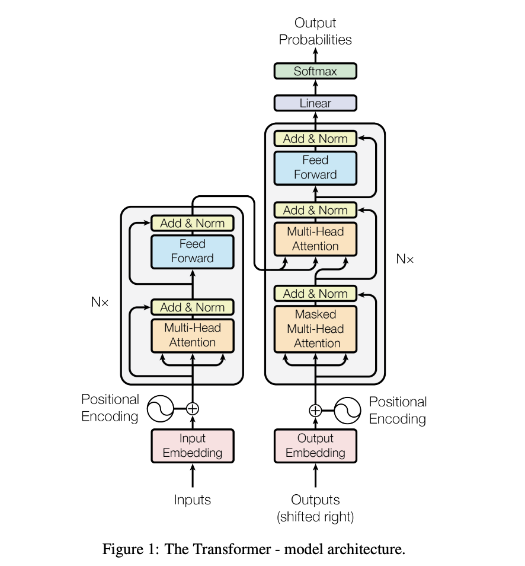

> Transformer是如此的重要，以至于我们需要单开一章来重点讲解

## 一. 模型架构



从宏观角度来看，Transformer的编码器是由多个相同的层叠加而成的，每个层都有两个子
层（子层表示为 sublayer）。第一个子层是多头自注意力（multi-head self-attention）
汇聚；第二个子层是基于位置的前馈网络（positionwise feed-forward network）。具体
来说，在计算编码器的自注意力时，查询、键和值都来自前一个编码器层的输出。受 7.6节
中残差网络的启发，每个子层都采用了**残差连接（residual connection）**。在
Transformer中，对于序列中任何位置的任何输入 $\mathbf{x} \in \mathbb{R}^{d}$ , 都
要求满足 $sublayer(\mathbf{x}) \in \mathbb{R}^{d}$，以便满足残差连接。在残差连接
的加法计算之后，紧接着应用层规范化（layer normalization）。因此，输入序列对应的
每个位置，Transformer编码器都将输出一个维表示向量。

Transformer解码器也是由多个相同的层叠加而成的，并且层中使用了残差连接和层规范
化。除了编码器中描述的两个子层之外，解码器还在这两个子层之间插入了第三个子层，称
为编码器－解码器注意力（encoder-decoder attention）层。在编码器－解码器注意力
中，查询来自前一个解码器层的输出，而键和值来自整个编码器的输出。在解码器自注意力
中，查询、键和值都来自上一个解码器层的输出。但是，解码器中的每个位置只能考虑该位
置之前的所有位置。这种掩蔽（masked）注意力保留了自回归（auto-regressive）属性，
确保预测仅依赖于已生成的输出词元。

具体的解析我放到另外一篇文章中，其中也包含了常见面试问题

[transformer论文解析](docs/notes/papers/transformer.md)

接下来我们分模块针对transformer的架构实现代码，具体原理的话，已经在上一章
attention机制中讲过了，这里就不过多赘述。

### 1. Multi-Head Attention

这里可以使用pytorch的批量矩阵乘法，实现多头但是只有一次矩阵乘法

```python
class MultiHeadAttention(nn.Module):
    def __init__(self, d_model, num_heads):
        super(MultiHeadAttention, self).__init__()
        # ensure that the model dimension (d_model)
        # is divisible by the number of heads
        assert d_model % num_heads == 0

        # initialize dimensions
        self.d_model = d_model # model's dimension
        self.num_heads = num_heads # number of heads
        self.d_k = d_model // num_heads # dimension of head's K, V, Q

        # linear layers for transforming input
        self.W_q = nn.Linear(d_model, d_model) # Q
        self.W_k = nn.Linear(d_model, d_model) # K
        self.W_v = nn.Linear(d_model, d_model) # V
        self.W_o = nn.Linear(d_model, d_model) # Output

    def scaled_dot_product_attention(self, Q, K, V, mask=None):
        # calculate attention scores,
        # transpose is used to swap the second-to-last and the last dimensions of a tensor
        attn_scores = torch.matmul(Q, K.transpose(-2, -1)) / math.sqrt(self.d_k)

        # apply mask if provided (useful for preventing attention to certain parts like padding)
        if mask is not None:
            # masked_fill support broadcasting
            attn_scores = attn_scores.masked_fill(mask, -1e9)

        # softmax is applied to obtain attention probabilities
        attn_probs = torch.softmax(attn_scores, dim=-1)

        # Multiply by values to obtain the final output
        output = torch.matmul(attn_probs, V)
        return output

    def split_heads(self, x):
        # reshape the input to have num_heads for multi-head attention
        # This method reshapes the input x into the shape (batch_size, num_heads, seq_length, d_k).
        batch_size, seq_length, d_model = x.size()
        return x.view(
            batch_size,
            seq_length,
            self.num_heads,
            self.d_k
        ).transpose(1, 2)

    def combine_heads(self, x):
        # reshape the input to have num_heads for multi-head attention
        # this method combines the results back into a single tensor of shape (batch_size, seq_length, d_model)
        batch_size, _, seq_length, d_k = x.size()
        return x.transpose(1, 2).contiguous().view(
            batch_size,
            seq_length,
            self.d_model
        )

    def forward(self, Q, K, V, mask=None):
        # Apply linear transformations and split heads
        Q = self.split_heads(self.W_q(Q))
        K = self.split_heads(self.W_k(K))
        V = self.split_heads(self.W_v(V))

        # Perform scaled dot product attention
        atten_output = self.scaled_dot_product_attention(Q, K, V, mask)

        # Combine heads and apply output transformation
        output = self.W_o(self.combine_heads(atten_output))
        return output

```

### 2. Position-wise Feed-Forward Networks

在基于位置的前馈网络中，我们会对multi-head attention的输出应用一层mlp

```python
# Position-wise Feed-Forward Networks
class PositionWiseFeedForward(nn.Module):
    """
    a normal MLP
    It helps in transforming the features learned by the attention mechanisms within the transformer,
    acting as an additional processing step for the attention outputs.
    """
    def __init__(self, d_model, d_ff):
        super(PositionWiseFeedForward, self).__init__()
        self.fc1 = nn.Linear(d_model, d_ff)
        self.fc2 = nn.Linear(d_ff, d_model)
        self.relu = nn.ReLU()

    def forward(self, x):
        return self.fc2(self.relu(self.fc1(x)))
```

### 3. Positional Encoding

```python
# Positional Encoding
class PositionalEncoding(nn.Module):
    """
    it is used to inject the position information of
    each token in th input sequence
    """
    def __init__(self, d_model, max_seq_length):
        super(PositionalEncoding, self).__init__()

        pe = torch.zeros(max_seq_length, d_model)
        position = torch.arange(0, max_seq_length, dtype=torch.float).unsqueeze(1)
        div_term = torch.exp(torch.arange(0, d_model, 2).float() * -(math.log(10000.0) / d_model))

        pe[:, 0::2] = torch.sin(position * div_term)
        pe[:, 1::2] = torch.cos(position * div_term)

        self.register_buffer('pe', pe.unsqueeze(0))

    def forward(self, x):
        return x + self.pe[:, :x.size(1)]
```

### 4. Encoder Layer

我们对上述实现的组件进行组装，就形成了encoder

```python
class EncoderLayer(nn.Module):
    """
    The EncoderLayer class defines a single layer of the transformer's encoder.
    It encapsulates a multi-head self-attention mechanism followed by position-wise feed-forward neural network,
    with residual connections, layer normalization, and dropout applied as appropriate.
    These components together allow the encoder to capture complex relationships in the input data
    and transform them into a useful representation for downstream tasks.
    Typically, multiple such encoder layers are stacked to form the complete encoder part of a transformer model.
    """
    def __init__(self, d_model, num_heads, d_ff, droupout):
        super(EncoderLayer, self).__init__()
        self.self_attn = MultiHeadAttention(d_model, num_heads)
        self.feed_forward = PositionWiseFeedForward(d_model, d_ff)
        self.norm1 = nn.LayerNorm(d_model)
        self.norm2 = nn.LayerNorm(d_model)
        self.dropout = nn.Dropout(droupout)

    def forward(self, x, mask):
        atten_output = self.self_attn(x, x, x, mask)
        # residual connection
        x = self.norm1(x + self.dropout(atten_output))
        ff_output = self.feed_forward(x)
        x = self.norm2(x + self.dropout(ff_output))
        return x
```

### 5. Decoder Layer

```python
class DecoderLayer(nn.Module):
    """
    The DecoderLayer class defines a single layer of the transformer's decoder.
    It consists of a multi-head self-attention mechanism,
    a multi-head cross-attention mechanism (that attends to the encoder's output),
    a position-wise feed-forward neural network, and the corresponding residual connections,
    layer normalization, and dropout layers.
    This combination enables the decoder to generate meaningful outputs based on the encoder's representations,
    taking into account both the target sequence and the source sequence.
    As with the encoder, multiple decoder layers are typically stacked to form the complete decoder part of a transformer model.
    """
    def __init__(self, d_model, num_heads, d_ff, dropout):
        super(DecoderLayer, self).__init__()
        self.self_attn = MultiHeadAttention(d_model, num_heads)
        self.cross_attn = MultiHeadAttention(d_model, num_heads)
        self.feed_forward = PositionWiseFeedForward(d_model, d_ff)
        self.norm1 = nn.LayerNorm(d_model)
        self.norm2 = nn.LayerNorm(d_model)
        self.norm3 = nn.LayerNorm(d_model)
        self.dropout = nn.Dropout(dropout)

    def forward(self, x, enc_output, src_mask, tgt_mask):
        """
        x: the input to the decoder layer
        enc_output: the output from the encoder layer
        src_mask: source mask to ignore certain parts of the encoder's output
        tgt_mask: target mask to ignore certain parts of the decoder's input
        """
        attn_output = self.self_attn(x, x, x, tgt_mask)
        x = self.norm1(x + self.dropout(attn_output))
        attn_output = self.cross_attn(x, enc_output, enc_output, src_mask)
        x = self.norm2(x + self.dropout(attn_output))
        ff_output = self.feed_forward(x)
        x = self.norm3(x + self.dropout(ff_output))
        return x

```

### transformer

```python
class Transformer(nn.Module):
    def __init__(
            self, src_vocab_size, tgt_vocab_size, d_model, num_heads,
            num_layers, d_ff, max_seq_length, droupout
    ):
        super(Transformer, self).__init__()
        self.encoder_embedding = nn.Embedding(src_vocab_size, d_model)
        self.decoder_embedding = nn.Embedding(tgt_vocab_size, d_model)
        self.positional_encoding = PositionalEncoding(d_model, max_seq_length)

        self.encoder_layers = nn.ModuleList([EncoderLayer(d_model, num_heads, d_ff, droupout) for _ in range(num_layers)])
        self.decoder_layers = nn.ModuleList([DecoderLayer(d_model, num_heads, d_ff, droupout) for _ in range(num_layers)])

        self.fc = nn.Linear(d_model, tgt_vocab_size)
        self.dropout = nn.Dropout(droupout)

    def generate_mask(self, src, tgt):
        """
        src_mask = (batch_size, 1, 1, src_seq_length)
        tgt_mask = (batch_size, 1, tgt_seq_length, 1)
        """
        src_mask = (src != 0).unsqueeze(1).unsqueeze(2)
        tgt_mask = (tgt != 0).unsqueeze(1).unsqueeze(3)
        seq_length = tgt.size(1)
        nopeak_mask = (1 - torch.triu(torch.ones(1, seq_length, seq_length), diagonal=1)).bool()
        tgt_mask = tgt_mask & nopeak_mask
        return src_mask, tgt_mask

    def forward(self, src, tgt):
        """
        src: size: (batch_size, src_seq_length),
        tgt: size: (batch_size, tgt_seq_length),
        """
        src_mask, tgt_mask = self.generate_mask(src, tgt)
        src_embedded = self.dropout(self.positional_encoding(self.encoder_embedding(src)))
        tgt_embedded = self.dropout(self.positional_encoding(self.decoder_embedding(tgt)))

        enc_output = src_embedded
        for enc_layer in self.encoder_layers:
            enc_output = enc_layer(enc_output, src_mask)

        dec_output = tgt_embedded
        for dec_layer in self.decoder_layers:
            dec_output = dec_layer(dec_output, enc_output, src_mask, tgt_mask)

        output = self.fc(dec_output)
        return output


```

## 二. 模型训练

```python
def train_model():
    src_vocab_size = 5000
    tgt_vocab_size = 5000
    d_model = 512
    num_heads = 8
    num_layers = 6
    d_ff = 2048
    max_seq_length = 100
    droupout = 0.1

    transformer = Transformer(
        src_vocab_size,
        tgt_vocab_size,
        d_model,
        num_heads,
        num_layers,
        d_ff,
        max_seq_length,
        droupout
    )

    src_data = torch.randint(1, src_vocab_size, (64, max_seq_length))
    tgt_data = torch.randint(1, tgt_vocab_size, (64, max_seq_length))

    criterion = nn.CrossEntropyLoss()
    optimizer = optim.Adam(transformer.parameters(), lr=0.0001, betas=(0.9, 0.98), eps=1e-9)

    transformer.train()

    for epoch in range(100):
        optimizer.zero_grad()
        output = transformer(src_data, tgt_data[:, :-1])
        loss = criterion(output.contiguous().view(-1, tgt_vocab_size), tgt_data[:, 1:].contiguous().view(-1))
        loss.backward()
        optimizer.step()
        print(f'epoch {epoch}, loss {loss.item():.4f}')

if __name__ == '__main__':
    train_model()
```

## 三. 完整代码

```python
import torch
import torch.nn as nn
import torch.optim as optim
import torch.utils.data as data
import math
import copy

class MultiHeadAttention(nn.Module):
    def __init__(self, d_model, num_heads):
        super(MultiHeadAttention, self).__init__()
        # ensure that the model dimension (d_model)
        # is divisible by the number of heads
        assert d_model % num_heads == 0

        # initialize dimensions
        self.d_model = d_model # model's dimension
        self.num_heads = num_heads # number of heads
        self.d_k = d_model // num_heads # dimension of head's K, V, Q

        # linear layers for transforming input
        self.W_q = nn.Linear(d_model, d_model) # Q
        self.W_k = nn.Linear(d_model, d_model) # K
        self.W_v = nn.Linear(d_model, d_model) # V
        self.W_o = nn.Linear(d_model, d_model) # Output

    def scaled_dot_product_attention(self, Q, K, V, mask=None):
        # calculate attention scores,
        # transpose is used to swap the second-to-last and the last dimensions of a tensor
        attn_scores = torch.matmul(Q, K.transpose(-2, -1)) / math.sqrt(self.d_k)

        # apply mask if provided (useful for preventing attention to certain parts like padding)
        if mask is not None:
            # masked_fill support broadcasting
            attn_scores = attn_scores.masked_fill(mask, -1e9)

        # softmax is applied to obtain attention probabilities
        attn_probs = torch.softmax(attn_scores, dim=-1)

        # Multiply by values to obtain the final output
        output = torch.matmul(attn_probs, V)
        return output

    def split_heads(self, x):
        # reshape the input to have num_heads for multi-head attention
        # This method reshapes the input x into the shape (batch_size, num_heads, seq_length, d_k).
        batch_size, seq_length, d_model = x.size()
        return x.view(
            batch_size,
            seq_length,
            self.num_heads,
            self.d_k
        ).transpose(1, 2)

    def combine_heads(self, x):
        # reshape the input to have num_heads for multi-head attention
        # this method combines the results back into a single tensor of shape (batch_size, seq_length, d_model)
        batch_size, _, seq_length, d_k = x.size()
        return x.transpose(1, 2).contiguous().view(
            batch_size,
            seq_length,
            self.d_model
        )

    def forward(self, Q, K, V, mask=None):
        # Apply linear transformations and split heads
        Q = self.split_heads(self.W_q(Q))
        K = self.split_heads(self.W_k(K))
        V = self.split_heads(self.W_v(V))

        # Perform scaled dot product attention
        atten_output = self.scaled_dot_product_attention(Q, K, V, mask)

        # Combine heads and apply output transformation
        output = self.W_o(self.combine_heads(atten_output))
        return output


# Position-wise Feed-Forward Networks
class PositionWiseFeedForward(nn.Module):
    """
    a normal MLP
    It helps in transforming the features learned by the attention mechanisms within the transformer,
    acting as an additional processing step for the attention outputs.
    """
    def __init__(self, d_model, d_ff):
        super(PositionWiseFeedForward, self).__init__()
        self.fc1 = nn.Linear(d_model, d_ff)
        self.fc2 = nn.Linear(d_ff, d_model)
        self.relu = nn.ReLU()

    def forward(self, x):
        return self.fc2(self.relu(self.fc1(x)))


# Positional Encoding
class PositionalEncoding(nn.Module):
    """
    it is used to inject the position information of
    each token in th input sequence
    """
    def __init__(self, d_model, max_seq_length):
        super(PositionalEncoding, self).__init__()

        pe = torch.zeros(max_seq_length, d_model)
        position = torch.arange(0, max_seq_length, dtype=torch.float).unsqueeze(1)
        div_term = torch.exp(torch.arange(0, d_model, 2).float() * -(math.log(10000.0) / d_model))

        pe[:, 0::2] = torch.sin(position * div_term)
        pe[:, 1::2] = torch.cos(position * div_term)

        self.register_buffer('pe', pe.unsqueeze(0))

    def forward(self, x):
        return x + self.pe[:, :x.size(1)]


class EncoderLayer(nn.Module):
    """
    The EncoderLayer class defines a single layer of the transformer's encoder.
    It encapsulates a multi-head self-attention mechanism followed by position-wise feed-forward neural network,
    with residual connections, layer normalization, and dropout applied as appropriate.
    These components together allow the encoder to capture complex relationships in the input data
    and transform them into a useful representation for downstream tasks.
    Typically, multiple such encoder layers are stacked to form the complete encoder part of a transformer model.
    """
    def __init__(self, d_model, num_heads, d_ff, droupout):
        super(EncoderLayer, self).__init__()
        self.self_attn = MultiHeadAttention(d_model, num_heads)
        self.feed_forward = PositionWiseFeedForward(d_model, d_ff)
        self.norm1 = nn.LayerNorm(d_model)
        self.norm2 = nn.LayerNorm(d_model)
        self.dropout = nn.Dropout(droupout)

    def forward(self, x, mask):
        atten_output = self.self_attn(x, x, x, mask)
        # residual connection
        x = self.norm1(x + self.dropout(atten_output))
        ff_output = self.feed_forward(x)
        x = self.norm2(x + self.dropout(ff_output))
        return x


class DecoderLayer(nn.Module):
    """
    The DecoderLayer class defines a single layer of the transformer's decoder.
    It consists of a multi-head self-attention mechanism,
    a multi-head cross-attention mechanism (that attends to the encoder's output),
    a position-wise feed-forward neural network, and the corresponding residual connections,
    layer normalization, and dropout layers.
    This combination enables the decoder to generate meaningful outputs based on the encoder's representations,
    taking into account both the target sequence and the source sequence.
    As with the encoder, multiple decoder layers are typically stacked to form the complete decoder part of a transformer model.
    """
    def __init__(self, d_model, num_heads, d_ff, dropout):
        super(DecoderLayer, self).__init__()
        self.self_attn = MultiHeadAttention(d_model, num_heads)
        self.cross_attn = MultiHeadAttention(d_model, num_heads)
        self.feed_forward = PositionWiseFeedForward(d_model, d_ff)
        self.norm1 = nn.LayerNorm(d_model)
        self.norm2 = nn.LayerNorm(d_model)
        self.norm3 = nn.LayerNorm(d_model)
        self.dropout = nn.Dropout(dropout)

    def forward(self, x, enc_output, src_mask, tgt_mask):
        """
        x: the input to the decoder layer
        enc_output: the output from the encoder layer
        src_mask: source mask to ignore certain parts of the encoder's output
        tgt_mask: target mask to ignore certain parts of the decoder's input
        """
        attn_output = self.self_attn(x, x, x, tgt_mask)
        x = self.norm1(x + self.dropout(attn_output))
        attn_output = self.cross_attn(x, enc_output, enc_output, src_mask)
        x = self.norm2(x + self.dropout(attn_output))
        ff_output = self.feed_forward(x)
        x = self.norm3(x + self.dropout(ff_output))
        return x

class Transformer(nn.Module):
    def __init__(
            self, src_vocab_size, tgt_vocab_size, d_model, num_heads,
            num_layers, d_ff, max_seq_length, droupout
    ):
        super(Transformer, self).__init__()
        self.encoder_embedding = nn.Embedding(src_vocab_size, d_model)
        self.decoder_embedding = nn.Embedding(tgt_vocab_size, d_model)
        self.positional_encoding = PositionalEncoding(d_model, max_seq_length)

        self.encoder_layers = nn.ModuleList([EncoderLayer(d_model, num_heads, d_ff, droupout) for _ in range(num_layers)])
        self.decoder_layers = nn.ModuleList([DecoderLayer(d_model, num_heads, d_ff, droupout) for _ in range(num_layers)])

        self.fc = nn.Linear(d_model, tgt_vocab_size)
        self.dropout = nn.Dropout(droupout)

    def generate_mask(self, src, tgt):
        """
        src_mask = (batch_size, 1, 1, src_seq_length)
        tgt_mask = (batch_size, 1, tgt_seq_length, 1)
        """
        src_mask = (src != 0).unsqueeze(1).unsqueeze(2)
        tgt_mask = (tgt != 0).unsqueeze(1).unsqueeze(3)
        seq_length = tgt.size(1)
        nopeak_mask = (1 - torch.triu(torch.ones(1, seq_length, seq_length), diagonal=1)).bool()
        tgt_mask = tgt_mask & nopeak_mask
        return src_mask, tgt_mask

    def forward(self, src, tgt):
        """
        src: size: (batch_size, src_seq_length),
        tgt: size: (batch_size, tgt_seq_length),
        """
        src_mask, tgt_mask = self.generate_mask(src, tgt)
        src_embedded = self.dropout(self.positional_encoding(self.encoder_embedding(src)))
        tgt_embedded = self.dropout(self.positional_encoding(self.decoder_embedding(tgt)))

        enc_output = src_embedded
        for enc_layer in self.encoder_layers:
            enc_output = enc_layer(enc_output, src_mask)

        dec_output = tgt_embedded
        for dec_layer in self.decoder_layers:
            dec_output = dec_layer(dec_output, enc_output, src_mask, tgt_mask)

        output = self.fc(dec_output)
        return output


def train_model():
    src_vocab_size = 5000
    tgt_vocab_size = 5000
    d_model = 512
    num_heads = 8
    num_layers = 6
    d_ff = 2048
    max_seq_length = 100
    droupout = 0.1

    transformer = Transformer(
        src_vocab_size,
        tgt_vocab_size,
        d_model,
        num_heads,
        num_layers,
        d_ff,
        max_seq_length,
        droupout
    )

    src_data = torch.randint(1, src_vocab_size, (64, max_seq_length))
    tgt_data = torch.randint(1, tgt_vocab_size, (64, max_seq_length))

    criterion = nn.CrossEntropyLoss()
    optimizer = optim.Adam(transformer.parameters(), lr=0.0001, betas=(0.9, 0.98), eps=1e-9)

    transformer.train()

    for epoch in range(100):
        optimizer.zero_grad()
        output = transformer(src_data, tgt_data[:, :-1])
        loss = criterion(output.contiguous().view(-1, tgt_vocab_size), tgt_data[:, 1:].contiguous().view(-1))
        loss.backward()
        optimizer.step()
        print(f'epoch {epoch}, loss {loss.item():.4f}')

if __name__ == '__main__':
    train_model()
```
