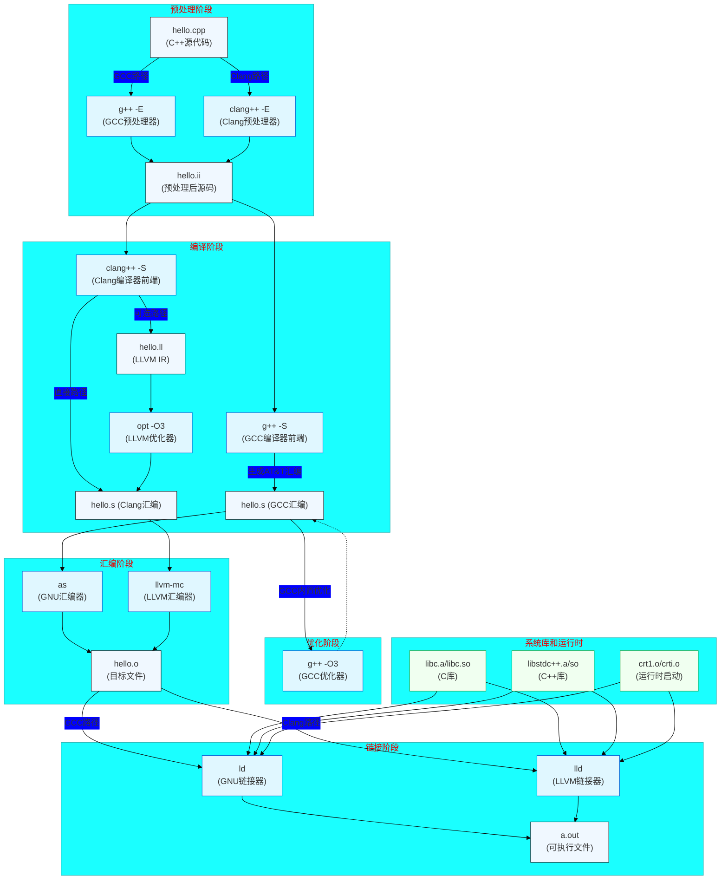

## 一. 简介

首先这里有一个表格：

| 分类维度 | 具体类型 | 典型代表/影响 |
|---------|---------|--------------|
| **硬件架构** | CPU指令集架构(ISA) | x86, ARM, MIPS, RISC-V, PowerPC |
| **语法风格** | 汇编语法规范 | AT&T语法, Intel语法 |
| **编译器/工具链** | 代码生成方式 | GCC, MSVC, Clang, NASM |
| **操作系统** | 系统调用约定/ABI | Linux(ELF), Windows(COFF), macOS(Mach-O) |

硬件架构意思是CPU的指令集架构，比如平常见到的x86-64等等，这些可以理解为是汇编语言的种类。

语法风格的话其实就是汇编语言的风格，这里就不多赘述，linux x86一般是AT&T风格，所以掌握AT&T就可以了

编译器这里就专门讨论cpp的编译器，其实是一系列工具链，可能会包含一些展开/优化/编译等，最常用的就是gcc和clang

操作系统一般是基于硬件架构来编写的，是硬件架构的上一层封装。

对于每种硬件架构，都有他对应的汇编器，汇编器的作用就是将汇编语言转化为机器码，机器码就是直接在CPU上运行的代码。但是一种硬件架构可以有多种汇编器，不过至少有一点是确定的，就是如果更换平台的话，就必须要更换汇编器。

| 架构类型 | 汇编器代表 | 处理指令示例 | 输出格式 |
|---------|-----------|-------------|---------|
| x86/x64 | NASM, MASM | mov eax, 1 | PE/ELF |
| ARM/AArch64 | GNU as (Gas) | mov w0, #1 | ELF |
| RISC-V | riscv64-unknown-elf-as | li a0, 1 | ELF |
| MIPS | mips-linux-gnu-as | li $t0, 1 | ELF |


## 二. 编译流程

假如说我们当前有一个`hello.cpp`文件，内容如下

```cpp
#include <iostream>

int main() {
    std::cout << "Hello, World!" << "\n";
    return 0;
}
```

下面是编译工具链的全过程，`g++/clang++`就是按照下述这个顺序，一步步展开，编译，优化的。现在`g++/clang++`更多的是一个智能的预处理调度器，比如在宏展开和头文件展开的时候，一般用的是`cpp`这种底层工具

```shell
cpp hello.cpp -o hello.ii
```

但是如果使用`g++ -E`, 它会根据上下文选择最佳处理方式，并自动配置正确的编译环境。这就是为什么在构建工具链中，我们总是使用编译器驱动而非直接调用底层工具的原因。



链接过程中，可以看出不管是g++/clang++最后编译得到机器码之后，链接器是可以兼容的，可以使用GNU ld，也可以使用llvm lld，都可以。

接下来详细的比较一下各个阶段的产物差别：

- **预处理阶段**: 不管是gcc还是clang要做的都是将头文件和宏展开，所以这一部两者产生的`hello.ii`其实区别不大，可能会在某些空白行，或者注释有差异。

- **汇编阶段**: 生成的`hello.s`就会有比较大的区别，首先两者会有自己的抽象AST，然后gcc会将其转化为中间产物GIMPLE三地址码形式，而clang则会直接将其转化为LLVM IR，这里gcc或者clang还有属于自己的tree-ssa或者opt汇编优化器，可以优化汇编代码。

- **目标阶段**: 生成`hello.o`, 这一步会将汇编使用汇编器转化为机器码，只要是相同的平台，就会遵循一致的格式，这个时候产物就在某种意义上共通了，GCC通常使用GNU的汇编器（as），而Clang可以使用自己的集成汇编器（llvm-mc）或者GNU汇编器，但是输出的目标文件格式（如ELF格式）是标准的。虽然这并不代表两者产生的机器码是相同的，但是格式是相同的话，就可以互相链接。

- **链接阶段**: 链接的是该平台的机器码，一般没啥差别。


## 三. 性能分析

- **预处理阶段**: 这里gcc和clang的差距主要是编译时间，内存占用以及输出大小，这里由于自身实现的差距，clang一般要优于gcc。

| 指标 | GCC | Clang | 差异幅度 |
|------|-----|-------|----------|
| 编译时间 | 较慢 | 快30-50% | 🔴 显著差异 |
| 内存占用 | 高 | 低20-30% | 🔴 显著差异 |
| 输出大小 | 相同 | 相同 | ⚪ 无差异 |

- **编译阶段**：
  - 前端：构建AST，诊断信息质量，模板处理效率，这里clang也大概比gcc快一倍，特别是在模板解析过程中，clang比gcc优势大很多

  - 中间表示优化：
  
| 优化类型 | GCC 优势 | Clang 优势 | 中立领域 |
|----------|----------|------------|----------|
| 循环优化 | 简单循环展开 | 循环向量化 | 公共子表达式消除 |
| 内联决策 | 保守策略 (减少代码膨胀) | 激进策略 (更多内联) | 静态函数优化 |
| 常数传播 | 基础传播 | 跨函数传播 | 本地传播 |
| SIMD向量化 | - | AVX-512支持更好 | SSE基础优化 |

  - 汇编代码生成`hello.s`: 性能因素取决于汇编指令数，指令选择质量，以及寄存器分配。在这里clang是高指令密度，依赖链优化较好，寄存器溢出5%，gcc表现各个方面较为一般。Clang 平均生成少10-15%的指令，复杂控制流中优势明显。

- **目标文件生成**：性能指标是文件大小，重定位信息以及调试信息, 调试信息一般是DWARF格式，clang有更加完善的格式。

| 特征 | GCC | Clang | 差异原因 |
|------|-----|-------|----------|
| .o 文件大小 | 稍大 | 稍小 | DWARF格式差异 |
| LTO支持 | 有限 | 完善 | LLVM模块化设计 |
| 调试信息 | DWARF4 | DWARF5 | 标准版本不同 |

- **链接阶段**：链接阶段关心的性能是链接速度，内存占用以及LTO效果。GCC 默认使用 GNU ld 或 gold，Clang 可选 lld 或 mold(超快链接器)。
 - LTO技术是一种链接时的代码优化技术，会在编译时带来一些编译期性能的开销（大概多一倍），但是可以给编译后的目标文件带来较大的提升，他会保存编译时的中间表示，例如LLVM IR，然后在链接的时候对全局的代码进行优化，例如库函数跨模块内联，无用代码全局消除，全局常量传播，全程序指针分析等等，可以达到20%+的运行时提升，体积也会减少20%-40%，

 ```shell
 # GCC 启用LTO
g++ -flto -O3 main.cpp utils.cpp -o app_gcc
# Clang 启用LTO
clang++ -flto=thin -O3 main.cpp utils.cpp -o app_clang
 ```
- **执行阶段**: 上述的各个阶段可以看出都已经产生了若干实质性的差异，这些差异最终导致Clang和GCC机器码的不同，对于CPU来说，机器码的执行逻辑是一样的，但是Clang编译出的机器码，分支预测错误率会更低，向量化计算密度更高。

总结：可以看出

1. **编译速度**：Clang普遍快30-50%，尤其大型项目

2. **运行时性能**：视应用类型而定

3. **数值计算**：GCC 平均优3-5%

4. **分支密集**：Clang 优5-10%

5. **向量化计算**：Clang 优10-15%

6. **调试支持**：Clang的DWARF5更强大

7. **内存占用**：Clang生成代码通常小5-15%

## 四. 补充

在前三节中提到了一些比较有意思的东西，在这里补充一下

### 1. 指令集

首先是指令集问题。指令集（ISA）是一组软件层面约定的和CPU硬件执行的接口，所以对于ISA来说首先需要硬件层面支持，其次OS内核也需要支持，最后需要告诉编译器生成支持该指令的代码或者在软件层面自己编写该ISA代码，前者比较通用，后者可以特定优化。

| 层级 | 要求 | 检测方法 |
|------|------|----------|
| **硬件** | CPU支持该指令集 | lscpu 查看标志位 |
| **操作系统** | 内核支持指令执行 | 运行时CPUID检测 |
| **编译器** | 支持生成该指令代码 | 编译器版本检查 |
| **应用程序** | 显式使用指令 | 条件编译与运行时检测 |

这里有一些常用的ISA，比如x86-64一般都是AVX ISA，

| 平台 | 基础ISA | 向量扩展 | 特殊功能扩展 |
|------|---------|----------|--------------|
| x86-64 | AVX2 | AVX-512 | AMX(矩阵运算) |
| ARM v9 | A64 | SVE2(可变长向量) | SME(矩阵扩展) |
| RISC-V | RV64GC | RVV 1.0(向量扩展) | N/A |

当然不同平台的指令集不同，具体需要根据平台来决定，linux可以使用下面的指令查看当前平台支持的ISA：

```shell
lscpu | grep Flags
cat /proc/cpuinfo | grep flags
```

比如我当前是MacBook M2pro，在本地部署了个linux ubuntu docker，运行之后显示如下：

```shell
Flags:                                fp asimd evtstrm aes pmull sha1 sha2 crc32 atomics fphp asimdhp cpuid asimdrdm jscvt fcma lrcpc dcpop sha3 asimddp sha512 asimdfhm dit uscat ilrcpc flagm sb paca pacg dcpodp flagm2 frint bf16
```

可以看出涵盖了数值运算，加密算法等等一系列CPU加速指令集，可以供该平台的程序使用。现在平台架构大概就是x86, arm, risc-v这三种，具体使用ISA的时候需要根据平台来进行取舍。

### 2. 汇编语法初探

这里打算解析一下x86-64 平台上的`hello.s`文件的汇编语言含义。


