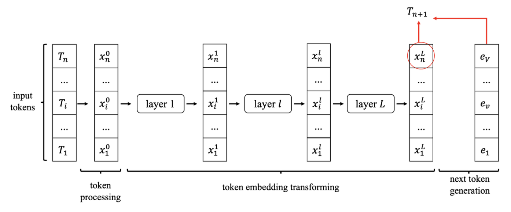
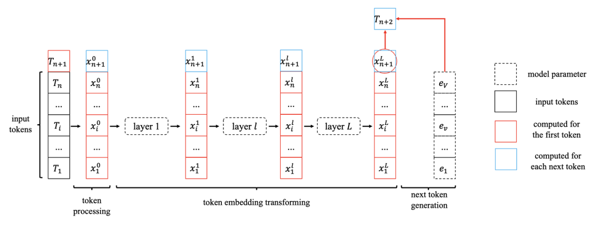
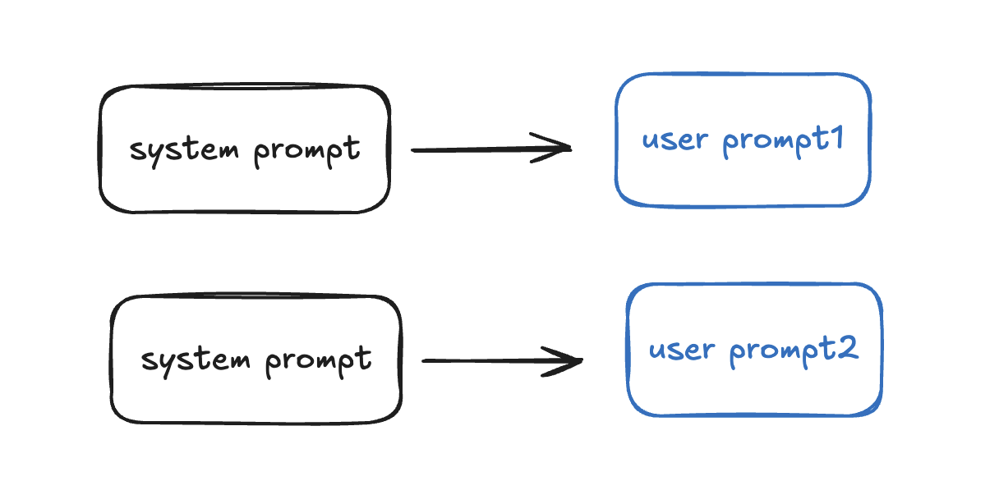

## 一. decoder-only模型量级分析

现在业界的大模型都是基于transformer架构，对
于[transformer](docs/notes/algorithm/transformer.md), 在其他章节已经介绍过了

模型的架构主要有两大类：encoder-decoder 和 decoder-only，本章先分析decoder-only
架构下的transformer模型的参数量，计算量，中间激活值

首先定义：模型层数 $l$ , 隐藏层维度 $h$ , 注意力头数 $a$ , 词表大小 $V$ , 训练数
据批次大小 $b$ , 序列长度 $s$

### 1. 模型参数量

transformer模型由 $l$ 个相同层堆叠而成，每个层有两个子层，self-attention层和ffn
层(feed-forward network)，经过堆叠之后，通过output ＆ softmax层输出结果，在进入
transformer层之前，还会进入embedding层

- self-attention

      输入为 $Q$ , $K$ , $V$ , 对应都有一个权重矩阵 $W_Q$ , $W_K$ , $W_V$ , 以及偏置。计算完attention之后还会进行一次线性变换 $W_o$ , 对于每个self-attention层，会配备一个layer normalization，包含两个可训练模型参数，平移参数 $\beta$ 和缩放参数 $\gamma$ 所以参数数量为：

  $$
  4h^2 + 6h
  $$

- ffn

      由两个线性层组成，一般的，第一个线性层维度将 $h$ 映射为 $4h$ , 第二个线性层再将维度从 $4h$ 映射回 $h$ , 第一个线性层拥有权重矩阵 $W_1$, 第二个拥有权重矩阵 $W_2$ , 当然对于ffn层后也会有一层layer normalization 那么参数量为：

  $$
  8h^2 + 7h
  $$

- output ＆ softmax 和 embedding

  包含一个线性层，拥有权重矩阵 $W_o$，映射回词表，然后做softmax，所以参数量为
  $hV$ ，embedding层的参数量也相同, 而且输出层的权重矩阵通常与词嵌入矩阵是参数共
  享的，所以我们只需要算一份

#### 总结

总结下来，每个transformer层的参数量为 $12h^2 + 13h$ , 所以 $l$ 层之后，再算上
output和embedding，参数量大小为

$$
l(12h^2 + 13h) + Vh
$$

当 $h$ 较大的时候，我们可以近似看为 $12lh^2$

#### 1.1 训练过程显存占用分析

在训练神经网络的过程中，占用显存的大头主要分为四部分：**模型参数、前向计算过程中
产生的中间激活、后向传递计算得到的梯度、优化器状态**。这里着重分析参数、梯度和优
化器状态的显存占用，中间激活的显存占用后面会详细介绍。训练大模型时通常会采用
adamW优化器，并用混合精度训练来加速训练，基于这个前提分析显存占用。

在一次训练迭代中，每个可训练模型参数都会对应1个梯度，并对应2个优化器状态（adam优
化器梯度的一阶动量和二阶动量）。设模型参数为 $\phi$ , 那么梯度元素数量为 $\phi$
, adamW优化器元素数量为 $2\phi$ , f16占2个bytes，f32占4个bytes，在混合精度训练
中，会使用float16的模型参数进行前向传递和后向传递，计算得到float16的梯度；在优化
器更新模型参数时，会使用float32的优化器状态、float32的梯度、float32的模型参数来
更新模型参数。因此，对于每个可训练模型参数，占用了

$$
(2 + 4) + (2 + 4) + (4 + 4) = 20bytes
$$

所以训练过程显存占用为 $20\phi$ bytes

#### 1.2 推理过程显存占用分析

在神经网络的推理阶段，没有优化器状态和梯度，也不需要保存中间激活。少了梯度、优化
器状态、中间激活，模型推理阶段占用的显存要远小于训练阶段。模型推理阶段，占用显存
的大头主要是模型参数，如果使用float16来进行推理，推理阶段模型参数占用的显存大概
是 $2 \phi $ bytes。如果使用KV cache来加速推理过程，KV cache也需要占用显存，KV
cache占用的显存下文会详细介绍。此外，输入数据也需要放到GPU上，还有一些中间结果
（推理过程中的中间结果用完会尽快释放掉），不过这部分占用的显存是很小的，可以忽
略。

### 2. 计算量FlOPs估计

> FlOPs，floating point operations，表示浮点数运算次数，衡量了计算量的大小。首先
> 对于 $a \in R^{a \times b}$ , $b \in R^{b \times c}$ , 那么 $a \times b$ 会进
> 行 $a \times b \times c$ 次乘法运算和加法运算

- self-attention块计算量估计

一次训练中，输入的数据 $data \in R^{b \times s}$ , 我们知道计算公式如下：

$$
Q = xW_Q, \ K = xW_K, \ V = xW_V
$$

$$
x_{out} = \text{softmax}\left(\frac{QK^T}{\sqrt{h}}\right) \cdot V \cdot W_o + x
$$

$Q$ , $K$ , $V$ 线性变换复杂度为 $3 * 2 * bsh^2$ = $6bsh^2$

$QK^T$ 计算方式为
$[b, a, s, per\_head\_size] \times [b, a, per\_head\_size, s] = [b, a, s, s]$ ,
复杂度为 $2bs^2h$

$V$ 的加权以及之后 $W_o$ 的线性映射为 $2bs^2h + 2bsh^2$

- FFN计算

公式为

$$
x = f_{\text{gelu}}(x_{out}W_1)W_2 + x_{out}
$$

第一个线性层：$[b, s, h] \times [h, 4h] = [b, s, 4h]$ 复杂度为 $8bsh^2$

第二个线性层：$[b, s, 4h] \times [4h, h] = [b, s, h]$ 复杂度为 $8bsh^2$

总结：上述计算量为 $24bsh^2 + 4bs^2h$ , 此外logits计算会将隐藏向量映射为词表大
小，输入和输出为 $[b, s, h] \times[h, V] = [b, s, V]$ 计算量为 $2bshV$ , 所以综
上所述，一次训练迭代的计算量为

$$
l \times (24bsh^2 + 4bs^2h) + 2bshV
$$

#### 2.1 计算量与参数量关联

首先如果 $h$ 足够大，我们计算量近似为 $24lbsh^2$ , 前面提到当模型参数为 $12lh^2$
时，输入的tokens数为 $bs$ , 可以发现 $24lbsh^2 / (12lh^2 \times bs) = 2$ , 所以
我们可以近似的认为，**在一次前向传递中，对于每个token，每个模型参数，需要进行2次
浮点数运算**，即一次乘法法运算和一次加法运算。

一次训练迭代包含了前向传递和后向传递，后向传递的计算量是前向传递的2倍。因此，前
向传递 + 后向传递的系数 $ = 1 + 2 = 3$ 。一次训练迭代中，对于每个token，每个模型
参数，需要进行6次浮点数运算。

#### 2.2 训练时间估计

模型参数量和训练总tokens数决定了训练transformer模型需要的计算量。给定硬件GPU类型
的情况下，可以估计所需要的训练时间。给定计算量，训练时间（也就是GPU算完这么多
flops的计算时间）不仅跟GPU类型有关，还与GPU利用率有关。计算端到端训练的GPU利用率
时，不仅要考虑前向传递和后向传递的计算时间，还要**考虑CPU加载数据、优化器更新、
多卡通信和记录日志的时间**。一般来讲，GPU利用率一般在 $[0.3, 0.55]$ 之间。

上文讲到一次前向传递中，对于每个token，每个模型参数，进行2次浮点数计算。使用激活
重计算技术来减少中间激活显存（下文会详细介绍）需要进行一次额外的前向传递，因此前
向传递 + 后向传递 + 激活重计算的系数 $=1+2+1=4$。使用激活重计算的一次训练迭代
中，对于每个token，每个模型参数，需要进行8次浮点数运算。在给定训练tokens数、硬件
环境配置的情况下，训练transformer模型的计算时间为：

$$
训练时间 = \frac{8 \times \text{tokens数} \times \text{模型参数量}}{\text{GPU数} \times \text{GPU峰值flops} \times \text{GPU利用率}}
$$

### 3. 中间激活值分析

除了模型参数、梯度、优化器状态外，占用显存的大头就是前向传递过程中计算得到的中间
激活值了，需要保存中间激活以便在后向传递计算梯度时使用。这里的激活
（activations）指的是：前向传递过程中计算得到的，并在后向传递过程中需要用到的所
有张量。这里的激活不包含模型参数和优化器状态，但包含了dropout操作需要用到的mask
矩阵。

在分析中间激活的显存占用时，只考虑激活占用显存的大头，忽略掉一些小的buffers。比
如，对于layer normalization，计算梯度时需要用到层的输入、输入的均值 $\mu$ 和方差
$\sigma^2$ 。输入包含了 $bsh$ 个元素，而输入的均值和方差分别包含了 $bs$ 个元素。
由于 $h$ 通常比较大，所以 $bsh >> bs$ 。因此，对于layer normalization，中间激活
近似估计为 $bsh$ ，而不是 $bsh + 2bs$。

大模型在训练过程中通常采用混合精度训练，中间激活值一般是float16或者bfloat16数据
类型的。在分析中间激活的显存占用时，假设中间激活值是以float16或bfloat16数据格式
来保存的，每个元素占了2个bytes。唯一例外的是，dropout操作的mask矩阵，每个元素只
占1个bytes。在下面的分析中，单位是bytes，而不是元素个数。

接下来我们分别分析self-attention层和ffn层的中间激活

- self-attention

1. 对于 $Q$ , $K$ , $V$ , 需要保存他们的共同的输入 $x$ , 这就是中间激活。输入
   $x$ 的形状为 $[b, s, h]$ , 元素个数为 $bsh$ , 占用显存大小为 $2bsh$

2. 对于 $QK^T$ 矩阵乘法，需要保存中间激活 $Q, K$, 两个张量形状大致均为
   $[b, s, a, h/a]$ ，占用显存大小合计为 $2 * 2 * bsh = 4bsh$

3. 对于softmax，需要保存输入 $QK^T$, 形状为 $[b, a, s, s]$ 占用大小 $2bs^2a$

4. droupout操作，保存一个mask矩阵，形状与 $QK^T$ 相同，但是bytes占用为1，所以显
   存占用为 $bs^2a$

5. 计算与 $V$ 的权重，需要保存softmax的结果，大小为 $2bs^2a$ , 以及 $V$ , 二者占
   用显存一共 $2bs^2a + 2bsh$

6. 计算输出映射以及一个droupout操作，输入映射需要保存输入，大小为 $2bsh$ ,
   droupout需要保存mask矩阵，大小为 $bsh$ , 二者合计占用 $3bsh$

因此将上述中间激活相加，为 $11bsh + 5bs^2a$

---

- FFN

1. 第一个线性层保存其输入，为 $2bsh$

2. 激活函数保存其输入，$8bsh$

3. 第二个线性层保存其输入，为 $8bsh$

4. 最后一个droupout操作，保存mask矩阵，占用为 $bsh$

所以FFN层总共需要保存的参数为 $19bsh$

---

另外我们考虑两个layer norm层，需要保存其输入，占用为 $4bsh$

综上，$l$ 个transformer层需要保存的中间激活占用显存大小为
$l \times (34bsh + 5bs^2a)$

#### 3.1 对比中间激活与模型参数大小

在一次训练迭代中，模型参数（或梯度）占用的显存大小只与模型参数量和参数数据类型有
关，与输入数据的大小是没有关系的。优化器状态占用的显存大小也是一样，与优化器类型
有关，与模型参数量有关，但与输入数据的大小无关。而中间激活值与输入数据的大小（批
次大小 $b$ 和序列长度 $s$ ）是成正相关的，随着 $b$ 和 $s$ 的增大，中间激活占用的
显存会同步增大。当我们训练神经网络遇到显存不足OOM（Out Of Memory）问题时，通常会
尝试减小批次大小来避免显存不足的问题，这种方式减少的其实是中间激活占用的显存，而
不是模型参数、梯度和优化器的显存。

随着 $b$ 的逐渐增大，中间激活占用的显存会远远超过模型参数显存，这个时候通常采
用**激活重计算**技术来减少中间激活，理论上可以从 $O(n)$ 优化为 $O(\sqrt{n})$ ,
本质上是时间换空间

## 二. 推理与KV Cache

首先要明确，对于transformer类模型，一次推理只会生成一个token，我们可以将其推理理
解为，输入一个长度为 $n$ 的tokens，然后最后输出一个预测的token，用流程图来表示就
是下面这样

当生成了一个token之后，生成下一个token需要重新走一下所有流程，但是我们可以看出，
流程有很多可以复用的中间状态，比如，当输入的token序列为
$\{t_1, ... t_n, t_{n+1}\}$ 时，我们发现对于
$\{x_{i}^l\ |\ 1 \leq i \leq n, 1 \leq l \leq L  \}$ 这些变量，其实和上一轮计算
的时候没有变化，那么这一部分我们就可以缓存下来

接下来引入本篇主角，在推断阶段，transformer模型加速推断的一个常用策略就是使用 KV
cache。一个典型的大模型生成式推断包含了两个阶段：

1. 预填充阶段：输入一个prompt序列，为每个transformer层生成key cache和value
   cache（KV cache）。

2. 解码阶段：使用并更新KV cache，一个接一个地生成词，当前生成的词依赖于之前已经
   生成的词。

更具体地说，我们将推理过程优化为如下过程

首先设第 $i$ 个transformer层的权重矩阵为 $W_{Q}^{(i)}$, $W_{K}^{(i)}$ ,
$W_{V}^{(i)}$ , $W_{1}^{(i)}$ , $W_{2}^{(i)}$ , 这里1和2是ffn层的全连接层，然后
第 $i$ 层的输入为 $x^{(i)}$ , key, value, query, output 表示为 $x_{K}^{(i)}$ ,
$x_{V}^{(i)}$ , $x_{Q}^{(i)}$ , $x_{O}^{(i)}$

- Prefill阶段 (预填充) TODO: 这里写的有点问题，特别是x_out部分，最好以单个token
  维度展现求和

key cache和value cache的计算过程为：

$$
x_K^{(i)} = x^{(i)} \cdot W_K^{(i)}
$$

$$
x_V^{(i)} = x^{(i)} \cdot W_V^{(i)}
$$

---

$$
x^{(i)}_Q = x^{(i)} \cdot W^{(i)}_Q
$$

$$
x^{(i)}_{out} = softmax\left(\frac{x^{(i)}_Q {x^{(i)}_K}^T}{\sqrt{h}}\right) \cdot x^{(i)}_V \cdot W^{(i)}_O + x^{(i)}
$$

$$
x^{(i+1)} = f_{gelu}(x^{(i)}_{out} \cdot W_1) \cdot W_2 + x^{(i)}_{out}
$$

- decode 阶段 (解码)

给定当前生成词在第 $i$ 个transformer层的向量表示为
$t^i \in R^{b \times 1 \times h}$

$$
x^{(i)}_K \leftarrow Concat(x^{(i)}_K, t^{(i)} \cdot W^{(i)}_K)
$$

$$
x^{(i)}_V \leftarrow Concat(x^{(i)}_V, t^{(i)} \cdot W^{(i)}_V)
$$

---

$$
t_Q^{(i)} = t^{(i)} \cdot W_Q^{(i)}
$$

$$
t_{out}^{(i)} = softmax\left(\frac{t_Q^{(i)} x_K^{(i)T}}{\sqrt{h}}\right) \cdot x_V^{(i)} \cdot W_O^{(i)} + t^{(i)}
$$

$$
t^{(i+1)} = f_{gelu}(t_{out}^{(i)} \cdot W_1) \cdot W_2 + t_{out}^{(i)}
$$

## 三. KV Cache延伸技术

### 1. Batch Prompting

这种优化针对的是system prompt的场景，即不同的句子有相同的system prompt，这样我们
可以采用batch prompting的技术，减少prefill的计算。

### 2. RalyAttention

参考文章:

[知乎](https://zhuanlan.zhihu.com/p/709959195)

[知乎](https://zhuanlan.zhihu.com/p/709989373)

[知乎](https://zhuanlan.zhihu.com/p/710281067)
