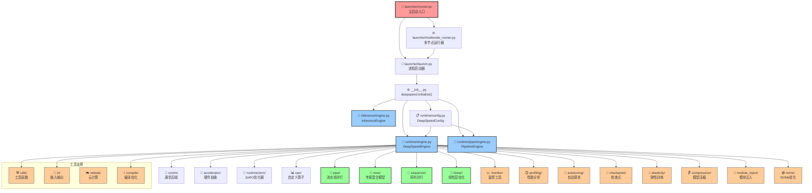

> 记录一些阅读deepspeed源码过程中的心得与感悟

这里是一个我用cursor画的一个思维导图，大概描述了调用层级，所以就先从launcher开始看



## 一. Launcher

> deepspeed/launcher/

这里是整个deepspeed启动训练任务的入口，首先是`runner.py`, 它会根据单机or多机分配到`launch.py`或者`multinode_runner.py`.

暂且不考虑单worker的情况，因为太简单了，launcher最难的地方其实就是多机的初始化和通信，这里我们首先要知道一些细节，这里针对GPU多机多卡训练的通信介绍一些知识

### 1. communication

1. 物理层传输：底层通信是指底层硬件的物理层传输，这些是硬件自带的能力，这里分为intranode以及internode，intranode是单机多卡内的通信，internode是多机间通信

- intranode：在NV GPU环境下，节点内通信直接使用NVLink即可，带宽达到900GB/s，下位方案是PCIe通用总线，带宽约32GB/s。

- internode：首先就是InfiniBand，这是一种高速网络技术，支持RDMA，速度最快200Gbps+，下位方案是以太网TCP/UDP使用Socket的通信，只有大约10-100Gbps。

2. 通信库：软件层面的通信优化，可以在软件的层面上优化通信速度，选取合适的通信后端，同时也会提供故障重启，弹性扩缩容等操作。

- MPI：高性能消息传输接口（Message Passing Interface），是一种通用的技术，例如OpenMPI，基于MPI标准，封装物理层能力（IB，TCP等等）提供多机间通信能力。

- NCCL：如果是NV环境，那么就是MPI的上位替代，是NVIDIA发布的一个高效的集体通信库，专为多个GPU之间提供优化的传输效率和简化应用而设计，采用RDMA技术加速，intranode使用NVLink，自动优化通信路径，减少网络拥塞，当然这是一个与物理层无关的软件抽象，所以如果NVLink不支持会降级为PCIe，所以例如IB，NVLink等均不构成**强依赖**。

3. 应用接口层：其实就是`torchrun`，我们可以看一下pytorch的doc，里面是这样说的

> By default for Linux, the Gloo and NCCL backends are built and included in PyTorch distributed (NCCL only when building with CUDA). MPI is an optional backend that can only be included if you build PyTorch from source.

也就是torch支持`gloo`的cpu训练以及`nccl`的gpu训练，`nccl`一般作为`gloo`的备选方案。

接下来回到launcher之中，deepspeed并没有使用torch，而是自己实现了一套launcher，可以让用户通过`--launcher`来选择，默认是PDSH，也可以选择OpenMPI等一些MPI通信，没有使用nccl，因为nccl局限于cuda。

### 2. network

既然是多机分布式训练，机器之间必然会产生通信，这里deepspeed提供了两种方式，一种是`ssh`, 这要求配置hostfile，并且每两个node之间需要可以ssh免密登录，另外一种模式是`no_ssh`, 这个时候多个node之间不会尝试ssh验证，原理是在每个node都启动一个训练进程，然后必须要手动指定`node_rank`, `master_addr`, `master_port`等一些信息。

对于`ssh`模式，我们会设置`node_rank`, `master_addr`, `master_port`等一些关键信息。对于`no_ssh`模式，这一切需要配置好。

经过上述的网络通信基础设置，最后多node会在每个node上启动一个`python -m deepspeed.launcher.launch`, 开始执行分布式训练进程。

### 3. subprocess

最后launcher这个包，会启动若干的进程，然后执行不同的事情。对于多node，我们肯定会先选择一个node登录，然后在这个node上执行一个runner进程，对于runner进程，关系如下图所示：

```shell
Runner (runner.py)
└── Launcher (launch.py)
    ├── Training Process 0 (GPU 0)
    ├── Training Process 1 (GPU 1)
    ├── Training Process 2 (GPU 2)
    └── ...
```

可以看出，runner是主进程，会接受一些参数做一些通信和网络的相关配置，之后对于多node而言，会在每个node上启动一个launcher进程，这个是每个node上都有的，用于管理训练进程。

具体的训练进程是运行在每个node的slots上的，如果当前node 8卡都需要参与，那么就会启动8个training process，代表具体的训练进程，launcher的目的是管理这些进程，不断地loop去看当前的train进程还有多少正在work，然后对于用户发送的SIGINT或者系统发送的SIGTERM，写一些优雅退出的handler去退出train进程。

我们需要传入一些参数，这些具体的参数，可以看deepspeed文档，这里就不多赘述。

**不过上述的launcher，似乎因为deepspeed版本过老的原因，如今都由pytorch解决了，直接torchrun即可**

## 二. Initialize

经过上述的launcher，我们成功在各个node上启动了自己的`train.py`, 接下来我们先提供一个官方的`train.py`, 然后依次剖析里面的细节。

我看的是[deepspeed example](https://github.com/deepspeedai/DeepSpeedExamples) 里面的BERT pre-train脚本，在`training/bing_bert`之中

### 1. distribute

> deepspeed/comm/

在`prepare_model_optimizer`中，使用了`deepspeed.init_distributed(dist_backend='nccl')`，借此我们可以看一下deepspeed的通信包是如何设计的。

deepspeed的通信包保持着和`torch.distributed`同样的API设计，方便用户迁移，阅读这部分代码感觉也可以为未来阅读`pytorch`源码打下基础。

可以看出comm包主要就各种通信op(all_reduce, all_gather)进行封装，首先将默认的`torch.distributed`封装为`TorchBackend`, 这意味着默认的backend，然后这里也支持用户定制属于自己的backend。对于封装的`TorchBackend`主要是更加的普适，对各个torch版本都适用。当然deepspeed也提供了一个自己的定制后端作为参照：`CCLBackend`Intel通信库。

通过`init_deepspeed_backend()`来选择自己的定制backend，如果cdb最后还是为None，就使用`TorchBackend`

```python
if cdb is None:
    init_deepspeed_backend(get_accelerator().communication_backend_name(), timeout, init_method)
    set_backend()
    utils.logger.info(f'cdb={cdb}')
if cdb is None and torch.distributed.is_initialized():
    # The user initialized torch.dist themselves, create cdb and short-circuit
    cdb = TorchBackend(dist_backend, timeout, init_method)
    return
```

目前看来这块代码还挺奇怪的，比较偏向于半成品，大致思路其实是想设计一个更加普适通用的通信后端框架，但是目前只是对`torch.distributed`进行了一次包装

和`launcher`模块面临的处境差不多，在启动分布式训练的时候确实可能需要很多的网络和通信的准备工作，但是现代pytorch已经将这些繁琐的工作收敛进torch之中，deepspeed这里的代码只能说有一定的启发作用。

目前对deepspeed的通信有了一定的了解，分为了两个部分，一个是init阶段，使用MPI来通信一些基本信息和环境变量，例如`LOCAL_RANK`这种，意思是如果没有设置这种rank，可以只通过指定若干host来让deepspeed帮你自动排序，最后注入环境变量。或者说这些基础环境变量完全由用户来指定，这样就不需要MPI了。第二个阶段是work阶段，这个时候就需要定制的通信后端，例如cpu使用`gloo`, nv gpu使用`nccl`, intel使用`ccl`等等, 这里强调的是高性能所以不能使用MPI。

### 2. deepspeed.initialize

> deepspeed/\_\_init\_\_.py

重点来了，这里应该是deepspeed整个框架的初始化的汇集点, 第一部分的分布式环境初始化也应该是这个初始化的一部分。

```python
# 初始化分布式环境
dist.init_distributed()

#初始化device mesh
dist.initialize_mesh_device(mesh_param, ("data_parallel", "sequence_parallel"))

if not isinstance(model, PipelineModule):
        config_class = DeepSpeedConfig(config, mpu, mesh_device=mesh_device)
        if config_class.hybrid_engine.enabled:
            engine = DeepSpeedHybridEngine(args)
        else:
            engine = DeepSpeedEngine(args)
    else:
        assert mpu is None, "mpu must be None with pipeline parallelism"
        mpu = model.mpu()
        config_class = DeepSpeedConfig(config, mpu)
        engine = PipelineEngine(args)

    # Restore zero.Init context if necessary
    zero.partition_parameters.restore_init_context()

    return_items = [
        engine,
        engine.optimizer,
        engine.training_dataloader,
        engine.lr_scheduler,
    ]
    return tuple(return_items)
```

可以看出deepspeed核心的计算和调度代码在`engine`之中，这个留到下一节讲。之后就是一个`if pp`的配置，首先GPU是由`device_mesh`组织的，目的是将GPU组织成一个网格结构，比如

```python
dist.initialize_mesh_device(mesh_param, ("data_parallel", "sequence_parallel"))
```

这里就是将各个worker组织成二维网格结构，第一行是dp的gpu group，第二行是sp的gpu group，这样做的好处就是不需要自己去划分不同的process group，更加便捷。不过我观察megatron并没有使用device mesh, 而是选择自己手动管理process group的形式，不知道有无什么讲究

然后就是构造engine，deepspeed将pp与dp+tp分割开了，看样子deepspeed并不支持3D parallel。不过也可以理解，deepspeed适合比较小的模型，走的是ZeRO这一套，如果是真正的大模型，还是需要使用megatron
