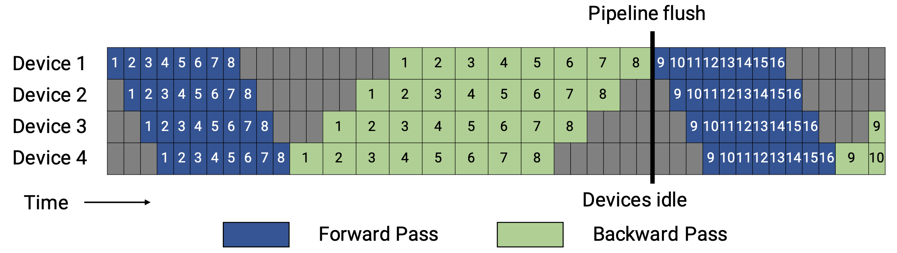
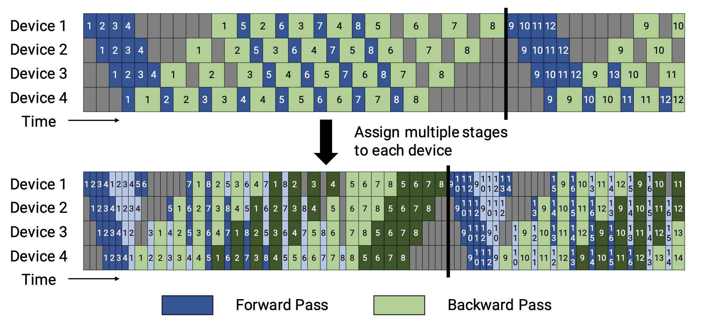

## Megatron-LM: Training Multi-Billion Parameter Language Models

作为model parallel的基石，如果你已经掌握了单机单卡简单使用pytorch训练model之后,
建议来细读这一篇Megatron-LM的paper。

[Megatron-LM paper](https://arxiv.org/pdf/1909.08053)

总结：其实通篇下来，就只需要理解这张图


处理GEMM followed by a nonlinearity: $Y=GeLU(XA)$, 有两种tensor切割方式:

- $A$: split along col, $X$: split along row:

$$
X = [X_1, X_2], \, A = \begin{bmatrix} A_1 \\ A_2 \end{bmatrix}.
$$

这个时候 $Y = GeLU(X_1A_1 + X_2A_2)$, 但是需要在GeLU前做一次sync

- $A$: split along row, $X$: duplicate

$$
A = [A_1, A_2]
$$

$$
[Y_1, Y_2] = [GeLU(XA_1), GeLU(XA_2)]
$$

可以看出这种方式，计算的 $Y$ 仍然保持分割状态，但是无需做一次sync，只需要分治做
GeLU即可

对于MegatronV1来说，主要就介绍的是相对于当时Gpipe的tensor parallel策略，但是从如
今的视角来看，tensor parallel已经是时代的眼泪了。

## Megatron-LM2: Efficient Large-Scale Language Model Training on GPU Clusters Using Megatron-LM

[Megatron-LM2 paper](https://arxiv.org/pdf/2104.04473)

为了适应急剧增长的model size，MegatronV2提出了更加完备的并行策略，结合了Gpipe与
Data Parallel，提出了DP + TP + PP的混合并行策略，整篇论文中有如下三个要点：

- interleaved schedule.

- mix parallel.

- sequence parallel.

### 1. Mix Parallel

对于mix parallel, 主要需要理解，DP, PP, TP之间的“正交性”，DP将model copy到不同机
器上，划分batch为若干mini-batch，最后对梯度all reduce，这是一种朴素的并行策
略。PP进一步拆分transformer block，将不同的层划分到不同的机器上，mini-batch也进
一步划分为若干micro-batch，以流水线的形式进行forward与backward，TP聚焦于节点内
部，划分weight到不同GPU上，最后all gather/all reduce来获得结果

### 2. Interleaved Schedule

 首先需要理解Gpipe中的native pp调度：对于native pp
来说，forward的时候会逐层计算，然后backward按逆序逐层传递梯度，通过划分
micro-batch（假设数量为$M$），当前pp_size为$P$，这个时候bubble为

$$
\frac{bubble}{all} = \frac{P - 1}{M + P - 1}
$$

接下来就是PipeDream里面提出的1F1B调度，也是本论文采取的pp调度策略，1F1B有
non-Interleaved以及Interleaved两种调度策略



上图中，由于bwd耗时往往为fwd的两倍，所以占据两个格子。1F1B调度的精髓是当一个
micro-batch fwd执行完毕之后，立马执行bwd，然后释放显存，这样可以显著降低显存占用

对于Interleaved pp调度，我们会将一组在一个GPU上的连续的transformer layer进行进一
步划分，成为多个chunk，比如，之前GPU0的layer id为0, 1, 2, 3, 一共四块GPU，有16
层，现在如果我们规定`virtual_pp_stage = 2`, 那么GPU0被分配到的层会变
为`0, 1, 8, 9`, 层数不变，但是chunk变了，这样fwd的顺序会变为

```
micro-batch1 fwd:
GPU0 -> GPU1 -> GPU2 -> GPU3 -> GPU0 -> ... -> GPU3
```

这个时候`micro-batch1`的fwd执行完毕，就会开始执行bwd

论文图中，深色为chunk1，浅色为chunk2，`virtual_pp_stage = 2`

这样做的坏处是，Device之间的点对点通信次数(量)直接变为`virtual_pp_stage`倍，但是
带来的好处是，bubble比也降低为原来的`virtual_pp_stage`倍。并且可以做到通信的
overlap

这里的通信与计算的overlap是这样做的：对于一个stage，我需要计算一个forward，这里
需要recv一个tensor，然后计算，然后send出去结果。之后计算一个backward，这里同样需
要recv一个tensor，然后计算，然后send出去。

可以做到的overlap其实就是在loop的时候，wait recv一个tensor，计算fwd，然后异步去
send，之后wait recv grad，计算bwd，然后异步send，再下一轮的时候wait recv的就是上
一轮异步send的tensor，这样就实现了通信和计算的overlap，（虽然这里我感觉，在
non-interleaved版本的1f1b调度中，也可以实现这样的overlap，可能在没有划分virtual
stage的时候，这样overlap收益不高，大头在计算，划分完virtual stage之后计算成本/2
了）

### 3. Sequence Parallel

其实就是将seq len这个维度分割，我貌似没有get到这个和tp的区别，虽然tp分割的是
hidden_dim

## Dualpipe

[DeepSeek V3 paper](https://arxiv.org/pdf/2412.19437)

论文中对Dualpipe的描述是这样的： efficient pipeline parallelism. Compared with
existing PP methods, DualPipe has fewer pipeline bubbles. More importantly, it
overlaps the computation and communication phases across forward and backward
processes, thereby addressing the challenge of heavy communication overhead
introduced by cross-node expert parallelism.

可以看出，Dualpipe其实是一种和DeepEP深度耦合的技术，主要解决的就是expert之间的
all2all通信问题，当然其本身的overlap也很优秀，拥有更少的bubbles

题外话：Finally, we meticulously optimize the memory footprint during training,
thereby enabling us to train DeepSeek-V3 without using costly Tensor Parallelism
(TP). 果然TP已经是时代的眼泪了（bushi
