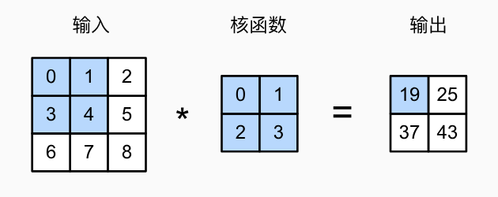
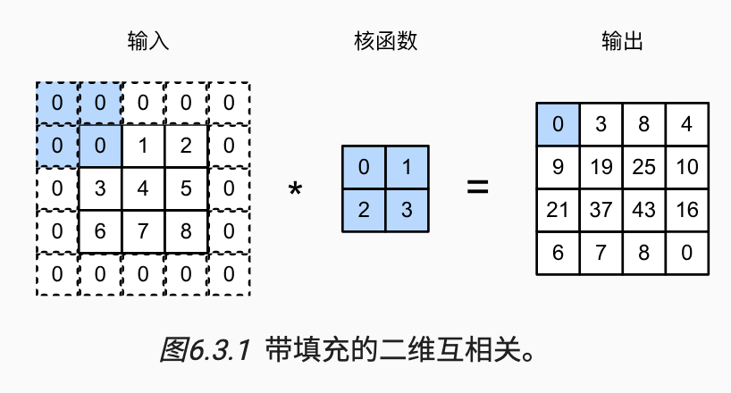
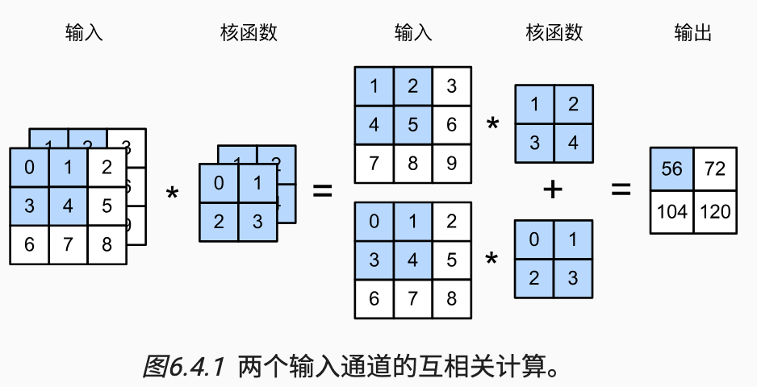
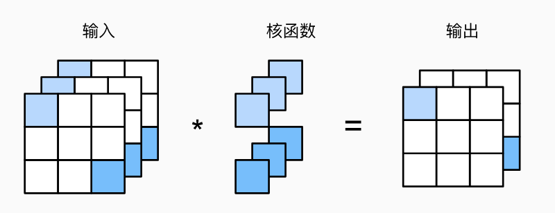
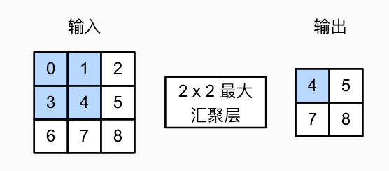
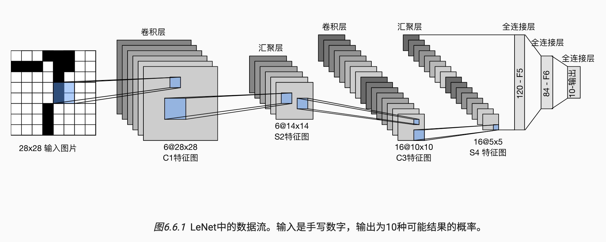
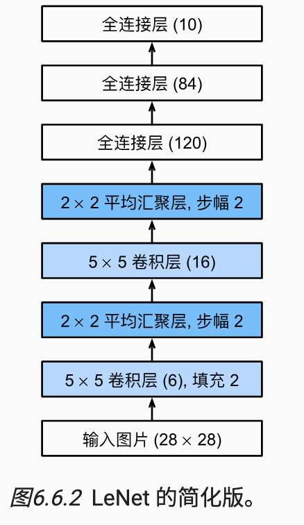

> 前言：这一节我们将学习卷积神经网络，从全连接层过渡到卷积，然后讲解

## 一. 从全连接层过渡到卷积层
### 1. 介绍
全连接层可以理解为一种「拟合」操作，通过矩阵变换，但是在处理图像数据的时候，会遇到参数过大导致训练困难以及过拟合的问题，这就不是我们想看到的，可以注意到，图像天然本就拥有丰富的空间结构，这一特点并没有被我们所利用，所以我们可以从图像的特点入手，进而改进这一结构。

### 2. 特性
我们以图像识别为例，在图像识别中，某个物体会具有以下两种特性：

- 不变性：具体来讲是平移不变性，某个固定的物体不管出现在图像的哪个位置，我们的神经网络应该对其具有相似的”反应“
- 局部性：神经网络的每一层应该只探索图像中的局部区域，不需要过度在意相隔较远的区域之间的联系，通过层与层之间的叠加来实现最终整个图像的识别

### 3. 推导
我们可以利用上述两个特点来改进多层感知机，首先我们输入一个二维图像 $X$ , 输出设置为 $H$ , 可以知道 $X$ 和 $H$ 应该具有相同的结构。我们有如下公式：
$$
[H]_{i, j} = [U]_{i, j} + \sum_k\sum_l [W]_{i, j, k, l}[\mathbf{X}]_{k, l}
$$
其中，$U$ 代表偏置参数，$W$ 代表我们需要训练的权重参数。我们可以简单利用下标的变换获得下面的公式，权重参数变为了 $V$
$$
[H]_{i, j} = [U]_{i, j} + \sum_a\sum_b [V]_{i, j, a, b}[\mathbf{X}]_{a, b}
$$

**首先引入上述第一个原则不变性**，那么就代表我们的 $V, U$ 实际上不依赖于 $i, j$ 的值，我们将其归一化，得到：
$$
[H]_{i, j} = u + \sum_a\sum_b[\mathbf{V}]_{a, b}[\mathbf{X}]_{i+a, j+b}
$$
这意味着对于 $\forall (i, j)$ 我们都有 $[V]_{i, j, a, b} = [\mathbf{V}]_{a, b}$, 这就获得了某种意义上的「定值」，我们拿着这个固定的方框，在图像任意位置扫描就可以

**其次我们使用第二个特性：局部性**。这个特性可以帮助我们限制 $a, b$ 的范围，我们只需要在一个规定的比较小的范围 $\delta$ 内聚合特征即可：
$$
[H]_{i, j} = u + \sum_{a=-\delta}^{\delta}\sum_{b = -\delta}^{\delta}[\mathbf{V}]_{a, b}[\mathbf{X}]_{i+a, j+b}
$$

直到这里，我们完成了二维卷积层`Conv2d`的大致推导！这里的 $V$ 其实就是卷积核kernel, 可以视为卷积层的权重weight，整个运算就定义了卷积层，可以发现，通过学习图像本身的空间特征，使得卷积层的参数大幅下降！代价就是：我们的特征现在是平移不变的。

### 4. 通道
我们上面得知了一个二维图像的卷积形式，但是我们忽略了图像的另外一个特点，那就是一个二维图像一般需要三维表达，第三维就是颜色，也就是上述的运算只适合灰度图像。

图像的一个像素点一般包含三个通道（三种原色），所以图像其实是一个三维张量，那么我们 $X$ 的索引就应该更新为 $[X]_{i, j, k}$ , 由此得知卷积层的权重也应该调整为 $[V]_{a, b, c}$ , 对于输出来说，我们的目的是图像识别，那么操作也应该是将三原色拟合为一个通道，用一个卷积核来识别。

$$
[H]_{i, j} = u + \sum_{a=-\delta}^{\delta}\sum_{b = -\delta}^{\delta}\sum_{c}[\mathbf{V}]_{a, b, c}[\mathbf{X}]_{i+a, j+b, c}
$$

对于第三维通道，没有局部性，而不变性蕴含在二维空间中，所以我们采取全部遍历求和的形式。

接下来引入新的概念：**通道**。我们可以把通道想象成一个特征，例如一个卷积核所覆盖的区域中，我们想提取边缘性或者其他特性，这个时候一个卷积核一般只能提取一个特性，比如上述的卷积核可能特征就是具体物体的特征（大小，外表，颜色等），有的时候我们还想捕捉边界特征等一些其他特征，这时候该怎么办呢？

解决方案就是堆叠多个卷积核，每个卷积核可以视为一个通道（特征），这样我们的输出就会有多个通道，也会变成三维张量 $[H]_{i, j, k}$ , 而且因为卷积核发生了堆叠，那么权重就会变为四维张量 $[V]_{a, b, c, d}$ 公式就变为:
$$
[H]_{i, j, d} = u + \sum_{a=-\delta}^{\delta}\sum_{b = -\delta}^{\delta}\sum_{c}[\mathbf{V}]_{a, b, c, d}[\mathbf{X}]_{i+a, j+b, c}
$$

### 5. 特征映射和感受野
卷积层有时被称为特征映射，因为他可以被视为一个输入映射到下一层的空间维度的转换器，在卷积神经网络中，对于某一层的任意元素 $x$ ，其感受野是指在前向传播中可能影响到 $x$ 的所有元素（来自于所有先前层），这让我们知道了，当一个特征图中的任意元素需要检测更广区域的输入特征时，我们可以构建一个更深的网络

请注意，感受野可能大于输入的实际大小。

### 6. 总结
至此我们就完成了从全连接到卷积层cnn的过渡，总结下来就是：

- 图像的平移不变性使我们以相同的方式处理局部图像，而不在乎它的位置。

- 局部性意味着计算相应的隐藏表示只需一小部分局部图像像素。

- 在图像处理中，卷积层通常比全连接层需要更少的参数，但依旧获得高效用的模型。

- 卷积神经网络（CNN）是一类特殊的神经网络，它可以包含多个卷积层。

- 多个输入和输出通道使模型在每个空间位置可以获取图像的多方面特征。

## 二. CNN 实现
### 1. 互相关运算
在上述中，卷积层其实是一个错误的叫法，因为他表达的运算其实是互相关运算，而不是卷积运算，首先我们将通道设为1，探究二维张量的互相关运算。



在二维互相关运算中，卷积核窗口其实就是从左上角到右下角的一个滑动窗口，对于每个窗口内实行”点积“操作。可以发现最后的输出会变为 $(n_h - k_h + 1) \cdot (n_w - k_w + 1)$ , $n$ 为原本图像，$k$ 为卷积核kernel

那么卷积层的实现也简单起来，前向传播就是对输入扫描了一遍互相关运算得出结果

```python
def corr2d(X: torch.Tensor, K: torch.Tensor) -> torch.Tensor:
    """二维互相关运算"""
    h, w = K.shape
    Y = torch.zeros((X.shape[0] - h + 1, X.shape[1] - w + 1))
    for i in range(Y.shape[0]):
        for j in range(Y.shape[1]):
            Y[i, j] = (X[i:i + h, j:j + w] * K).sum()
    return Y


class Conv2D(nn.Module):
    """二维卷积层"""

    def __init__(self, kernel_size: Tuple[int, int]):
        """传入一个二维的卷积核"""
        super().__init__()
        self.weight = nn.Parameter(torch.rand(kernel_size))
        self.bias = nn.Parameter(torch.zeros(1))

    def forward(self, x):
        return corr2d(x, self.weight) + self.bias

```

可以使用数据来训练我们的权重和偏差：

```python
# 首先造一个数据
X = torch.ones((6, 8))
X[:, 2:6] = 0
# 指定kernel
K = torch.tensor([[1.0, -1.0]])
# 先计算出来预期结果
Y = corr2d(X, K)

# 更复杂的卷积核例子, 这里使用nn包中的卷积层，指定输入输出通道，卷积核shape，以及是否设置偏差conv2d的weight参数会被随机初始化
conv2d = nn.Conv2d(in_channels=1, out_channels=1, kernel_size=(1, 2), bias=False)

# (批量大小，通道，高度，宽度)
X = X.reshape((1, 1, 6, 8))
Y = Y.reshape((1, 1, 6, 7))
# 学习率
lr = 3e-2

for i in range(10):
    Y_hat = conv2d(X)
    l = (Y_hat - Y) ** 2
    conv2d.zero_grad()
    l.sum().backward()

    conv2d.weight.data[:] -= lr * conv2d.weight.grad
    if (i + 1) % 2 == 0:
        print(f'epoch {i + 1}, loss {l.sum():.3f}')

print(conv2d.weight)
```
运行一下可以看出偏差在不断变小，而且我们最后训练出来的 weight 也接近于我们初始设定的 kernel

仔细思考一下，其实我们的互相关运算和卷积的差别不大，只需要水平和垂直翻转二维卷积核张量，互相关运算就可以转化为卷积运算。值得一提的是，因为卷积核是从数据中学习到的，所以无论这些层执行严格的卷积运算还是互相关运算，卷积层的输出都不会受到影响。下文中我们会将互相关运算称为卷积运算，为了和文献中一致，尽管这样并不严谨。

### 2. 填充和步幅

在1中，输入的高度和宽度均为3，卷积核的高度和宽度均为2，生成的输出表征的维数为 $2 \cdot 2$ , 正如我们推导的一样，卷积的形状取决于输入形状和卷积核的形状。有时在应用多层卷积的时候，我们常常丢失边缘像素，解决这个问题的方式就是填充




我们只需要添加 $p_h$ 行填充和 $p_w$ 列填充，输出形状就为：
$$
(n_h - k_h + p_h + 1) \cdot (n_w - k_w + p_w + 1)
$$
我们一般设置 $p_h = k_h - 1$, $p_w = k_w - 1$. 即可使得输入和输出具有相同的形状。这里也解释了我们为什么通常将kernel的长宽均设置为奇数，这样的话我们需要填充的行和列均为偶数，只需要上下（左右）均匀分配即可，另外一个好处就是提供了书写上的便利：对于任何二维张量 $X$ , 输出 $Y[i, j]$ 是通过以输入 $X[i, j]$ 为中心，与卷积核进行互相关计算得到的。

```python
def comp_conv2d(conv2d: nn.Conv2d, X: torch.tensor) -> torch.tensor:
    X = X.reshape((1, 1) + X.shape) # tuple的连接操作
    Y = conv2d(X)
    return Y.reshape(Y.shape[2:]) # 去掉批量和通道

# padding代表上下左右都添加1行，总共添加了2行2列，kernel_size=3 等价于 kernel_size=(3*3)
conv2d = nn.Conv2d(in_channels=1, out_channels=1, kernel_size=3, padding=1)
X = torch.rand(size=(8, 8))
# print(comp_conv2d(conv2d, X).shape)

# padding主要依照kernel_size决定，使得输入和输出shape相同
conv2d = nn.Conv2d(1, 1, kernel_size=(5, 3), padding=(2, 1))
```

步幅：在计算互相关时，我们是自上而下，自左而右滑动计算，每次默认移动1，但有时候为了高效计算，会缩减采样次数，每次滑动多个元素，这个就是步幅。

```python
# 也可以设置步幅, stride, 这里相当于(2, 2), 当然也可以单独设置(3, 5)等
conv2d = nn.Conv2d(1, 1, kernel_size=3, padding=1, stride=2)
```

这个时候我们的图像大小进一步缩小。代表丢弃了某些采样点

### 3. 多输入和多输出通道
我们展示多输入输出通道时，互相关运算是怎么做的。

#### 多输入通道


当输入包含多个通道时，需要构造一个与输入具有相同通道数的卷积核，以便与输入进行互相关运算，假设输入的通道数是 $c_i$ , 那么卷积核的输入通道数也为 $c_i$ , 如果卷积核的窗口形状是 $(k_h, k_w)$ , 那么当 $c_i = 1$ 时可以把卷积核看为二维张量，然而当 $c_i > 1$ 时，卷积核为 $c_i \cdot k_h \cdot k_w$ 的三维张量，这个时候互相关运算的计算策略为 

**对每个通道输入的二维张量和每个通道的卷积核的二维张量「对应」进行互相关运算，然后再对通道「求和」**

```python
def corr2d_multi_in(X: torch.Tensor, K: torch.Tensor) -> torch.Tensor:
    return sum(d2l.corr2d(x, k) for x, k in zip(X, K))

X = torch.tensor([[[0.0, 1.0, 2.0], [3.0, 4.0, 5.0], [6.0, 7.0, 8.0]],
                  [[1.0, 2.0, 3.0], [4.0, 5.0, 6.0], [7.0, 8.0, 9.0]]])
K = torch.tensor([[[0.0, 1.0], [2.0, 3.0]], [[1.0, 2.0], [3.0, 4.0]]])

print(corr2d_multi_in(X, K))
```

#### 多输出通道

每一层有多个输出通道是至关重要的。在最流行的神经网络架构中，随着神经网络层数的加深，我们常会增加输出通道的维数，通过减少空间分辨率以获得更大的通道深度。直观地说，我们可以将每个通道看作对不同特征的响应。而现实可能更为复杂一些，因为每个通道不是独立学习的，而是为了共同使用而优化的。因此，多输出通道并不仅是学习多个单通道的检测器。

用 $c_i, c_o$ 分别表示输入和输出通道的数目，那么我们需要为每个输出通道创建一个 $c_i \cdot k_h \cdot k_w$ 的卷积核三维张量，那么当前多输入输出卷积层的weight就会有多个卷积核张量，变为四维张量：$c_o \cdot c_i \cdot k_h \cdot k_w$

在互相关运算中，每个输出通道先获取所有输入通道，再以对应该输出通道的卷积核计算出结果

```python
# 多输出通道
def corr2d_multi_in_out(X: torch.Tensor, K: torch.Tensor) -> torch.Tensor:
    return torch.stack([corr2d_multi_in(X, k) for k in K], 0)

# 堆叠操作
K = torch.stack((K, K + 1, K + 2), 0)
print(corr2d_multi_in_out(X, K))
```
### 4. 1 * 1卷积层

我们来探讨一个看似没啥意义，但是十分流行的卷积层：1*1卷积层。

卷积的本质是有效提取相邻像素之间的特征，显然1*1卷积没有这个作用，可以发现它唯一的计算就在通道上。我们可以将其看做是在每个像素位置应用的「全连接层」,如下是一个作用于3个输入通道与一个输出通道的例子



我们可以使用全连接层来实现 1 * 1 卷积层
```python
# 1*1卷积层的全连接层实现
def corr2d_multi_in_out_1x1(X: torch.Tensor, K: torch.Tensor) -> torch.Tensor:
    c_i, h, w = X.shape
    c_o = K.shape[0]
    X = X.reshape((c_i, h * w))
    K = K.reshape((c_o, c_i))
    Y = torch.mm(K, X)
    return Y.reshape((c_o, h, w))

X = torch.normal(0, 1, (3, 3, 3))
K = torch.normal(0, 1, (2, 3, 1, 1))

Y1 = corr2d_multi_in_out_1x1(X, K)
Y2 = corr2d_multi_in_out(X, K)
assert float(torch.abs(Y1 - Y2).sum()) < 1e-6
```
所以，1*1卷积层通常用于调整网络层的通道数量和控制模型复杂性。

## 三. 汇聚层pooling

一个完善的卷积神经网络自然不会只有卷积层，通常当我们处理图像时，我们希望逐渐降低隐藏表示的空间分辨率、聚集信息，或者是抛弃某些已经无用的像素信息，这样随着我们在神经网络中层叠的上升，每个神经元对其敏感的感受野（输入）就越大。

这里我们就介绍汇聚层（池化层），它的作用有如下两点：

- 降低卷积层对位置的敏感性
- 降低对空间降采样表示的敏感性

### 1. 最大汇聚层与平均汇聚层

与卷积层类似，汇聚层运算符由一个固定形状的窗口组成，该窗口根据其步幅大小在输入的所有区域上滑动，为固定形状窗口（有时称为汇聚窗口）遍历的每个位置计算一个输出。 然而，不同于卷积层中的输入与卷积核之间的互相关计算，汇聚层不包含参数。 相反，池运算是确定性的，我们通常计算汇聚窗口中所有元素的最大值或平均值。这些操作分别称为最大汇聚层（maximum pooling）和平均汇聚层（average pooling）。



汇聚窗口形状为 $p \cdot q$ 的汇聚层被称之为 $p \cdot q$ 汇聚。回到本节开头提到的对象边缘检测示例，现在我们将使用卷积层的输出作为 $2 \cdot 2$ 最大汇聚的输入。设置卷积层输入为 $X$ ，汇聚层输出为 $Y$ 。无论 $X[i, j]$ 和 $X[i, j + 1]$ 的值相同与否，或 $X[i, j + 1]$ 和 $X[i, j + 2]$ 的值相同与否，汇聚层始终输出 $Y[i, j] = 1$ 。也就是说，使用
最大汇聚层，即使在高度或宽度上移动一个元素，卷积层仍然可以识别到模式。

```python
# 汇聚层pooling
def pool2d(X: torch.Tensor, pool_size: Tuple[int, int], mode='max') -> torch.Tensor:
    p_h, p_w = pool_size
    Y = torch.zeros((X.shape[0] - p_h + 1, X.shape[1] - p_w + 1))
    for i in range(Y.shape[0]):
        for j in range(Y.shape[1]):
            if mode == 'max':
                Y[i, j] = X[i: i + p_h, j: j + p_w].max()
            elif mode == 'avg':
                Y[i, j] = X[i: i + p_h, j: j + p_w].mean()
    return Y

X = torch.arange(16, dtype=torch.float32).reshape((1, 1, 4, 4))
# 这里是直接设置3 * 3, 且步长为3，当然也可以精细化设置
pool2d = nn.MaxPool2d(3)
pool2d = nn.MaxPool2d(3, padding=1, stride=2)
pool2d = nn.MaxPool2d(kernel_size=(2, 3), padding=(0, 1), stride=(2, 3))
pool2d(X)
```

当然，汇聚层也会有填充和步幅，以及多个通道。在处理多通道输入的时候，汇聚层在每个输入通道上单独计算，而不是像卷积层一样在通道上对输入进行汇总，这意味着 **汇聚层的输出通道数与输入通道数相同**

```python
# pooling层输出通道与输入通道相同
X = torch.cat((X, X + 1), 1)
pool2d = nn.MaxPool2d(3, padding=1, stride=2)
# print(pool2d(X))
```

### 2. 总结

- 对于给定输入元素，最大汇聚层会输出该窗口内的最大值，平均汇聚层会输出该窗口内的平均值。

- 汇聚层的主要优点之一是减轻卷积层对位置的过度敏感。

- 我们可以指定汇聚层的填充和步幅。

- 使用最大汇聚层以及大于1的步幅，可减少空间维度（如高度和宽度）。

- 汇聚层的输出通道数与输入通道数相同。

## 四. LeNet

最后我们介绍LeNet，它是最早发布的卷积神经网络之一，因其在计算机视觉任务中的高效性能而受到广泛关注。



每个卷积块中的基本单元是一个卷积层，一个sigmod激活函数，以及平均汇聚层。

```python
# LeNet
net = nn.Sequential(
    nn.Conv2d(1, 6, kernel_size=5, padding=2), nn.Sigmoid(),
    nn.AvgPool2d(kernel_size=2, stride=2),
    nn.Conv2d(6, 16, kernel_size=5), nn.Sigmoid(),
    nn.AvgPool2d(kernel_size=2, stride=2),
    nn.Flatten(),
    nn.Linear(16 * 5 * 5, 120), nn.Sigmoid(),
    nn.Linear(120, 84), nn.Sigmoid(),
    nn.Linear(84, 10)
)


print(nn.Conv2d(1, 6, kernel_size=5, padding=2).weight.shape)
```

我们可以从每一层的shape中看出是怎么处理的



请注意，在整个卷积块中，与上一层相比，每一层特征的高度和宽度都减小了。 第一个卷积层使用2个像素的填充，来补偿
卷积核导致的特征减少。 相反，第二个卷积层没有填充，因此高度和宽度都减少了4个像素。 随着层叠的上升，通道的数量从输入时的1个，增加到第一个卷积层之后的6个，再到第二个卷积层之后的16个。 同时，每个汇聚层的高度和宽度都减半。最后，每个全连接层减少维数，最终输出一个维数与结果分类数相匹配的输出。

我们尝试使用LeNet来训练一下。

首先我们实现评估函数, 这里我们在GPU上训练, 其中的`accuracy`等函数都在前面的章节实现过
```python
def evaluate_accuracy_gpu(net, data_iter, device=None): #@save
    """使用GPU计算模型在数据集上的精度"""
    if isinstance(net, nn.Module):
        net.eval()  # 设置为评估模式
        if not device:
            device = next(iter(net.parameters())).device
    # 正确预测的数量，总预测的数量
    metric = d2l.Accumulator(2)
    with torch.no_grad():
        for X, y in data_iter:
            if isinstance(X, list):
                # BERT微调所需的（之后将介绍）
                X = [x.to(device) for x in X]
            else:
                X = X.to(device)
            y = y.to(device)
            metric.add(d2l.accuracy(net(X), y), y.numel())
    return metric[0] / metric[1]
```

为了使用GPU，我们再做一些小改动。在进行正向和反向传播之前，我们需要将每一小批数据移动到我们指定的设备上。与全连接层一样，我们使用交叉熵和小批量随机梯度下降来计算

```python
#@save
def train_ch6(net, train_iter, test_iter, num_epochs, lr, device):
    """用GPU训练模型"""
    def init_weights(m):
        if type(m) == nn.Linear or type(m) == nn.Conv2d:
            nn.init.xavier_uniform_(m.weight)
    net.apply(init_weights)
    print('training on', device)
    net.to(device)
    optimizer = torch.optim.SGD(net.parameters(), lr=lr)
    loss = nn.CrossEntropyLoss()
    animator = d2l.Animator(xlabel='epoch', xlim=[1, num_epochs],
                            legend=['train loss', 'train acc', 'test acc'])
    timer, num_batches = d2l.Timer(), len(train_iter)
    for epoch in range(num_epochs):
        # 训练损失之和，训练准确率之和，样本数
        metric = d2l.Accumulator(3)
        net.train()
        for i, (X, y) in enumerate(train_iter):
            timer.start()
            optimizer.zero_grad()
            X, y = X.to(device), y.to(device)
            y_hat = net(X)
            l = loss(y_hat, y)
            l.backward()
            optimizer.step()
            with torch.no_grad():
                metric.add(l * X.shape[0], d2l.accuracy(y_hat, y), X.shape[0])
            timer.stop()
            train_l = metric[0] / metric[2]
            train_acc = metric[1] / metric[2]
            if (i + 1) % (num_batches // 5) == 0 or i == num_batches - 1:
                animator.add(epoch + (i + 1) / num_batches,
                             (train_l, train_acc, None))
        test_acc = evaluate_accuracy_gpu(net, test_iter)
        animator.add(epoch + 1, (None, None, test_acc))
    print(f'loss {train_l:.3f}, train acc {train_acc:.3f}, '
          f'test acc {test_acc:.3f}')
    print(f'{metric[2] * num_epochs / timer.sum():.1f} examples/sec '
          f'on {str(device)}')

lr, num_epochs = 0.9, 10
train_ch6(net, train_iter, test_iter, num_epochs, lr, d2l.try_gpu())
```

感性理解一下LeNet:
