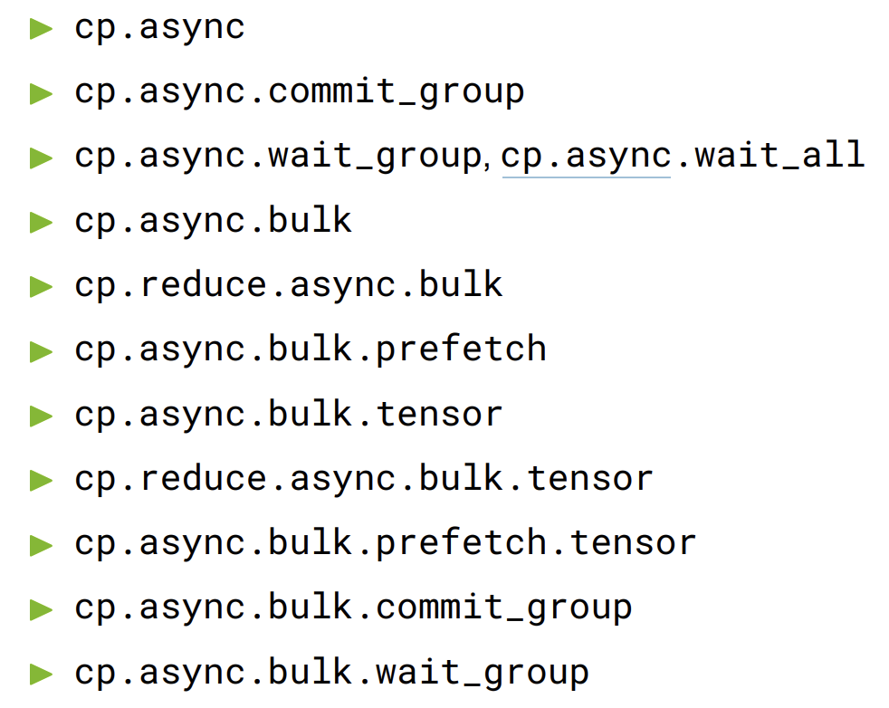

[blog](https://hazyresearch.stanford.edu/blog/2024-05-12-tk)

## 一. 浅谈一些封装的PTX

PTX内联的形式：`asm volatile("指令" : 输出操作数约束 : 输入操作数约束 : Clobber列表);`

常用约束符:

- `r`: 通用寄存器
- `l`: 64位寄存器
- `h`: 寄存器的高16位
- `m`: 内存操作数
- `g`: 允许寄存器或内存
- `i`: 立即数
- `=`: 表示操作数在ptx中是output, 且只写

---

`file: include/ops/warp/memory/util/util.cuh`

### `move<T>`: `load/store`

里面大多封装了关于`ld / st / ldmatrix` 的PTX指令，是关于数据搬运的

`ld`: Load a register variable from an addressable state space variable

```
ld{.weak}{.ss}{.cop}{.level::cache_hint}{.level::prefetch_size}{.vec}.type d, [a]{.unified}{, cache-policy};
```

`st`: Store data to an addressable state space variable.

```
st{.weak}{.ss}{.cop}{.level::cache_hint}{.vec}.type [a], b{, cache-policy};
```

```c
template<typename T> struct move {
    __device__ static inline void lds(T& dst, uint32_t src);
    __device__ static inline void sts(uint32_t dst, const T& src);
    __device__ static inline void ldg(T& dst, T* src);
    __device__ static inline void stg(T* dst, const T& src);
};
```

举一个bf16的特化模板例子：

```c
// unpacked types
template<> struct move<bf16> {
    __device__ static inline void lds(bf16& dst, uint32_t src) {
        asm volatile("ld.shared.b16 %0, [%1];\n" : "=h"(*(uint16_t*)&dst) : "r"(src));
    }
    __device__ static inline void sts(uint32_t dst, const bf16& src) {
        asm volatile("st.shared.b16 [%1], %0;\n" : : "h"(*(uint16_t*)&src), "r"(dst));
    }
    __device__ static inline void ldg(bf16& dst, bf16* src) {
        asm volatile("ld.global.b16 %0, [%1];\n" : "=h"(*(uint16_t*)&dst) : "l"(src));
    }
    __device__ static inline void stg(bf16* dst, const bf16& src) {
        asm volatile("st.global.b16 [%1], %0;\n" : : "h"(*(uint16_t*)&src), "l"(dst));
    }
};
```

`ld.shared.b16 %0, [%1]`: 从smem1中加载16Bit的数据存入reg0

`st.shared.b16 [%1], %0`: 将reg0中16Bit数据存入smem1

当然也可以向量化ld/st

```c
asm volatile("ld.shared.v4.b32 {%0, %1, %2, %3}, [%4];"
                 : "=r"(dst[0]), "=r"(dst[1]), "=r"(dst[2]), "=r"(dst[3])
                 : "r"(shm_ptr));
```

`ldmatrix`: Collectively load one or more matrices from shared memory for `mma` instruction

```
ldmatrix.sync.aligned.shape.num{.trans}{.ss}.type r, [p];
```

```cpp
template <>
struct move<fp8e4m3_4> {
  __device__ static inline void ldsm4(fp8e4m3_4& dst1, fp8e4m3_4& dst2,
                                      fp8e4m3_4& dst3, fp8e4m3_4& dst4,
                                      uint32_t src) {
    asm volatile(
        "ldmatrix.sync.aligned.m8n8.x4.shared::cta.b16 {%0, %1, %2, %3}, "
        "[%4];\n"
        : "=r"(*(uint32_t*)&dst1), "=r"(*(uint32_t*)&dst2),
          "=r"(*(uint32_t*)&dst3), "=r"(*(uint32_t*)&dst4)
        : "r"(src));
  }
  __device__ static inline void stsm4(uint32_t dst, fp8e4m3_4& src1,
                                      fp8e4m3_4& src2, fp8e4m3_4& src3,
                                      fp8e4m3_4& src4) {
    asm volatile(
        "stmatrix.sync.aligned.m8n8.x4.shared::cta.b16 [%4], {%0, %1, %2, "
        "%3};\n" ::"r"(*(uint32_t*)&src1),
        "r"(*(uint32_t*)&src2), "r"(*(uint32_t*)&src3), "r"(*(uint32_t*)&src4),
        "r"(dst));
  }
};
```

`m8n8`意思是8x8的matrix, b16意思是每次load/store 16bit, 可以看出这个`fp8e4m3_4`有四个元素，每行两个，也就是8x8

---

### `semaphore`: `mbarrier/barrier/bar`

`mbarrier`: mbarrier is a barrier created in shared memory that supports: Synchronizing any subset of threads within a CTA，and Waiting for completion of asynchronous memory operations initiated by a thread and making them visible to other threads.

可以得知，`mbarrier`对象是不透明的，且有固定的类型和位置(64bit, 在smem中)

这里需要区分`bar/barrier`

```cpp
struct semaphore {
 private:
  uint64_t value;
};  // note that this is an opaque type, so the value should not be accessed
    // directly.
template <int num_warps>
struct barrier {
  int barrier_id;
  __device__ __forceinline__ barrier(int _id) : barrier_id(_id) {}
  __device__ __forceinline__ barrier operator[](int i) {
    return barrier(barrier_id + i);
  }
};
```

- `mbarrier.init`

```c
asm volatile (
    "mbarrier.init.shared::cta.b64 [%0], %1;\n"
    :: "r"(bar_ptr), "r"(thread_count+transaction_count)
);
```

- `mbarrier.invalidate`

```c
asm volatile (
    "mbarrier.inval.shared::cta.b64 [%0];\n"
    :: "r"(bar_ptr)
);
```

- `mbarrier.arrive`: 在sm_90+会有 asynchronous memory operation

```cpp
asm volatile("mbarrier.arrive.release.cta.shared::cta.b64 _, [%0];\n"
             :
             : "r"(mbar_ptr)
             : "memory");

// hopper
asm volatile("mbarrier.arrive.release.cta.shared::cta.b64 _, [%0], %1;\n"
             :
             : "r"(mbar_ptr), "r"(count)
             : "memory");
```

可以看出，hopper架构下，可以指定当前arrive了多少次，比较有用的用法就是，只使用一个warp来load或者store数据，如果当前mbarrier设置的是warp_num的话，我可以`arrive(mbarrier, 4)`, 来达到每个warpgroup出一个warp来load的目的

- `mbarrier.wait`

```cpp
asm volatile(
    "{\n"
    ".reg .pred                P1;\n"
    "LAB_WAIT:\n"
    "mbarrier.try_wait.parity.shared::cta.b64 P1, [%0], %1;\n"
    "@P1                       bra.uni DONE;\n"
    "bra.uni                   LAB_WAIT;\n"
    "DONE:\n"
    "}\n" ::"r"(mbar_ptr),
    "r"(kPhaseBit));
```

这里需要注意`kPhaseBit`, `try_wait/test_wait`其实就是check当前这个Phase是否结束，所以我们每个Phase需要传入一个kPhaseBit来表示当前的阶段，为了和其他阶段区分，在具体应用的时候，可以直接使用01交替，因为只需要区分上一个phase

- `mbarrier.expect_tx`

```cpp
asm volatile(
    "mbarrier.arrive.expect_tx.shared::cta.b64 _, [%0], %1;\n" ::"r"(bar_ptr),
    "r"(bytes));
```

可以设置tma想要load的bytes, 等到达之后tx_count会自动减少

总结来说，因为`mbarrier`可以同时用来同步threads/warp/warpgroup, 以及同步aync memory load/store, 所以在init的时候会设置thread_count+transaction_count, 对于到达的thread_count, 需要显式arrive一下，对于async memory transaction, 可以设置expect_tx, 如果设置的bytes数量到达，就自动减一

---

### `cp.async`



`file: include/ops/warp/memory/util/tma.cuh`

1. `cp.async`: Initiates an asynchronous copy operation from one state space to another. 启动一个异步数据拷贝，貌似只能从global->shared

```cpp
cp.async.ca.shared.global xxx;
cp.async.cg.shared.global xxx;
```

每次启动一个异步拷贝之后记得 `cp.async.commit_group`，标记一个async操作

然后使用 `cp.async.wait_group` 来等待异步操作完成

2. `cp.async.bulk`: Initiates an asynchronous copy operation from one state space to another. 意思是启动一个批量异步拷贝. 使用tma

```cpp
// global -> shared (load)
cp.async.bulk.shared::cta.global.mbarrier::complete_tx::bytes[dstMem], [srcMem],
    size, [mbar];

// shared -> global (store)
cp.async.bulk.global.shared::cta.bulk_group[dstMem], [srcMem], size;
```

也会有`cp.async.prefetch` 来预取，`cp.reduce.async.bulk` 来做reduce

和`cp.async`一样，也有`cp.async.bulk.commit_group`, 以及`cp.async.bulk.wait_group`

`cp.async.bulk.tensor`: Initiates an asynchronous copy operation on the tensor data from one state space to another. 相当于针对tensor的批量异步拷贝，需要创建tensor map, 然后启动`tma`

```cpp
// global -> shared
cp.async.bulk.tensor.1d.shared ::cta.global.mbarrier::complete_tx::bytes
    .tile[sMem0],
    ,→ [tensorMap0, {tc0}], [mbar0];

// global -> shared
cp.async.bulk.tensor.1d.global.shared ::cta.bulk_group[tensorMap3, {tc0}],
    ,→[sMem3];
```

其中`.completion_mechanism = { .mbarrier::complete_tx::bytes }`, 进一步印证了“对于async memory transaction, 可以设置expect_tx, 如果设置的bytes数量到达，就自动减一”, 所以我们使用`cp.async.bulk`的时候，需要传入`mbarrier`

首先来看kittens中实现的最基础的async load/store两个方法

#### `load_async`

首先是`with-tma`的版本, 这里使用了`cp.async.bulk.tensor.5d`, 需要使用tma，先load tensor map

```cpp
template <int axis, cache_policy policy, ducks::st::all ST, ducks::gl::all GL,
          ducks::coord::tile COORD = coord<ST>>
__device__ static inline void load_async(ST &dst, const GL &src,
                                         const COORD &idx, semaphore &bar) {
  if (::kittens::laneid() == 0) {
    uint64_t tma_ptr =
        reinterpret_cast<uint64_t>(src.template get_tma<ST, axis>());
    uint32_t mbar_ptr = static_cast<uint32_t>(__cvta_generic_to_shared(&bar));
    uint32_t dst_ptr = static_cast<uint32_t>(__cvta_generic_to_shared(&dst));
    coord<ducks::default_type> unit_coord =
        idx.template unit_coord<axis, 3>();  // convert to unit coordinates
    int4 tma_coords = detail::tma_coords<ST, axis>(unit_coord);

    if constexpr (policy == cache_policy::NORMAL) {
      asm volatile(
          "cp.async.bulk.tensor.5d.shared::cluster.global.tile.mbarrier::"
          "complete_tx::bytes"
          " [%0], [%1, {%3, %4, %5, %6, %7}], [%2];"
          :
          : "r"(dst_ptr), "l"(tma_ptr), "r"(mbar_ptr), "n"(0),
            "r"(tma_coords.x), "r"(tma_coords.y), "r"(tma_coords.z),
            "r"(tma_coords.w)
          : "memory");
    } else {
      asm volatile(
          "cp.async.bulk.tensor.5d.shared::cluster.global.tile.mbarrier::"
          "complete_tx::bytes.L2::cache_hint"
          " [%0], [%1, {%3, %4, %5, %6, %7}], [%2], %8;"
          :
          : "r"(dst_ptr), "l"(tma_ptr), "r"(mbar_ptr), "n"(0),
            "r"(tma_coords.x), "r"(tma_coords.y), "r"(tma_coords.z),
            "r"(tma_coords.w), "l"(make_cache_policy<policy>())
          : "memory");
    }
  }
}
```

我们可以对比一下`non-tma`的版本，`non-tma`的版本下，可以合理利用所有的`thread`, 然后使用`cp.async`来异步搬运数据

```cpp
template <int axis, bool assume_aligned, ducks::st::all ST, ducks::gl::all GL,
          ducks::coord::tile COORD = coord<ST>, int N_THREADS = WARP_THREADS>
__device__ static inline void load_async(ST &dst, const GL &src,
                                         const COORD &idx) {
  using T = typename ST::dtype;
  const int row_stride = src.template stride<axis>();
  // we can handle this many rows each time we run a memcpy_async
  constexpr int elem_per_memcpy = sizeof(float4) / sizeof(typename ST::dtype);
  constexpr int memcpy_per_row = dst.cols / elem_per_memcpy;
  constexpr int total_calls =
      (dst.height * dst.width * kittens::TILE_ROW_DIM<T> *
           kittens::TILE_COL_DIM<T> +
       N_THREADS * elem_per_memcpy - 1) /
      (N_THREADS * elem_per_memcpy);  // round up

  coord<> unit_coord = idx.template unit_coord<axis, 3>();
  typename GL::dtype *src_ptr = (typename GL::dtype *)&src[unit_coord];
  uint32_t dst_ptr =
      static_cast<uint32_t>(__cvta_generic_to_shared(&dst.data[0]));
  int laneid = threadIdx.x % N_THREADS;

#pragma unroll
  for (int i = 0; i < total_calls; i++) {
    int load_idx = i * N_THREADS + laneid;

    int row = load_idx / memcpy_per_row;
    int col = (load_idx * elem_per_memcpy) % dst.cols;

    if constexpr (assume_aligned) {
      asm volatile("cp.async.cg.shared.global.L2::128B [%0], [%1], 16;\n" ::"r"(
                       dst.idx(dst_ptr, {row, col})),
                   "l"(&src_ptr[row * row_stride + col])
                   : "memory");
    } else {
      if (row + unit_coord.template dim<axis>() < src.template shape<axis>()) {
        asm volatile(
            "cp.async.cg.shared.global.L2::128B [%0], [%1], 16;\n" ::"r"(
                dst.idx(dst_ptr, {row, col})),
            "l"(&src_ptr[row * row_stride + col])
            : "memory");
      } else {
        // printf("thread %d skipping async load on row %d, col %d\n",
        // threadIdx.x, row + unit_coord.template dim<axis>(), col);
        float4 zeros = {0.f, 0.f, 0.f, 0.f};
        move<float4>::sts(dst.idx(dst_ptr, {row, col}),
                          zeros);  // use the default value
      }
    }
  }
  asm volatile("cp.async.commit_group;\n" ::: "memory");
}
template <ducks::st::all ST, ducks::gl::all GL,
          ducks::coord::tile COORD = coord<ST>>
__device__ static inline void load_async(ST &dst, const GL &src,
                                         const COORD &idx) {
  load_async<2, false, ST, GL, COORD, WARP_THREADS>(dst, src, idx);
}
```

#### `store_async`

使用`cp.async.bulk.tensor`的async store

```cpp
template <int axis, cache_policy policy, ducks::st::all ST, ducks::gl::all GL,
          ducks::coord::tile COORD = coord<ST>>
__device__ static inline void store_async(const GL &dst, const ST &src,
                                          const COORD &idx) {
  if (::kittens::laneid() == 0) {
    uint64_t tma_ptr =
        reinterpret_cast<uint64_t>(dst.template get_tma<ST, axis>());
    uint32_t src_ptr = static_cast<uint32_t>(__cvta_generic_to_shared(&src));
    coord<ducks::default_type> unit_coord =
        idx.template unit_coord<axis, 3>();  // convert to unit coordinates
    int4 tma_coords = detail::tma_coords<ST, axis>(unit_coord);

    asm volatile("fence.proxy.async.shared::cta;\n" ::: "memory");
    if constexpr (policy == cache_policy::NORMAL) {
      asm volatile(
          "cp.async.bulk.tensor.5d.global.shared::cta.tile.bulk_group"
          " [%0, {%2, %3, %4, %5, %6}], [%1];"
          :
          : "l"(tma_ptr), "r"(src_ptr), "n"(0), "r"(tma_coords.x),
            "r"(tma_coords.y), "r"(tma_coords.z), "r"(tma_coords.w)
          : "memory");
    } else {
      asm volatile(
          "cp.async.bulk.tensor.5d.global.shared::cta.tile.bulk_group.L2::"
          "cache_hint"
          " [%0, {%2, %3, %4, %5, %6}], [%1], %7;"
          :
          : "l"(tma_ptr), "r"(src_ptr), "n"(0), "r"(tma_coords.x),
            "r"(tma_coords.y), "r"(tma_coords.z), "r"(tma_coords.w),
            "l"(make_cache_policy<policy>())
          : "memory");
    }
  }
  store_commit_group();
}
```

在代码中找到了一个`shared::cluster -> shared::cta` 的 async store，不知道是什么用途

```cpp
// Generic transfer
__device__ static inline void store_async(void* dst, void* src, int dst_cta,
                                          uint32_t size_bytes, semaphore& bar) {
  if (laneid() == 0) {
    void const* const ptr = &bar;
    uint32_t mbarrier_ptr =
        static_cast<uint32_t>(__cvta_generic_to_shared(ptr));

    // **************************************************
    // load from src to dst in different threadblocks
    uint32_t src_ptr = static_cast<uint32_t>(__cvta_generic_to_shared(src));
    uint32_t dst_ptr = static_cast<uint32_t>(__cvta_generic_to_shared(dst));

    // mapa instr =
    // https://docs.nvidia.com/cuda/parallel-thread-execution/index.html#data-movement-and-conversion-instructions-mapa
    // find dst addr in neighbor's cta
    uint32_t neighbor_addr_dst;
    asm volatile("mapa.shared::cluster.u32  %0, %1, %2;\n"
                 : "=r"(neighbor_addr_dst)
                 : "r"(dst_ptr), "r"(dst_cta));

    uint32_t neighbor_addr_mbarrier = mbarrier_ptr;
    asm volatile("mapa.shared::cluster.u32  %0, %1, %2;\n"
                 : "=r"(neighbor_addr_mbarrier)
                 : "r"(mbarrier_ptr), "r"(dst_cta));

    // cp.async instr =
    // https://docs.nvidia.com/cuda/parallel-thread-execution/index.html#data-movement-and-conversion-instructions-cp-async-bulk
    // copy src into dst in neighbor's cta
    asm volatile("fence.proxy.async.shared::cta;\n" ::: "memory");
    asm volatile(
        "cp.async.bulk.shared::cluster.shared::cta.mbarrier::complete_tx::"
        "bytes [%0], [%1], %2, [%3];\n"
        :
        : "r"(neighbor_addr_dst), "r"(src_ptr), "r"(size_bytes),
          "r"(neighbor_addr_mbarrier)
        : "memory");
  }
}
```

`cp.async`貌似只能用来load， 这里放一个sync版本的store，其实就是使用的上文中提到的`move`中的`st`指令

```cpp
template <int axis, bool assume_aligned, ducks::st::all ST, ducks::gl::all GL,
          ducks::coord::tile COORD = coord<ST>, int N_THREADS = WARP_THREADS>
__device__ static inline void store(const GL &dst, const ST &src,
                                    const COORD &idx) {
  using T = typename ST::dtype;
  const int row_stride = dst.template stride<axis>();
  // we can handle this many rows each time we run a memcpy_async
  constexpr int elem_per_memcpy = sizeof(float4) / sizeof(typename ST::dtype);
  constexpr int memcpy_per_row = src.cols / elem_per_memcpy;
  constexpr int total_calls =
      (src.height * src.width * kittens::TILE_ROW_DIM<T> *
           kittens::TILE_COL_DIM<T> +
       N_THREADS * elem_per_memcpy - 1) /
      (N_THREADS * elem_per_memcpy);  // round up

  coord<> unit_coord = idx.template unit_coord<axis, 3>();
  typename GL::dtype *dst_ptr = (typename GL::dtype *)&dst[unit_coord];
  uint32_t src_ptr =
      static_cast<uint32_t>(__cvta_generic_to_shared(&src.data[0]));
  int laneid = threadIdx.x % N_THREADS;

#pragma unroll
  for (int i = 0; i < total_calls; i++) {
    int load_idx = i * N_THREADS + laneid;

    int row = load_idx / memcpy_per_row;
    int col = (load_idx * elem_per_memcpy) % src.cols;

    if constexpr (assume_aligned) {
      float4 tmp;
      move<float4>::lds(tmp, src.idx(src_ptr, {row, col}));
      move<float4>::stg((float4 *)&dst_ptr[row * row_stride + col], tmp);
    } else {
      if (row + unit_coord.template dim<axis>() < dst.template shape<axis>()) {
        float4 tmp;
        move<float4>::lds(tmp, src.idx(src_ptr, {row, col}));
        move<float4>::stg((float4 *)&dst_ptr[row * row_stride + col], tmp);
      }
    }
  }
}
```

总结：warp level中，对于global <-> share 之间的传输，提供了最基础的load/store (使用st/ld/ldmatrix/stmatrix) 的基础指令，同时也提供了aync方法, load async, store async，这里需要区分是否使用tma，如果使用tma的话，就使用的是`cp.async.bulk.tensor`来load/store, 如果没有使用tma，load_async的实现是使用的 `cp.async`

#### 同步机制

对于tma的async操作，需要有一套sync机制保证

##### With-TMA：

- `store_commit_group()`:

```cpp
// Commits previous asynchronous TMA stores to a group and performs them.
__device__ static inline void store_commit_group() {
  if (::kittens::laneid() == 0) {
    asm volatile("cp.async.bulk.commit_group;");
  }
  __syncwarp();
}
```

- `asm volatile("fence.proxy.async.shared::cta;\n" ::: "memory");`

在`store_async`之前一般加上这么一句，

- `store_async_wait()`: 使用一个thread去wait之前的`cp.async.bulk`操作

```cpp
// N The maximum number of remaining TMA store groups. Defaults to 0.
// 0代表等待所有
template <int N = 0>
__device__ static inline void store_async_wait() {
  if (::kittens::laneid() == 0) {
    asm volatile("cp.async.bulk.wait_group %0;" : : "n"(N) : "memory");
  }
  __syncwarp();
}
// TODO: 这里.read不知道是啥意思
template <int N = 0>
__device__ static inline void store_async_read_wait() {
  if (::kittens::laneid() == 0) {
    asm volatile("cp.async.bulk.wait_group.read %0;" : : "n"(N) : "memory");
  }
  __syncwarp();
}
```

- `load_async_wait()`: 注意这里不需要，仔细阅读上文中`with-tma`的`load_aync`, 会发现需要传入一个`mbarrier`, 这个bar会帮我们做好同步的事情

- `expected_bytes()`:

这个函数比较关键，一般和tma的`load_async`一起使用

```cpp
__device__ static inline void expect_bytes(semaphore& bar, uint32_t bytes) {
  if (::kittens::laneid() == 0) {
    void const* const ptr = &bar;
    uint32_t bar_ptr = static_cast<uint32_t>(__cvta_generic_to_shared(ptr));

    asm volatile(
        "mbarrier.arrive.expect_tx.shared::cta.b64 _, [%0], %1;\n" ::"r"(
            bar_ptr),
        "r"(bytes));
  }
}
```

##### Non-TMA

- `store_async_wait()`: 上文中说到，non-tma无法做到async store，故忽略

- `load_async_wait()` 这个kittens中放到了warpgroup下，其实也就是使用`cp.async.wait_group`来等待

```cpp
template <int N = 0>
__device__ static inline void load_async_wait(
    int bar_id) {  // for completing (non-TMA) async loads
  asm volatile("cp.async.wait_group %0;\n" : : "n"(N) : "memory");
  sync(bar_id);
}
```

总结：所以我们在进行async load/store的时候，使用kittens就有了一个范式

```cpp
kittens::init_semaphore(input_arrived[num_warpgroup], 2);
kittens::init_semaphore(output_ready[num_warpgroup], 4);

for (coord = {0, 0}; coord < UPPER; coord = next(coord)) {
  // async load...
  if (warpgroup::warpid() == 1) {
    // tx count--
    // use one warp, use tma to load, global memory -> shared memory
    tma::expect_bytes(input_arrived[warpgroup_id], bytes);
    tma::load_async(shared_memory[warpgroup_id], global_memory[warpgroup_id],
                    coord, input_arrived[warpgroup_id]);
  } else if (warpgroup::laneid() == 0) {
    // tx count --
    // wait prev tma store
    arrive(input_arrived[warpgroup_id]);
  }
  // wait tx count == 0
  kittens::wait(input_arrived[warpgroup_id], phase);

  // warp level compute...

  // warp level async store...
  // reg -> shared memory
  store(shared_memory[warpgroup_id], res);
  if (laneid() == 0) {
    // wait four warp in warpgourp complete
    // tx count -= 4
    kittens::arrive_and_wait(output_ready[warpgroup_id], phase);
  }
  phase ^= 1;

  // shared memory -> global memory
  if (warpgroup::warpid() == 0) {
    // single warp to store async use tma
    tma::store_async(global_memory[warpgroup_id], shared_memory[warpgroup_id],
                     coord);
    // Waits for previous committed TMA store groups to finish reading from
    // shared memory.
    tma::store_async_read_wait();
  }
}
```

这个范式trick了一下，将第一个warp的sync放到下一次循环的开头，其实更加native的写法，是在每次循环的最后，再次`kittens::wait(output_ready[warpgroup_id], phase)`
