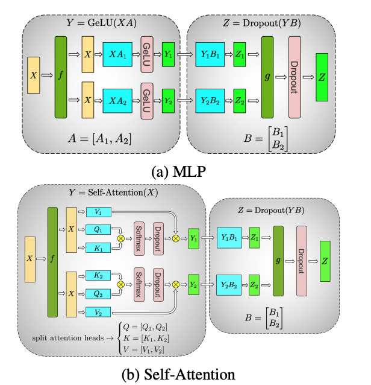

## Megatron-LM: Training Multi-Billion Parameter Language Models

作为model parallel的基石，如果你已经掌握了单机单卡简单使用pytorch训练model之后，建议来细读这一篇Megatron-LM的paper。

[Megatron-LM paper](https://arxiv.org/pdf/1909.08053)

总结：其实通篇下来，就只需要理解这张图

处理GEMM followed by a nonlinearity: $Y=GeLU(XA)$, 有两种tensor切割方式:

- $A$: split along col, $X$: split along row:

$$
X = [X_1, X_2], \, A = \begin{bmatrix} A_1 \\ A_2 \end{bmatrix}.
$$

这个时候 $Y = GeLU(X_1A_1 + X_2A_2)$, 但是需要在GeLU前做一次sync

- $A$: split along row, $X$: duplicate

$$
A = [A_1, A_2]
$$

$$
[Y_1, Y_2] = [GeLU(XA_1), GeLU(XA_2)]
$$

可以看出这种方式，计算的 $Y$ 仍然保持分割状态，但是无需做一次sync，只需要分治做GeLU即可

## Megatron-LM2: Efficient Large-Scale Language Model Training on GPU Clusters Using Megatron-LM

[Megatron-LM2 paper](https://arxiv.org/pdf/2104.04473)

interleaved schedule, mix parallel. 

